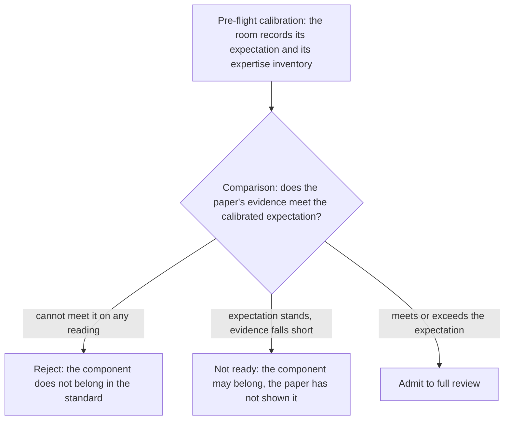

## Abstract

The committee has never operated a rule for what belongs in the standard library; this paper supplies one.

Each pre-meeting mailing now carries more than one hundred proposals, a volume the committee's own direction papers describe as unmanageable for any individual reader. Review capacity has not grown to match, and the release schedule is fixed, so the quantity that absorbs the growth is the review each paper receives. This paper describes a gate: a threshold evaluation, held before a proposal consumes review time, that asks whether the component belongs in the standard at all. For library components the paper supplies the gate's instruments - eight measurable quantities calibrated against the published record of past admissions. For language features the paper states the gate question and marks the space for delegates with compiler and teaching expertise to supply the instruments.

---

## Revision History

### R0: July 2026

- Initial version.

---

## 1. Disclosure

The author provides information and serves at the pleasure of the committee.

The author developed and maintains [Corosio](https://github.com/cppalliance/corosio) and [Capy](https://github.com/cppalliance/capy), coroutine-native I/O libraries under the C++ Alliance, and is a co-author of [P2469R0](http://www.open-std.org/jtc1/sc22/wg21/docs/papers/2021/p2469r0.pdf)[1]. The author's preferred asynchronous model competes with [P2300R10](https://www.open-std.org/jtc1/sc22/wg21/docs/papers/2024/p2300r10.html)[2] (`std::execution`).

This paper places an admission model and its supporting evidence in the record. It is input to the criteria discussion that [P2000R4](https://www.open-std.org/jtc1/sc22/wg21/docs/papers/2022/p2000r4.pdf)[3] encouraged.

The author's stake extends to the model itself: the library instruments in Section 5 treat networking favorably, and the author maintains networking libraries. Section 5.7 prices the model's costs against networking with the same instruments it applies everywhere else. The model's arithmetic is the author's; the record it is calibrated against is the committee's own.

One limitation is structural. The value model in Section 5 was written by a party to disputes it would judge. A reader who rejects the model loses none of the underlying findings: the criteria vacuum in Section 5.4, the budget pricing in Section 5.5, and the penalty record in Section 5.6 are documented from published committee papers, vendor records, and public minutes, and they stand without the model.

The method is documentary: every claim is sourced to published papers, public minutes, vendor documentation, or public mailing lists, and every quotation was verified against its source. Generative AI assisted with research and drafting; the author verified the quotations and takes responsibility for every claim.

This paper asks for nothing.

---

## 2. Introduction

This paper is a companion to [P4050R0](https://www.open-std.org/jtc1/sc22/wg21/docs/papers/2026/p4050r0.pdf)[4], which identifies fourteen failure modes and proposes proportional deliberation, and to [P4034R0](https://www.open-std.org/jtc1/sc22/wg21/docs/papers/2026/p4034r0.pdf)[5], which addresses input quality through structured expert interviews. The retrospective series [P4094R0](https://www.open-std.org/jtc1/sc22/wg21/docs/papers/2026/p4094r0.pdf)[6], [P4097R0](https://www.open-std.org/jtc1/sc22/wg21/docs/papers/2026/p4097r0.pdf)[7], [P4098R0](https://www.open-std.org/jtc1/sc22/wg21/docs/papers/2026/p4098r0.pdf)[8], and [P4131R0](https://www.open-std.org/jtc1/sc22/wg21/docs/papers/2026/p4131r0.pdf)[9] supplies the case evidence used here.

This paper contributes four things:

1. A documented account that review per paper is the quantity collapsing under proposal volume (Section 3).
2. A two-step gate model - calibration before advocacy, then comparison - that renders three verdicts instead of two (Section 4).
3. The library instruments for the gate (Section 5), each grounded in the published admission record, with the evidence bar a passing paper must then meet (Section 7).
4. A stated gap where the language instruments belong, marked for delegates with compiler and teaching expertise (Section 6).

The paper assumes the reader accepts the committee's own throughput accounting as accurate; every figure in Section 3 is drawn from numbered committee documents.

---

## 3. The Mailing Outgrew the Review

This section establishes the problem the gate addresses, in four steps: proposal volume rose, review capacity did not, the release schedule is fixed, and therefore the review each paper receives is the quantity that gives way. Sections 3.1 through 3.4 document each step from the committee's own records.

### 3.1 Volume Rose

The Direction Group described the inflow in 2020: "One effect of this enthusiasm for C++ is to inundate us with a flood of proposals. The sheer volume of proposals leads to fewer proposals getting through the processes to get accepted. Some proposals become warped from the need to gain support in an environment where time to think and present ideas is limited" ([P2000R2](https://www.open-std.org/jtc1/sc22/wg21/docs/papers/2020/p2000r2.pdf)[10]). The same group had already quantified the load in [P0939R3](https://www.open-std.org/jtc1/sc22/wg21/docs/papers/2019/p0939r3.pdf)[11], Section 7.2: "WG21 does not lack for proposals. The interest is high and the number of proposals of each mailing has grown to more than 100. That's unmanageable for an individual with a day job." [P2000R3](https://www.open-std.org/jtc1/sc22/wg21/docs/papers/2022/p2000r3.pdf)[12] adds the traffic figure: "The WG21 mailing lists alone produce in total between 1,000 and 3,000 messages a month, which is a large volume of traffic to keep on top of."

The volume has not receded since those papers were written. The admin group reported in [N5005](https://www.open-std.org/jtc1/sc22/wg21/docs/papers/2025/n5005.pdf)[13] (January 2025): "The post-Wroc&lstrok;aw mailing had 167 papers, 107 of which were P-papers not counting multiple revisions, withdrawn papers, or papers adopted in Wroc&lstrok;aw."

The historical scale of the inflow is on record. Herb Sutter's [pre-meeting trip report for San Diego 2018](https://herbsutter.com/2018/11/05/pre-trip-report-fall-iso-c-standards-meeting-san-diego/)[14] counted 274 papers in one mailing, against a corpus of 1,148 papers for the entire eight-year C++98 cycle, and his [post-meeting trip report](https://herbsutter.com/2018/11/13/trip-report-fall-iso-c-standards-meeting-san-diego/)[15] observed that the mailing "started to approach the total number of technical papers to produce the first C++ standard (total of pre-meeting mailings from 1990-1997)". Counted from the public [open-std.org paper indexes](https://www.open-std.org/jtc1/sc22/wg21/docs/papers/2024/)[16], the years 2019 and 2024 each produced more than 900 paper documents (617 and 560 unique papers respectively): each of those single years approaches the paper output of the entire eight-year C++98 cycle.

### 3.2 Capacity Did Not

The convener described the bottleneck to the San Diego 2018 plenary, as recorded in [P1338R1](https://www.open-std.org/jtc1/sc22/wg21/docs/papers/2019/p1338r1.pdf)[17]: "There are 181 people at this meeting. We have grown a lot and the number of papers has grown a lot too. We used to have less papers than people, but that is no longer the case. We still want to look at all of the papers ... To be able to see all the papers, we have scaled the groups and added incubation groups at the meeting. We are still bottlenecked at LWG and CWG which need to do the final review of the papers."

Two years later, the chairs of both library groups gave the same answer to the same question. The pre-autumn 2020 telecon minutes, [N4871](https://www.open-std.org/jtc1/sc22/wg21/docs/papers/2020/n4871.pdf)[18], record the exchange. Asked whether to look into expanding the throughput or managing expectations, the Library Working Group (LWG) chair answered: "I'm not sure what we can do to expand the throughput. We should probably start managing expectations." The Library Evolution Working Group (LEWG) chair answered in the same discussion: "It's hard to improve throughput, we should start managing expectations."

The throughput numbers behind those answers are published. LEWG's own accounting in [P2400R2](https://open-std.org/jtc1/sc22/wg21/docs/papers/2021/p2400r2.html)[19] records, in its cumulative tally running from April 2020, 74 telecons and 107 papers reviewed in roughly seventeen months, against a standing backlog of 41 active papers, at a cadence of one or two papers per ninety-minute telecon. The people doing that review were polled during the same period: the November 2020 plenary record, [P2260R0](https://www.open-std.org/jtc1/sc22/wg21/docs/papers/2020/p2260r0.pdf)[20], reports that over 60 percent of participants said they often feel exhausted by meetings and demands from all sources, and 46 percent said the pace was not sustainable. The N4871 exchange and these poll figures are pandemic-era records and are read here as corroboration, not as steady state. The steady-state capacity evidence brackets them: the convener's bottleneck statement is from 2018, and the 2022 removal of `submdspan` for LWG scheduling reasons (Section 3.4) shows the same constraint operating after meetings resumed.

### 3.3 The Ship Date Does Not Move

The release schedule absorbs none of the growth. [P1000R6](https://www.open-std.org/jtc1/sc22/wg21/docs/papers/2024/p1000r6.pdf)[21] fixes the three-year cadence, and the cadence has held through C++26. The train model's stated protection - features are pulled when not ready - operates asymmetrically in practice: [P4131R0](https://www.open-std.org/jtc1/sc22/wg21/docs/papers/2026/p4131r0.pdf)[9] documents, release by release from C++14 through C++26, that features are pushed when almost ready rather than pulled when not ready.

### 3.4 Review per Paper Is the Quantity That Collapses

When volume rises, capacity holds, and the deadline is fixed, the quantity that gives way is the review each paper receives. The record shows this directly.

[P3443R0](https://www.open-std.org/jtc1/sc22/wg21/docs/papers/2024/p3443r0.pdf)[22] measured one study group's 2024 docket: 63 papers discussed in 10 months, and of the 41 papers that received binding polls, 56.10 percent were published less than one week before they were discussed and polled. The paper states the experience from inside the room: "During the last year the authors of this paper felt that the process of making P2900 is too fast. Papers are sneaking in at a high rate and are processed immediately as they arrive." (P2900 is the Contracts for C++ proposal; the study group is SG21, and its Contracts-deadline year was an intense one, which is why the figure is read here as one measured instance of the mechanism rather than a committee-wide average.)

[P3023R1](https://www.open-std.org/jtc1/sc22/wg21/docs/papers/2023/p3023r1.html)[23] describes the attention side of the same collapse: "In committee, we frequently spend time on things that only a small number of people care about. It's difficult to say 'no' when someone, somewhere would benefit. There's also a tendency to mentally check-out during these discussions which results in proposals not getting an appropriate rigor."

Even proposals with the strongest provenance lose review time. [P2630R1](https://www.open-std.org/jtc1/sc22/wg21/docs/papers/2022/p2630r1.html)[24] records that `submdspan`, a function "considered critical for the overall functionality of mdspan", was removed from P0009 (the mdspan proposal) "due to review time constraints ... in order for mdspan to be included in C++23". The separation poll itself is recorded in the [LEWG telecon summary on the P0009 tracker](https://github.com/cplusplus/papers/issues/96)[25] as "made purely out of scheduling concerns to make sure that LWG is not overloaded."

Together the four steps yield this section's finding. The standard does not ship late; it ships less-reviewed.

---

## 4. The Gate Question

When review per paper is the collapsing quantity, the highest-leverage intervention is the one that happens before review is spent. That intervention is a threshold question: does this component belong in the standard at all? This section describes a two-step model for asking it. Section 4.1 describes the calibration step, Section 4.2 the comparison step, and Section 4.3 the three verdicts the comparison renders.

Library and language proposals face different forms of the question, because the ecosystem alternative exists for one and not the other. A library component can be downloaded; a language feature cannot. Section 5 develops the library gate in full. Section 6 states the language gate and leaves its instruments open.

### 4.1 The Pre-Flight Calibration

Before a proposal's advocacy frames the discussion, the evaluating group confers and pools what the room knows about the domain. The output is not a verdict. It is a calibrated expectation: a rough, order-of-magnitude estimate of what standardizing the component ought to be worth, together with an inventory of who in the room can competently judge the claims. The estimate draws on observable ecosystem facts - whether multiple incompatible implementations of the same concept exist, whether the component crosses interface boundaries between independently authored libraries, and how fast the domain moves. Section 5.3 makes these three quantities precise. No proposal is rejected at this step.

The calibration serves two purposes. The first is anchoring control, and it is a design premise of the model rather than a sourced finding: a well-written proposal sets the frame for everything discussed after it, so when the room forms its expectation first, the paper must shift a formed estimate instead of supplying the first one. Whether a conferring room sharpens its estimates or entrenches them is an empirical question; the calibration records the model needs in order to be evaluated are the same records that would answer it.

The second purpose is the expertise inventory, and the published record shows why it must happen before discussion rather than during the poll. The October 2021 electronic poll on asynchronous models, published in [P2453R0](https://www.open-std.org/jtc1/sc22/wg21/docs/papers/2022/p2453r0.html)[26], asked whether the sender/receiver model is a good basis for most asynchronous use cases "including networking"; the poll achieved consensus while the published comments include "can't judge its suitability for networking" from a voter who voted Weakly Favor. [P4097R0](https://www.open-std.org/jtc1/sc22/wg21/docs/papers/2026/p4097r0.pdf)[7] documents the episode. A statement of non-expertise that surfaces inside the poll comments arrives too late to inform the poll. The calibration step collects it first, and "none of us knows this domain" is itself a recorded finding.

### 4.2 The Comparison

The proposal is then read as evidence and measured against the calibrated expectation. The threshold is comparative: the paper's evidence meets the gate when it agrees with or exceeds what the room independently estimated. Agreement between two independent estimates - the room's and the paper's - is what creates confidence. A paper that claims far more value than the room estimated is not thereby wrong, but the gap is a claim in itself, and it requires evidence proportional to the gap rather than deference to the authors.

### 4.3 Three Verdicts, Not Two

The comparison renders one of three verdicts: reject, not ready, or admit. Current practice renders reject rarely, informally, and without attaching it to the component: the one formal component-level exclusion in the record surveyed here, the Kona 2007 concurrency scope vote of Section 5.4, did not hold - every excluded item later entered. The gate makes the verdict explicit, recorded, and attached.

*Figure 1: The two-step gate. The pre-flight produces an expectation, never a verdict; the verdict comes from comparing the paper against the expectation.*

Reject means the component does not belong: even a generous reading of the evidence cannot meet the expectation the room formed, and no volume of paper can change that. The distinction matters because volume has substituted for evidence before. Counted from the public [wg21.link index](https://wg21.link/index.json)[27] by title match on executor, sender, receiver, scheduler, and `std::execution` (a floor, since papers without a matching title word are excluded), the executor lineage produced 115 distinct papers and 219 revision documents between its first paper in 2012 and mid-2026, including the fourteen revisions of [P0443R0](http://www.open-std.org/jtc1/sc22/wg21/docs/papers/2016/p0443r0.html)[28] - retired unadopted - and the replacement design that followed. A gate that renders a recorded verdict settles the belongs-question at paper one, on evidence; the verdict attaches to the component rather than to the persistence of its authors.

Not ready means the expectation stands but this paper has not measured up to it: the component may merit standardization, and the paper is returned for the evidence the gate requires. The distinction between reject and not ready protects good components from weak papers, and denies weak components rescue by strong papers.

Under the model, the room does openly what it already does implicitly. Every scheduling decision the committee makes today embeds an unrecorded judgment about whether the component belongs; the gate records the judgment, its inputs, and the expertise of the people who made it.

---

## 5. The Library Gate

This section supplies the instruments the pre-flight calibration uses for library components, and the evidence that no such instruments have ever policed the door. Section 5.1 states the default. Section 5.2 defines the vocabulary. Section 5.3 states the value model. Sections 5.4 through 5.6 calibrate the model against the committee's own record: the criteria vacuum, the priced budget, and the penalty ledger. Section 5.7 identifies what clears the gate.

### 5.1 The Default Is No

Standardization has costs that ecosystem delivery does not bear. An ecosystem library fixes bugs in its next release, changes its API when users report friction, drops features that turn out to be mistakes, and competes for its users. A standard library component is specified once, implemented by every conforming vendor, taught to every student, maintained in perpetuity, and - per the record in Section 5.6 - frozen at the point of adoption. A component that is useful but needs nothing from standardization is simply a useful library, and the burden of demonstrating otherwise sits on the proposer.

### 5.2 The Vocabulary

The gate's instruments are eight named quantities. Each term receives one sentence of context here and is used with exactly this meaning for the rest of the paper.

| Term | Meaning |
|---|---|
| Coordination Problem | The class of problem that justifies standardization: a concept everybody needs but every library implements differently |
| Complexity Budget | The finite resource of specification the standard can carry; every addition spends it |
| The GitHub Test | The threshold question: what does standardization deliver that downloading the library does not |
| Reach Test | The audience question: how large is the constituency that collects the benefit |
| Return on Complexity (ROC) | Value delivered per unit of Complexity Budget spent |
| Interaction Tax | The permanent ongoing cost each component imposes on everything standardized after it |
| Standardization Penalty | The immediate loss of value on entry: the component can no longer compete or evolve in the marketplace |
| Standardization Dividend | The net payout to the community: gross benefit times reach, minus committee cost, Penalty, and Tax |

*Table 1: The eight instruments of the Library Gate, each defined once here and used bare throughout the paper.*

### 5.3 The Value Model

The model turns the vocabulary into arithmetic; the disclosure in Section 1 applies to this model in particular. Five quantities parameterize it: `B`, the gross benefit per beneficiary per year beyond availability alone; `N`, the number of beneficiaries; `delta`, the fraction of value forfeited to ossification, between 0 and 1; `k`, the complexity spent in wording, names, and interactions; and `C0`, the fixed cost of admission in committee hours and displaced floor time. Two rates complete it: `tau`, the annual Interaction Tax per unit of complexity, and `r`, a time discount rate.

The GitHub Test is the threshold condition: `B` is the difference between the standardized benefit and the downloadable benefit, and if everything the component offers is captured by downloading it, `B` is zero and no other number matters. This is the default no of Section 5.1, stated as arithmetic.

The Standardization Penalty relates in-standard value to ecosystem value: the standardized component delivers `(1 - delta)` of what its ecosystem form delivers, and `delta` grows with the domain's evolution velocity multiplied by the freeze horizon - release cycle plus implementation lag plus the effectively permanent freeze of the application binary interface (ABI). The Penalty is not a constant; it is a property of the domain, measurable from ecosystem release cadence. Hash maps and regular expressions live in high-velocity domains, so their `delta` approaches 1; Section 5.6 prices both. Strings live in a low-velocity domain, so their `delta` is small.

The remaining definitions compose. The annual dividend flow of an admitted component is `d = (1 - delta) * B * N - tau * k`: benefit net of Penalty, minus the Interaction Tax the component levies on the rest of the standard every year. The Standardization Dividend `D` is the discounted sum of that flow minus `C0`. Return on Complexity is `ROC = D / k`.

The admission rule is comparative, because the Complexity Budget is finite: admit if and only if `ROC` meets or beats `lambda`, where `lambda` is the return of the best proposal the admission displaces. Positive is not the bar; better than every competitor for the same budget is the bar.

One scaling law separates most components that clear this rule from most that do not. For a convenience component, value scales linearly with adoption: each user collects the benefit once. For a vocabulary component, value lives in the links: independently authored libraries that can now interoperate collect the benefit pairwise, so value grows with the square of adoption - to the extent the links are realized in practice, which is why Section 5.7 counts realized boundary traffic rather than potential pairs. Linear algebra computation happens inside a codebase - linear scaling. Strings cross every interface boundary - quadratic scaling. Among components the ecosystem can deliver, only those whose value scales with the square of adoption reliably outrun `delta`, `tau * k`, and `C0`; the exception is the component the ecosystem cannot deliver at all, such as a facility requiring compiler support, whose `B` is large enough that linear scaling clears.

The model never requires absolute precision, because the admission rule is a ranking. `lambda` is the return of the displaced proposal, so order-of-magnitude estimates suffice to rank whenever the gaps are large, and the gaps are large: a component serving everyone who connects to the internet and a component serving one specialty container's users differ by a margin no estimation error can flip. This is the ordinal sufficiency principle, and it is what licenses the pre-flight calibration of Section 4.1 to be rough. The objection that these quantities cannot be measured precisely is an argument against false precision, not against measurement.

One retrodiction shows the instruments operating at the precision the model claims for them, using only facts knowable at the decision. Run the gate on the regular expression component as of 2003, the year the hash table and regex admissions were before the committee. The GitHub Test: `B` was modest - Boost.Regex was freely downloadable, so standardization offered availability on closed toolchains and little else. The scaling class: regular expressions are consumed inside a codebase and rarely cross interface boundaries as a vocabulary type, so value scales linearly. The domain velocity: regex engines were under active development in 2003 and had been for years, so `delta` was foreseeably large - the freeze would forfeit the improvements the domain kept producing. Verdict at order-of-magnitude precision: linear scaling, small `B`, large `delta` - reject, or at most not-ready pending evidence that availability-on-every-toolchain outweighed a foreseeably large Penalty. The committee admitted it unanimously (Section 5.4), and Section 5.6 records what the Penalty then collected. The retrodiction uses hindsight to select the example, not to run the instruments; every input was on the table in 2003.

### 5.4 No Admission Rule Has Ever Policed the Door

The committee has asked the gate question of itself for twenty-five years without answering it. This section traces the record from the TR1 charter to the present standing documents.

The criteria question is as old as the library extension effort that produced the first Library Technical Report (TR1). [N1314](https://www.open-std.org/jtc1/sc22/wg21/docs/papers/2001/n1314.htm)[29] (Matt Austern, 2001) recorded the library working group's position at the start: "At this early stage, the library working group was reluctant to identify any possible directions that would definitely be ruled out." What it did require measured proposal quality, not need: "A proposal should be a well thought out design, and should include specific text that would be suitable for a standard. ... Ideally it should include a reference implementation ..." On criteria themselves, N1314 stated: "We will need to develop criteria for evaluating proposals." No later document in the record surveyed here - the calls for proposals, the direction papers, and the standing documents traced through the rest of this section - supplied them.

The criterion that emerged instead was existing practice. The TR2 call for proposals, [N1810](https://www.open-std.org/jtc1/sc22/wg21/docs/papers/2005/n1810.html)[30] (2005), stated it with its rationale: "The committee prefers proposals that are based on existing practice. ... First, a proposal must be implementable, and the best evidence that something is implementable is that it has been implemented. Second, if a proposal is based on existing practice, the committee can have more confidence that the proposal solves a real problem and that its interface serves the needs of real users." The 2012 standing call, [N3370](https://www.open-std.org/jtc1/sc22/wg21/docs/papers/2012/n3370.html)[31], restated the preference and added a delivery rule: "the clear preference is for new library components to go into TRs, while modifications go into the standard." Existing practice is a quality filter, not an admission rule: it asks whether the component works, not whether the standard needs it.

The Direction Group assessed the founding criteria in [P0939R0](https://www.open-std.org/jtc1/sc22/wg21/docs/papers/2018/p0939r0.pdf)[32] (2018), Section 4.2: "During the early stages of the development of the first standard, we articulated some principle for what to include in the standard library, including Language support; Facilities that everybody needs; Facilities needed for communicating among separately developed libraries. We think these are reasonable criteria, but in practice they didn't have much effect." The same paper names the cost side: "No feature is cost free, there is always the implementation cost, the cost of producing teaching material, the time needed to learn, the opportunities for confusion, and the inevitable distraction from overselling." The same year, [P0977R0](https://www.open-std.org/jtc1/sc22/wg21/docs/papers/2018/p0977r0.pdf)[33] reproduced its author's own 1992 warning to the committee: "If every extension that is reasonably well-defined, clean and general, and would make life easier for a couple of hundred or couple of thousand C++ programmers were accepted, the language would more than double in size."

Twenty-one years after N1314, the Direction Group was still asking for the discussion to start. [P2000R4](https://www.open-std.org/jtc1/sc22/wg21/docs/papers/2022/p2000r4.pdf)[3] (2022), Section 5.3: "We encourage a discussion of criteria of what should be in the standard library and what should not. The aim is to be able to discuss proposed new standard-library components in the context of articulated criteria."

The standing documents contain no criteria. As of its 2024-05-14 revision, the entire policy list in [SD-9](https://isocpp.org/std/standing-documents/sd-9-library-evolution-policies)[34], "Library Evolution Policies", reads: "1. Policy: Library wording should not use [[nodiscard]]". The Tokyo 2024 minutes, [N4980](https://www.open-std.org/jtc1/sc22/wg21/docs/papers/2024/n4980.pdf)[35], record that "LEWG had its first policies discussion during the Tokyo meeting" - twenty-three years after N1314 - and frame the purpose as saving process time, not defining admission.

The nearest modern criteria statement appears in a paper written to argue against one admission. [P3001R0](https://www.open-std.org/jtc1/sc22/wg21/docs/papers/2023/p3001r0.html)[36] (2023) lists the categories: "Elements of the standard library ideally fall into one of the following categories: 3.1 Types and functions requiring compiler intrinsics ... 3.2 Core vocabulary types ... 3.3 Cross-platform OS abstractions ... 3.4 Fundamental algorithms and data structures", and states the cost frame: "Standardizing a feature takes a lot of work, and the committee has limited time. Everything we discuss takes time away from a different feature and means delaying something else." The room continued with the container the paper argued against at a 2:1 ratio, as the committee [paper tracker](https://github.com/cplusplus/papers/issues/1685)[37] records; the categories bound nothing.

The vote record shows what an unpoliced door produces. At Oxford 2003, the TR1 hash-table admission passed with zero recorded opposition - the minutes ([N1459](https://www.open-std.org/jtc1/sc22/wg21/docs/papers/2003/n1459.html)[38]) tally the motion at 19-0-0 in J16 and 9-0-0 in WG21, favor-oppose-abstain; Section 5.6 records what that component's 2003 interface forecloses today. At Kona 2007, the committee's only formal scope-exclusion vote in this record resolved to "Exclude thread pools, task launching, and reader-writer locks" ([N2452](https://www.open-std.org/jtc1/sc22/wg21/docs/papers/2007/n2452.html)[39]); task launching entered anyway as `std::async` in C++11, and reader-writer locks entered in C++14 and C++17. The Berlin 2006 minutes ([N1993](https://www.open-std.org/jtc1/sc22/wg21/docs/papers/2006/n1993.html)[40]) tally the special math straw poll at 3-5-2 in WG21 - a failure to carry - and the functions were published as a separate ISO standard and merged into C++17 regardless; Section 5.5 prices their twenty-one-year implementation arc.

The record supports one finding: the stated criteria were quality filters, the stated exclusions did not hold, the founding principles "didn't have much effect" by their authors' own assessment, and no standing document defines what belongs. The committee checks whether a proposal is well-made; nothing on record checks whether the standard needs it.

### 5.5 The Complexity Budget, Priced

The Complexity Budget is measurable in pages, names, and years of vendor latency. This section prices it.

The standard has more than tripled since C++98, and the library is where the growth is. The following table sets published ISO page counts beside page counts measured directly from the working-draft PDFs.

| Version | Published ISO pages | Working draft | Draft pages | Library share of clause text |
|---|---|---|---|---|
| C++98 | 732 | - | - | - |
| C++11 | 1338 | [N3337](https://www.open-std.org/jtc1/sc22/wg21/docs/papers/2012/n3337.pdf)[41] | 1324 | 66% |
| C++17 | 1605 | [N4659](https://www.open-std.org/jtc1/sc22/wg21/docs/papers/2017/n4659.pdf)[42] | 1622 | 68% |
| C++20 | - | [N4861](https://www.open-std.org/jtc1/sc22/wg21/docs/papers/2020/n4861.pdf)[43] | 1834 | 72% |
| C++23 | - | [N4950](https://www.open-std.org/jtc1/sc22/wg21/docs/papers/2023/n4950.pdf)[44] | 2134 | 75% |
| C++26 WD | - | [N5046](https://www.open-std.org/jtc1/sc22/wg21/docs/papers/2026/n5046.pdf)[45] | 2679 | 77% |

*Table 2: Standard size and library share by revision. Draft pages and library shares were measured from the cited PDFs on 2026-07-08; the share compares language-clause pages to library-clause pages as delimited by each draft's own bookmark tree, with front matter, annexes, and the indexes outside both counts. The C++26 working draft is 545 pages (26 percent) larger than the C++23 final draft, the largest single-cycle jump in absolute pages in the language's history.*

Bjarne Stroustrup corroborates the proportion in [HOPL-IV](https://dl.acm.org/doi/10.1145/3386320)[46] (2020): "The standard library is about 3/4 of the C++20 standard."

The name count grew faster than the pages. The library name index holds [3,543 entries in C++11](https://timsong-cpp.github.io/cppwp/std11/libraryindex)[47] and [14,278 in the C++26 working draft](https://eel.is/c++draft/libraryindex)[48] - a quadrupling in fifteen years. The index alone occupies 122 pages of the C++26 draft, up from 36 pages in C++11. Proposal authors state their name spend on the record: [P1673R13](https://www.open-std.org/jtc1/sc22/wg21/docs/papers/2023/p1673r13.html)[49] reports "Our proposal would add 61 new unique names to the C++ Standard Library."

Individual components price their own wording. Measured from the same drafts: the Ranges clause grew from 64 pages in C++20 to 170 in the C++26 working draft; the File systems clause is 54 pages; Regular expressions is 45; and the new Execution control clause enters at 91 pages - larger than filesystem or regex - with zero shipping mainstream implementations. A single merge paper can approach the scale of the original library: [P0896R4](https://www.open-std.org/jtc1/sc22/wg21/docs/papers/2018/p0896r4.pdf)[50] is a 226-page wording document, where the entire C++98 library specification was on the order of 350 pages.

A page of specification is not a shipped feature; vendors pay the budget again in implementation, and the latency is measured in years. The following table records when each of the three mainstream standard libraries shipped selected standardized features, compiled from the [cppreference compiler support table](https://en.cppreference.com/cpp/compiler_support)[51] and the vendors' own status pages on 2026-07-08.

| Feature | Standardized | libstdc++ | libc++ | MSVC STL |
|---|---|---|---|---|
| GC interface | C++11 | never | never | never |
| Special math | C++17 (TR1 2005) | GCC 6.1 (2016) | 20 of 21 ["Not Started"](https://releases.llvm.org/19.1.0/projects/libcxx/docs/Status/SpecialMath.html)[52] | complete in VS 2022 17.3 (2022) |
| Ranges | C++20 | GCC 10 (2020) | ~Clang 15 (2022) | VS 2019 16.10 (2021) |
| std::format | C++20 | GCC 13 (2023) | Clang 17 (2023) | VS 2019 16.10 (2021) |
| std::generator | C++23 | GCC 14 (2024) | not implemented | 19.43 (2025) |
| std::execution | C++26 WD | none | none | none |

*Table 3: Vendor availability lag for selected features, compiled from the cppreference support table and the vendors' own status pages on 2026-07-08. Standardized does not mean available: for the published standards, the lag runs from one year to nine-plus years, and sometimes to never. The std::execution row predates C++26 publication and is shown for scale.*

The special math functions entered TR1 in 2005, failed the Berlin vote, were published separately as ISO/IEC 29124:2010, merged into C++17 anyway, and remain 20-of-21 "Not Started" in libc++ - a mandated C++17 feature unavailable on the default Apple and Android toolchain nine years after standardization. The garbage collection interface was standardized in C++11, implemented by no vendor, and removed in C++23; the removal paper, [P2186R2](https://www.open-std.org/jtc1/sc22/wg21/docs/papers/2021/p2186r2.html)[53], states: "This status-quo hasn't changed in 12 years. ... the current specification simply missed the mark, and will not be missed."

The delivery pipeline confirms the same price. Of the fifteen published library-relevant Technical Specifications, four delivered nothing to the standard - the Networking TS never merged, the Reflection TS contributed zero words before its design was abandoned for a different approach, Library Fundamentals v3 merged nothing, and the Transactional Memory line ended as a white paper after fourteen years of study group work - and four more delivered fragments: Concurrency v1 without `future::then`, Library Fundamentals v2 without `observer_ptr`, the Concepts TS stripped of terse syntax and function concepts, and Parallelism v2 reduced to `simd` six years later. The ledger is the [cppreference TS registry](https://en.cppreference.com/cpp/experimental)[54] cross-checked against the final drafts.

The budget is finite in pages, in names, in vendor implementation capacity, and in the committee's own review hours (Section 3). Every admission spends all four.

### 5.6 The Standardization Penalty, on the Record

The Standardization Penalty is the committee's own finding. [P3001R0](https://www.open-std.org/jtc1/sc22/wg21/docs/papers/2023/p3001r0.html)[36] states it to proposal authors directly: "Proposal authors need to be aware that as soon as something is standardized, it is essentially done. The committee has decided against a 'standard library 2.0', so whatever facility was standardized, we have to live with it. ... Once standardized, a library's API and ABI is effectively frozen, unlike non-standard libraries which can continue to evolve." This section documents the mechanism and then the component ledger.

#### The freeze mechanism: Prague 2020

At the Prague meeting in February 2020, the committee polled the room on breaking ABI. The tallies were published on the [public list of the tooling study group, SG15](https://lists.isocpp.org/sg15/att-0979/attachment)[55], and the official minutes, [N4855](https://www.open-std.org/jtc1/sc22/wg21/docs/papers/2020/n4855.pdf)[56], record the outcome: "We decided not to promise ABI stability. ... We did not have a consensus for a big ABI break for C++23 ..." No ABI break has occurred through C++26 development. The vote did not choose stability; it declined to choose, and the default - freeze - won.

What the freeze forecloses was quantified in the papers before the room. [P1863R1](https://www.open-std.org/jtc1/sc22/wg21/docs/papers/2020/p1863r1.pdf)[57]: "It's been the case for years that implementers effectively have a veto on ABI breaking changes - we have already been prioritizing ABI above design or performance concerns. ... we believe we could provide an API-compatible unordered_map/std::hash implementation that improves existing performance by 200-300% on average. This is disallowed by ABI constraints. ... We say 'performance' but vote 'ABI'. This dissonance is harmful for the ecosystem." [P2028R0](https://www.open-std.org/jtc1/sc22/wg21/docs/papers/2020/p2028r0.pdf)[58] draws the permanent conclusion: "there are things in the standard library that are meaningfully inefficient (regex, unordered_map) and will be so forever." Botond Ballo's [Prague trip report](https://botondballo.wordpress.com/2020/03/12/trip-report-c-standards-meeting-in-prague-february-2020/)[59] records the operational form: "the Library Evolution group has had to reject multiple proposals for improvements to existing library facilities over the past several years, because they would be ABI-breaking."

The one implementation that did break string ABI shows the cost side. Jonathan Wakely described the GCC 5 dual-ABI transition on [gcc-patches](https://gcc.gnu.org/pipermail/gcc-patches/2014-November/405371.html)[60] in 2014: "Because strings are used pervasively through the library loads of functions need to be compiled twice, using the old and new string, so that both versions are exported from the library ... I have devised a horrible hack where the exception classes always use the old COW std::string type, even when the rest of the program doesn't." The dual-ABI hazard is [still documented in the vendor manual](https://gcc.gnu.org/onlinedocs/libstdc++/manual/using_dual_abi.html)[61] a decade later. Microsoft's STL promises binary compatibility across all toolsets since 2015 and formally defers its known performance bugs to a "vNext" break with, in the maintainers' words on [microsoft/STL #1652](https://github.com/microsoft/STL/issues/1652)[62], "no ETA".

#### regex: admitted under the criteria of its era, unfixable within nine years

`std::regex` is the clean experiment, because it passed every stated criterion of its time: it entered TR1 from Boost.Regex - deployed existing practice - through unanimous admission votes (Section 5.4). The Penalty arrived anyway. [P1433R0](https://www.open-std.org/jtc1/sc22/wg21/docs/papers/2019/p1433r0.pdf)[63] reported the measurement to WG21 in 2019, over a 1.3 GB input with one pattern:

| Implementation | Time (seconds) |
|---|---|
| RE2 | 10.35 |
| CTRE | 11.11 |
| PCRE2 | 16.92 |
| boost::regex | 20.37 |
| BSD egrep (baseline) | 21.92 |
| std::regex (libc++) | 1655 (28 minutes) |

*Table 4: The P1433R0 grep-task benchmark (1.3 GB CSV, pattern `([0-9]{4,16})?[aA]`, macOS with clang). The standardized component is seventy-five times slower than the system baseline and one hundred sixty times slower than the fastest downloadable alternative.*

All three vendors have said on the record that the fix requires an ABI break they will not take. The libc++ maintainers in [llvm/llvm-project #60991](https://github.com/llvm/llvm-project/issues/60991)[64]: "it's been pretty much untouched since it's been implemented more than ten years ago. ... don't expect huge improvements." Microsoft in [microsoft/STL #405](https://github.com/microsoft/STL/issues/405)[65]: "Resolving this issue will require breaking binary compatibility. We won't be able to accept pull requests for this issue until the vNext branch is available." libstdc++ in [GCC bug 118408](https://gcc.gnu.org/bugzilla/show_bug.cgi?id=118408)[66]: "It may be too late to fix this though ..." A poll of the text-processing study group, SG16, recorded consensus to recommend deprecation without guaranteed replacement in February 2020, per the [tracker record](https://github.com/cplusplus/papers/issues/597)[67]; no deprecation paper has followed, and SG16's own [tracking issue for one](https://github.com/sg16-unicode/sg16/issues/57)[68] remains open six years later, labeled "paper needed".

#### unordered_map: the 2003 interface forecloses the 2017 state of the art

The hash container admitted unanimously in 2003 specified reference stability and a bucket API, and those guarantees foreclose the open-addressing designs that now dominate. Meta's engineers state the mechanism in the [F14 announcement](https://engineering.fb.com/2019/04/25/developer-tools/f14/)[69]: "The standard guarantees reference stability: References and pointers to the keys and values in the hash table must remain valid until the corresponding key is removed. In practice, this means the entries must be indirect and individually allocated, which adds a substantial CPU overhead." Google's response was measured at [CppCon 2017](https://www.youtube.com/watch?v=ncHmEUmJZf4)[70]: "Our implementation of this new design gets 2-3x better performance with significant memory reductions (compared to unordered_map) and is being broadly deployed across Google. ... You might be asking, did we just break standards compatibility? Yes. Multiple times." Even a fully conformant rewrite pays: the [Boost.Unordered benchmarks](https://www.boost.org/doc/libs/latest/libs/unordered/doc/html/unordered/benchmarks.html)[71] show a standard-compliant rewrite making lookups almost twice as fast as `std::unordered_map`, with the non-conformant flat map faster still. Joaqu&iacute;n M L&oacute;pez Mu&ntilde;oz's analysis in [ACCU Overload 170](https://accu.org/journals/overload/30/170/munoz)[72] traces the foreclosure to four interface features that leak the 2003 chaining assumption. In the years since the Prague vote, no paper in the [wg21.link index](https://wg21.link/index.json)[27] proposes a standard open-addressing hash table (searched by title on hash, map, and container terms, 2026-07-08); that work happens entirely outside the standard.

#### filesystem: deprecations began immediately

`std::filesystem` entered C++17 from Boost.Filesystem with fourteen years of field history, and its `u8path` function completed a full add-deprecate-remove cycle inside three revisions: added in C++17, deprecated in C++20 by the char8_t changes of [P0482R6](https://open-std.org/jtc1/sc22/wg21/docs/papers/2018/p0482r6.html)[73], removal proposed in [P3364R0](https://www.open-std.org/jtc1/sc22/wg21/docs/papers/2024/p3364r0.pdf)[74] - a language change colliding with a shipped library API, which is the Interaction Tax of Table 1 operating, not ossification. The Penalty proper drives the second deprecation wave against the same class: [P2319R5](https://open-std.org/jtc1/sc22/wg21/docs/papers/2025/p2319r5.html)[75] states that "some common path accessors still exhibit broken behavior, which results in mojibake and data loss." Security repair also arrived from outside: both libc++ and libstdc++ shipped the time-of-check/time-of-use (TOCTOU) symlink race that Rust patched as [CVE-2022-21658](https://blog.rust-lang.org/2022/01/20/cve-2022-21658/)[76], and libc++ [fixed remove_all six days after the Rust advisory](https://github.com/llvm/llvm-project/commit/4f67a909902d8ab9e24e171201db189b661700bf)[77] with a test taken from the Rust patch. Boost.Filesystem, meanwhile, kept evolving after the standard froze: its v4 semantics fix the dotfile behaviors the standard cannot, per the [release history](https://www.boost.org/doc/libs/master/libs/filesystem/doc/release_history.html)[78].

#### format: the best case still pays

`std::format` is the strongest admission of the modern era - adopted from the {fmt} library with six and a half years of field deployment, an author who drove the standardization, and full implementation at proposal time. It is quoted as the model case, and it still pays the Penalty. The living library it came from stays ahead permanently:

| Feature | In {fmt} since | In the standard | Lag |
|---|---|---|---|
| print to stdout | ~2014 | std::print, C++23 | ~9 years |
| Range and tuple formatting | pre-2020 | C++23, partial | 3+ years |
| fmt::join | pre-2020 | not in any standard as of C++26 | 6+ years and counting |
| Named arguments | early {fmt} | not in any standard | 10+ years and counting |

*Table 5: Feature lag between {fmt} and the standard, from the [{fmt} documentation](https://fmt.dev/12.0/api/)[79] and [Barry Revzin's enumeration](https://stackoverflow.com/questions/63586747/what-are-the-differences-between-libfmt-and-stdformat)[80]. Victor Zverovich's own accounting: "the print function in almost its current form has been available in the {fmt} library ... since version 0.10.0 released 9.5 years ago" ([vitaut.net](https://vitaut.net/posts/2023/print-in-cpp23/)[81]).*

The shipped design also needed retroactive repair, and the repair was possible only because the freeze had not yet engaged. [P2216R3](https://www.open-std.org/jtc1/sc22/wg21/docs/papers/2021/p2216r3.html)[82] made invalid format strings a compile-time error as a defect report against published C++20; the LEWG record on the [tracking issue](https://github.com/cplusplus/papers/issues/919)[83] is explicit: "We voted in two breaking changes (wrt C++20) in the design of format. We did this with the understanding that std::format is not yet shipping in any implementation ..." Five further defect reports followed against the published standard. And the shipped implementations still trail the library they copied: Microsoft's own tracking issue [microsoft/STL #1802](https://github.com/microsoft/STL/issues/1802)[84] documented `std::format` at launch as "more than 3 times slower than its fmt counterpart", and Matt Godbolt's [2026 measurement](https://github.com/mattgodbolt/performance-tuning/commit/29bfb1c421076e8339d7d9751d0b1c639ebd0d1c)[85] still has fmt::format_to at roughly 80 nanoseconds against libstdc++'s 130.

The best case in the modern record - field-proven, author-driven, fully implemented - ships behind its ecosystem original on features, performance, and availability. That is the floor of the Penalty, not the ceiling.

#### execution: the Penalty arriving before the standard ships

`std::execution` provides a composable asynchronous model with structured cancellation, compile-time work-graph construction, and deployed GPU-domain prototypes; the paper trail examined here concerns not those properties but what adoption-before-deployment cost. It shows the Penalty operating on a component with no field deployment as adopted. Adopted at St. Louis in June 2024 with, per [Jonathan M&uuml;ller's trip report](https://www.think-cell.com/en/career/devblog/trip-report-summer-iso-cpp-meeting-in-st-louis-usa)[86], "a very narrow vote with 1/3 voting against adoption", the design accumulated a published correction ledger before any vendor shipped it: [P4041R0](https://www.open-std.org/jtc1/sc22/wg21/docs/papers/2026/p4041r0.pdf)[87] tabulates 2 removals, 1 rewrite, 2 architectural fixes, 7 post-adoption additions, 5 LWG defects, and 4 national-body comment groups against the June 2024 adoption. [P3187R1](https://www.open-std.org/jtc1/sc22/wg21/docs/papers/2024/p3187r1.pdf)[88] removed three operations - `ensure_started`, `start_detached`, and `execute` - from the approved design as unsafe before the working-draft merge itself. In January 2026 the design's architect wrote in [P3826R3](https://www.open-std.org/jtc1/sc22/wg21/docs/papers/2026/p3826r3.html)[89]: "early customization is irreparably broken and must be removed. ... It is a design change happening uncomfortably close to the release of C++26", and observed that "the major Standard Library vendors seem to be in no rush to implement std::execution." [P2583R4](https://open-std.org/jtc1/sc22/wg21/docs/papers/2026/p2583r4.pdf)[90] documents a structural gap - the completion protocol cannot perform C++20 symmetric transfer - that shipping C++26 forecloses. The component pays `delta` on entry without ever having collected ecosystem value to discount.

#### linalg: fix papers before any implementation exists

`std::linalg` was adopted for C++26 in November 2023 on the strongest possible existing-practice pedigree - the Basic Linear Algebra Subprograms (BLAS) interface, standardized outside any language standard since the 1970s. Between adoption and mid-2026 the lead author filed a run of fix papers against his own facility, beginning with [P3050R2](https://www.open-std.org/jtc1/sc22/wg21/docs/papers/2024/p3050r2.html)[91], and LWG deleted one function from the standard entirely, recording in [LWG 4302](https://cplusplus.github.io/LWG/issue4302)[92]: "If somebody cares sufficiently, they can propose it back for C++29 ..." No vendor ships it - Microsoft's tracking issue [microsoft/STL #4170](https://github.com/microsoft/STL/issues/4170)[93] has been open since 2023 - and the only usable implementation is [kokkos/stdBLAS](https://github.com/kokkos/stdblas)[94], the third-party reference library standardization was meant to obviate.

#### The long tail

The pattern is not new; it is the standard's whole history. The following components were recognized as defective within years of shipping and never repaired, or repaired only decades later.

| Component | Defect recognized | Outcome |
|---|---|---|
| vector&lt;bool&gt; | [LWG issue 96](https://timsong-cpp.github.io/lwg-issues/96)[95] opened 1998 | Closed not-a-defect: "Attempts to fix this directly have not been tractable, and removing it has not been tractable" |
| valarray | Its designers ended involvement before C++98 shipped, per the record collected [in this discussion](https://stackoverflow.com/questions/46465011/where-is-it-a-good-idea-to-use-stdvalarray)[96] | A proposed redesign arrived as standardization was closing and was not taken up; the component is unchanged since |
| initializer_list | Fix proposals in 2008 and 2015 | 2024 answer on the [public std-proposals list](https://lists.isocpp.org/std-proposals/2024/11/11583.php)[97]: "nope, no plans, nothing can be done" |
| optional&lt;T&amp;&gt; | Cut from C++17 over an assignment-semantics deadlock | Landed in C++26, roughly 15 years after the same debate in Boost ([P1683R0](https://www.open-std.org/jtc1/sc22/wg21/docs/papers/2020/p1683r0.html)[98]) |
| strstream | Deprecated at birth in C++98 | Removed in C++26, almost 30 years later ([P2867R1](https://www.open-std.org/jtc1/sc22/wg21/docs/papers/2023/p2867r1.html)[99]) |
| iostreams | [N4412](https://www.open-std.org/jtc1/sc22/wg21/docs/papers/2015/n4412.html)[100] catalogs the shortcomings (2015) | Coexists with printf and std::format: three parallel formatting systems specified simultaneously |

*Table 6: Components recognized as defective and never repaired. Admission is effectively irreversible; the Penalty runs until removal, and removal takes decades when it happens at all.*

The ledger supports one reading: `delta` is real, large in fast-moving domains, and permanent. A component's proposal must price it, and Section 7 states the evidence that pricing requires.

### 5.7 What Clears the Gate

Three classes of component clear the instruments with any regularity, and writers from the committee's library leadership have converged on the same three from different directions. [P3001R0](https://www.open-std.org/jtc1/sc22/wg21/docs/papers/2023/p3001r0.html)[36]'s categories - compiler intrinsics, core vocabulary types, cross-platform OS abstractions, fundamental algorithms - match the scope formula Titus Winters published on the [Abseil blog](https://abseil.io/blog/20180227-what-should-go-stdlib)[101] in 2018 ("Fundamentals. Things that can only be done with compiler support ... Vocabulary. Time, vector, string.") and the answer the sitting LEWG chair gave at the [CppCon 2020 fireside chat](https://www.youtube.com/watch?v=lil4xfpmnF4&t=1036s)[102]: "the things that I think belong in the Standard Library are the things that cannot go anywhere else. ... Vocabulary types. ... Abstractions around the platform. ... Things that require language support." Jonathan M&uuml;ller [derived the same three](https://www.foonathan.net/2017/11/standard-library/)[103] independently in 2017. In the model's terms these are the components for which the GitHub Test yields a nonzero `B`: compiler-support facilities cannot be downloaded at all, and vocabulary types collect their value from interoperation, which downloading one library cannot deliver.

Vocabulary types are the quadratic-scaling class, and the mechanism is on record in both directions. [P2125R0](https://www.open-std.org/jtc1/sc22/wg21/docs/papers/2020/p2125r0.pdf)[104] defines it: "The types that are most commonly passed through interfaces in a given codebase are what we call 'vocabulary types' ... having multiple common forms also leads to an ambient performance cost as chains of function calls convert back and forth between different forms." The cost of a missing vocabulary type is countable: a GitHub code search finds the QString-to-std::string conversion shim in [202,752 public C++ files](https://github.com/search?q=%22QString%3A%3AfromStdString%22+language%3Ac%2B%2B&type=code)[105] (file-level counts include vendored and duplicated trees; the order of magnitude is the datum). And the mechanism working is countable too: `string_view` arrived consolidated from three independently implemented production string-reference types ([N3762](https://open-std.org/jtc1/sc22/wg21/docs/papers/2013/n3762.html)[106]), and after standardization, ICU - a decades-old library with its own UTF-16 string class - [added std::u16string_view acceptance at its boundary](https://unicode-org.github.io/icu/userguide/strings/)[107], and Abseil designed its pre-adopted types to [collapse into aliases of the std types](https://abseil.io/about/design/dropin-types)[108]: "there is only one type in play."

The unsolved Coordination Problems show the gate passing components the docket lacks. JSON: [684,032 public files use nlohmann::json](https://github.com/search?q=%22nlohmann%3A%3Ajson%22+language%3Ac%2B%2B&type=code)[109] and 72,288 use rapidjson::Document (the same vendored-tree caveat applies, and the counts sweep in copies of the libraries themselves), with mutually incompatible value types and conversion protocols; the JSON proposal brought to WG21, [P0760R0](https://github.com/nlohmann/std_json/blob/master/proposal.md)[110], was never adopted. Error handling: the committee's own 2021 poll record, [P2384R1](https://www.open-std.org/jtc1/sc22/wg21/docs/papers/2021/p2384r1.html)[111], contains the sentence "We are in dire need of standardized error-or-value type, but there is still a lot of competing types in the area ..." These are concepts everybody needs and every library implements differently - the Coordination Problem definition - and their value lives at interface boundaries, which is quadratic scaling.

Networking belongs to the same class; Section 1 discloses the author's stake in it. The reach is surveyed, not asserted: the ISO C++ Developer Survey series records between 19.37 percent ([2024 summary](https://isocpp.org/files/papers/CppDevSurvey-2024-summary.pdf)[112]) and 25.38 percent ([2022 summary](https://isocpp.org/files/papers/CppDevSurvey-2022-summary.pdf)[113]) of C++ developers working on communications projects across 2021-2024, against a baseline population of roughly [10.3 million C++ developers](https://developernation.net/resources/reports/state-of-the-developer-nation-25th-edition-q3-20231/)[114], and the indirect reach ceiling is the [twenty billion installations of curl](https://daniel.haxx.se/blog/2024/03/20/curl-turns-26-today/)[115]. Sockets appear at interface boundaries between independently authored libraries, which is the quadratic axis. The instruments also price what the class pays, and the pricing is not small: protocol churn - TLS versions, QUIC, platform I/O interfaces - gives the domain a real velocity, so a standardized networking component carries a `delta` well above the vocabulary-type floor, and the Microsoft STL maintainer's objection quoted in Section 8 - specialist components decay under generalist maintenance and ABI restriction - is precisely a Penalty argument the gate takes at face value. A networking proposal therefore enters the comparison of Section 4.2 with a high expectation on both sides of the ledger: quadratic reach to claim, and a large, foreseeable Penalty to price and survive. Whether any particular proposal does so is the sufficiency question of Section 7, kept apart from the class question by the two-step model of Section 4.

Clearing the gate is necessary, not sufficient, and even vocabulary types misfire at the boundary. `char8_t`, a standardized vocabulary type, generated compiler opt-out flags rather than adoption - [P2513R2](https://www.open-std.org/jtc1/sc22/wg21/docs/papers/2022/p2513r2.html)[116] records that "-fno-char8_t and /Zc:char8_t- needed to be rolled out the moment conforming C++20-aspiring implementations rolled out ..." The gate is the beginning of scrutiny, not the end of it.

---

## 6. The Language Gate

Language features face the gate question in a different form, because the ecosystem alternative does not exist. A library can be downloaded, compared against rivals, and dropped; a language feature is implemented by every compiler, carried in every curriculum, and read by every maintainer of every codebase that ever uses it - or that ever reads code written by someone who did. The GitHub Test has no direct analog: nothing about a language feature can be downloaded, so the threshold question becomes whether the benefit justifies permanent complexity in every implementation and every reader, rather than whether standardization adds value over availability.

The costs on the language side are named in the committee's record - implementation cost in every front end, teaching cost in every curriculum, interaction cost against every existing feature, and the same review scarcity documented in Section 3 - but this paper does not supply the instruments to price them. The author's expertise is in libraries, and a gate calibrated by someone without compiler-implementation experience would be exactly the kind of unpriced assertion this paper argues against.

The author invites delegates who hold that expertise - compiler implementers, EWG veterans, and educators - to supply the language instruments: the analog of the vocabulary table in Section 5.2, the observable facts a pre-flight calibration would draw on, and the record of past language admissions against which to calibrate them. The two-step model of Section 4 is designed to accept such instruments unchanged; only the calibration inputs differ between the two gates.

---

## 7. What a Paper That Passes the Gate Must Prove

A component that passes the gate has cleared the room's expectation of worth; the paper must still measure what the room estimated. This section states the evidence obligations: the four-item checklist (7.1), the implementation requirement (7.2), the two steel-man sections (7.3 and 7.4), and the accountability artifacts that survive adoption (7.5). Each obligation in Section 7.1 corresponds to a quantity in the value model, so the sufficiency comparison of Section 4.2 is a comparison of measurements against estimates rather than a contest of impressions.

### 7.1 The Evidentiary Checklist

Every variable in the value model translates into an evidence obligation on the proposing paper.

| Requirement | Establishes | Form |
|---|---|---|
| Field reports from years of real deployment | `B`, and the domain velocity behind the Penalty | The bulk of the paper |
| Reach census with scaling class | `N`, and whether value scales as N or N-squared | Surveys, dependency counts, cross-library interface evidence |
| Complexity estimate | `k` | Wording size, name count, interaction survey |
| Docket comparison | `lambda` | Why this proposal over the alternatives competing for the same budget |

*Table 7: The four evidence obligations. Each row is the paper's measurement of a quantity the pre-flight calibration estimated.*

A paper that consists only of design supplies none of these. Design is not evidence.

### 7.2 Complete Implementation

The gate requires a complete library with benchmarks, unit tests, and documentation - not a sketch, not a header of stubs, not an API description without a build. The committee historically accepted proposals without implementations because producing them was expensive; that calibration is stale. In the author's experience building and maintaining the two AI-assisted library codebases disclosed in Section 1, generative AI has collapsed the cost of a demonstration library from months of skilled labor to days, and the evidence bar rises to match the fallen cost. A proposal without an implementation is no longer a proposal that could not afford one; it is a proposal that chose not to produce one. The same shift applies to language proposals: a proof-of-concept compiler fork is feasible for any feature whose complexity is appropriate for standardization, and a feature for which no proof-of-concept fork proves feasible even with AI assistance has documented its own implementation cost. [P4023R0](https://www.open-std.org/jtc1/sc22/wg21/docs/papers/2026/p4023r0.pdf)[117] addresses AI in the committee process broadly; the observation here is narrower - the cost of producing evidence dropped, so the excuse of cost is gone.

### 7.3 Steel Man Against Standardization

The proposal must contain the strongest argument for why it should NOT be standardized - why the ecosystem might be enough - and then confront that argument and defeat it with evidence.

A proposal that does not contain this section has not considered the alternative. The committee member who raises the objection in the room is doing work the author should have done in the paper. If the author cannot defeat the argument against standardization, the proposal is not ready. In the gate's terms, this section is the paper's own GitHub Test: it names the value of `B` the paper claims and defends it against the null hypothesis that `B` is zero.

### 7.4 Steel Man of Competing Designs

The proposal must contain the strongest case for the alternative designs that solve the same problem differently: what they provide that this design does not, what their advantages are, and why this design was chosen over them.

The cost of omitting this section is documented. [P4094R0](https://www.open-std.org/jtc1/sc22/wg21/docs/papers/2026/p4094r0.pdf)[6] records that three deployed executor models were unified into P0443R0 with no analysis of what each domain lost, and [P4098R0](https://www.open-std.org/jtc1/sc22/wg21/docs/papers/2026/p4098r0.pdf)[8] records six unification claims supported by one hypothetical code snippet. A proposal that does not steel man the competition has not demonstrated that it examined the design space; the room then examines it live, at the review prices established in Section 3.

### 7.5 Accountability Artifacts

Five artifacts close the loop after adoption, and they are stated here compactly because the companion papers carry their full arguments. Post-adoption metrics: the paper defines, before adoption, how the committee will know whether the component worked - deployment rate across implementations, adoption surveys, defect rates, teaching reports. Forced retrospective: a look-back at two releases or six years, whichever comes first; [P4034R0](https://www.open-std.org/jtc1/sc22/wg21/docs/papers/2026/p4034r0.pdf)[5] records the current state - "The committee has no retrospectives, no formal onboarding, no written institutional memory." Decision record: rationale, alternatives, dissent, and revisit conditions; [P4050R0](https://www.open-std.org/jtc1/sc22/wg21/docs/papers/2026/p4050r0.pdf)[4] Section 2 records that today none of the four is recorded. Domain coverage attestation: which domains were present for the poll, as metadata on the record; the P2453R0 episode in Section 4.1 is the motivating case. Prediction registry: claims made during adoption - "this will enable X", "this covers networking" - recorded with falsifiable criteria and a revisit date; [P4098R0](https://www.open-std.org/jtc1/sc22/wg21/docs/papers/2026/p4098r0.pdf)[8] surveys a decade of such claims and finds most received no published follow-up.

---

## 8. Anticipated Objections

Each objection is stated in its strongest published form. The answers draw on the record of Sections 3 through 5 and, where an objection rests on its own witnesses, on those witnesses' full statements.

### "Batteries should be included: a larger standard library drives adoption"

Guy Davidson stated the case in [a 2018 essay](https://web.archive.org/web/20180221120106/https://hatcat.com/?p=16)[118]: "I think the library is impoverished and needs fleshing out to make C++ a stronger contender in the development arena. ... Would you like to open a socket? Nope, can't do that." Its strongest sub-argument is the restricted environment: commercial, industrial, and military shops that cannot install third-party code and can use only what ships with the toolchain.

The sympathetic answer came from inside the batteries camp. Titus Winters, [responding directly](https://abseil.io/blog/20180227-what-should-go-stdlib)[101]: "it isn't that the standard has to provide these things, but that there needs to be some mechanism to readily distribute libraries and dependencies in the C++ community. It is far past time that we as a community find an answer that is somewhere between 'this is chaos' and 'this is in the standard'." The batteries-included language's own record supports him: at the 2019 Python Language Summit, [Amber Brown's talk](https://pyfound.blogspot.com/2019/05/amber-brown-batteries-included-but.html)[119] argued that standard library inclusion "stifles innovation, by discouraging programmers from using or contributing to competing PyPI packages", and Python subsequently removed more than twenty modules via [PEP 594](https://peps.python.org/pep-0594/)[120]. The survey data bounds the restricted-environment population: the [ISO survey series](https://isocpp.org/files/papers/CppDevSurvey-2024-summary.pdf)[112] records the top pain point every measured year as "Managing libraries my application depends on" (45 to 48 percent), which is a distribution problem, and batteries do not fix distribution.

### "C++ has no package manager, so the standard library must carry more"

The strongest public form of the argument appeared on [r/cpp in 2022](https://www.reddit.com/r/cpp/comments/scri8u/why_do_you_like_c/hucxyvm/)[121]: "C++ is almost unique in having a shitty standard library that you cannot build networked software with, and no standard package manager ..."

The Rust record answers the premise directly, from the [Rust internals forum](https://internals.rust-lang.org/t/expansion-of-standard-library/10475)[122]: "When all 3rd party code is just as easy to depend on as the standard library, there's no longer any special availability advantage to being in the standard library. ... once it's on crates.io, then 'everyone has it' in practice already." The implementer's answer is on record from the maintainer of Microsoft's STL, [writing on r/cpp in 2024](https://www.reddit.com/r/cpp/comments/19b1brk/why_does_c_get_so_much_hate_is_it_really_that_bad/kiox6z0/)[123]: "The Standard Library is the worst package manager, and Standard Library maintainers aren't domain experts. What you should want is a good networking library available through a good package manager (e.g. vcpkg) - you shouldn't want it to be in the Standard, where it'll be maintained by generalists (like me!) instead of proper specialists, updated on a toolset update cadence ... and subject to the usual ABI restrictions." His example is networking, the domain of the author's disclosed stake, and the gate model does not argue with him: Section 5.7 prices his objection as the Penalty a networking component must survive at sufficiency. The availability premise also fails empirically: Section 5.5 measured standardized-but-unavailable at one to nine-plus years per vendor, and sometimes never. Bjarne Stroustrup drew the conclusion at the [CppCon 2020 fireside chat](https://www.youtube.com/watch?v=lil4xfpmnF4&t=1643s)[102]: "If we could get a decent package manager and distribution system, I predict [the C++ Standard Library] would have a logger within a year. Because there are several good ones."

### "Standard blessing drives adoption and awareness beyond what downloads achieve"

The linalg proposal states the strong form in [P1673R13](https://www.open-std.org/jtc1/sc22/wg21/docs/papers/2023/p1673r13.html)[49]: "The set of linear algebra operations in this proposal are derived from a well-established, standard set of algorithms that has changed very little in decades. It is one of the strongest possible examples of standardizing existing practice that anyone could bring to C++."

The proposal's own text carries the answer: the same paper states that "The BLAS is a standard that codifies decades of existing practice. ... Optimized third-party BLAS implementations with liberal software licenses exist" - the Coordination Problem was solved outside the language standard, decades ago. The post-adoption record completes it: two and a half years on, no vendor ships `std::linalg` (Section 5.6), while the unblessed alternatives hold the field - [Eigen's own user list](https://libeigen.gitlab.io/)[124] names TensorFlow, Ceres, ROS, and Stan, reach earned without any standard's blessing, and curl reached twenty billion installations by adoption, not admission. Blessing without vendor implementation is a promise, and Section 5.5 measured the wait between promise and delivery in years.

### "Standardization worked fine for format"

Victor Zverovich, the author, [wrote in 2019](https://vitaut.net/posts/2019/std-format-cpp20/)[125]: "Contrary to the usual 'design-by-committee' narrative, the standardization process was tremendously beneficial both for the proposal and the {fmt} library, resulting in numerous improvements."

The claim is true and the paper's Section 5.6 already accepts it: format is the best-executed library standardization of the modern era. The objection fails as a generalization, not as a fact. The best case required six and a half years of prior field deployment, an author who carried the work through, and a retroactive defect-report window that existed only because no vendor had shipped yet - and it still trails its ecosystem original on features (Table 5), performance, and availability. Jason Turner's practitioner comparison in [C++ Weekly episode 341](https://www.youtube.com/watch?v=zc6B-j0S9Iw)[126] lands the same way: "if you're in an environment where you do have some sort of package manager or some way to take advantage of lib {fmt}, then I think it wins in this comparison here." When the best case pays the Penalty, the median case pays more.

### "The gate adds bureaucracy to an already slow process"

The gate's cost is one calibration discussion per new component - not per revision - and the arithmetic runs at mailing volume. The post-Wroc&lstrok;aw mailing carried 107 P-papers (Section 3.1), most of them revisions of components already calibrated; at ten minutes for each genuinely new component, a mailing's calibration load is measured in a few hours of assembled-room time. The break-even against Section 3's prices is short: LEWG's published cadence is one or two papers per ninety-minute telecon, with proposals returning across meetings, so a single gated-out component that would otherwise consume two telecons repays dozens of calibrations. The larger return is not the review hours of any one proposal but the end of re-litigation: the executor lineage of Section 4.3 asked the belongs-question across 115 papers and fourteen years because no verdict ever attached to the component; the gate attaches one at paper one - in that class's case, plausibly admit, on the evidence the calibration would have required up front. The model also does not add a judgment the committee does not already make - every scheduling decision embeds an unrecorded belongs-or-not judgment today. The gate records it.

### "The estimates are subjective"

They are rough by design, and the ordinal sufficiency principle of Section 5.3 is the answer: the admission rule is a ranking, rankings survive order-of-magnitude error when the gaps are large, and the gaps are large. Soft numbers force stated estimates that can be argued about; the current alternative is no numbers, which forces nothing. The objection describes the status quo, not the model.

---

## 9. Conclusion

The criteria question is the committee's own, asked in 2001 and open since. N1314 recorded that criteria "will need to be developed"; P0939R0 recorded that the founding criteria "didn't have much effect"; P2000R4 encouraged the discussion to start in 2022. This paper is input to that discussion.

The gate model asks the evaluating room to calibrate its expectation before advocacy frames it, and to measure the paper against the calibrated expectation rather than against the persistence of its authors. The library instruments - the Coordination Problem, the GitHub Test, the Reach Test, the Complexity Budget, the Standardization Penalty, the Interaction Tax, Return on Complexity - are each measurable from public data, and each is calibrated in this paper against components the committee already admitted and the record those admissions produced. The language instruments are not supplied here; that expertise lives with the delegates who implement compilers and teach the language, and Section 6 marks the space for it.

What the record shows without any model is already on the table: mailings the Direction Group calls unmanageable for any individual reader, chairs answering throughput questions with expectation management, a 2,679-page working draft that is 77 percent library text, a name index that quadrupled in fifteen years, and component after component that stopped competing once it shipped in the standard. A committee that operates a gate spends review - its scarcest resource, by its own accounting - only on components that can repay it. The next work is the language instruments, and it belongs to the delegates Section 6 names.

---

## Acknowledgements

The author thanks Joaqu&iacute;n M L&oacute;pez Mu&ntilde;oz and Peter Dimov for their critique of [P4129R1](https://www.open-std.org/jtc1/sc22/wg21/docs/papers/2026/p4129r1.pdf)[127], which informed the analytical approach used here. The author thanks Steve Gerbino for feedback on the requirements model that preceded this revision.

---

## References

[1] [P2469R0](http://www.open-std.org/jtc1/sc22/wg21/docs/papers/2021/p2469r0.pdf) - "Response to P2464: The Networking TS is baked, P2300 Sender/Receiver is not" (Jamie Allsop, Vinnie Falco, Richard Hodges, Christopher Kohlhoff, Klemens Morgenstern, 2021).

[2] [P2300R10](https://www.open-std.org/jtc1/sc22/wg21/docs/papers/2024/p2300r10.html) - "`std::execution`" (Micha&lstrok; Dominiak, Georgy Evtushenko, Lewis Baker, Lucian Radu Teodorescu, Lee Howes, Kirk Shoop, Michael Garland, Eric Niebler, Bryce Adelstein Lelbach, 2024).

[3] [P2000R4](https://www.open-std.org/jtc1/sc22/wg21/docs/papers/2022/p2000r4.pdf) - "Direction for ISO C++" (The Direction Group, 2022).

[4] [P4050R0](https://www.open-std.org/jtc1/sc22/wg21/docs/papers/2026/p4050r0.pdf) - "Failure Modes in Large-Scale Standardization" (Vinnie Falco, 2026).

[5] [P4034R0](https://www.open-std.org/jtc1/sc22/wg21/docs/papers/2026/p4034r0.pdf) - "Before They Retire: WG21-SAGE" (Vinnie Falco, 2026).

[6] [P4094R0](https://www.open-std.org/jtc1/sc22/wg21/docs/papers/2026/p4094r0.pdf) - "The Unification of Executors and P0443" (Vinnie Falco, 2026).

[7] [P4097R0](https://www.open-std.org/jtc1/sc22/wg21/docs/papers/2026/p4097r0.pdf) - "The Networking Claim and P2453R0" (Vinnie Falco, 2026).

[8] [P4098R0](https://www.open-std.org/jtc1/sc22/wg21/docs/papers/2026/p4098r0.pdf) - "Async Claims and Evidence" (Vinnie Falco, 2026).

[9] [P4131R0](https://www.open-std.org/jtc1/sc22/wg21/docs/papers/2026/p4131r0.pdf) - "Effects of the WG21 Train Model" (Vinnie Falco, 2026).

[10] [P2000R2](https://www.open-std.org/jtc1/sc22/wg21/docs/papers/2020/p2000r2.pdf) - "Direction for ISO C++" (The Direction Group, 2020).

[11] [P0939R3](https://www.open-std.org/jtc1/sc22/wg21/docs/papers/2019/p0939r3.pdf) - "Direction for ISO C++" (Howard Hinnant, Roger Orr, Bjarne Stroustrup, Daveed Vandevoorde, Michael Wong, 2019).

[12] [P2000R3](https://www.open-std.org/jtc1/sc22/wg21/docs/papers/2022/p2000r3.pdf) - "Direction for ISO C++" (The Direction Group, 2021).

[13] [N5005](https://www.open-std.org/jtc1/sc22/wg21/docs/papers/2025/n5005.pdf) - "WG21 2025-01 Hagenberg Admin telecon minutes" (Nina Dinka Ranns, 2025).

[14] [Pre-trip report: Fall ISO C++ standards meeting (San Diego)](https://herbsutter.com/2018/11/05/pre-trip-report-fall-iso-c-standards-meeting-san-diego/) - (Herb Sutter, 2018).

[15] [Trip report: Fall ISO C++ standards meeting (San Diego)](https://herbsutter.com/2018/11/13/trip-report-fall-iso-c-standards-meeting-san-diego/) - (Herb Sutter, 2018).

[16] [WG21 paper index, 2024](https://www.open-std.org/jtc1/sc22/wg21/docs/papers/2024/) - (ISO/IEC JTC1/SC22/WG21, 2024).

[17] [P1338R1](https://www.open-std.org/jtc1/sc22/wg21/docs/papers/2019/p1338r1.pdf) - "WG21 2018-11 San Diego Record of Discussion" (Nina Dinka Ranns, 2018).

[18] [N4871](https://www.open-std.org/jtc1/sc22/wg21/docs/papers/2020/n4871.pdf) - "WG21 Pre-Autumn 2020 telecon minutes" (Nina Dinka Ranns, 2020).

[19] [P2400R2](https://open-std.org/jtc1/sc22/wg21/docs/papers/2021/p2400r2.html) - "Library Evolution Report: 2021-06-01 to 2021-09-20" (Bryce Adelstein Lelbach, Fabio Fracassi, Ben Craig, et al., 2021).

[20] [P2260R0](https://www.open-std.org/jtc1/sc22/wg21/docs/papers/2020/p2260r0.pdf) - "WG21 2020-11 Virtual Meeting Record of Discussion" (Nina Dinka Ranns, 2020).

[21] [P1000R6](https://www.open-std.org/jtc1/sc22/wg21/docs/papers/2024/p1000r6.pdf) - "C++ IS schedule" (Herb Sutter, 2024).

[22] [P3443R0](https://www.open-std.org/jtc1/sc22/wg21/docs/papers/2024/p3443r0.pdf) - "Reflection on SG21's 2024 Process" (Ran Regev, 2024).

[23] [P3023R1](https://www.open-std.org/jtc1/sc22/wg21/docs/papers/2023/p3023r1.html) - "C++ Should Be C++" (David Sankel, 2023).

[24] [P2630R1](https://www.open-std.org/jtc1/sc22/wg21/docs/papers/2022/p2630r1.html) - "Submdspan" (Christian Trott, Mark Hoemmen, Damien Lebrun-Grandie, 2022).

[25] [cplusplus/papers issue 96](https://github.com/cplusplus/papers/issues/96) - WG21 paper tracker record for P0009, carrying the LEWG telecon summaries (2022).

[26] [P2453R0](https://www.open-std.org/jtc1/sc22/wg21/docs/papers/2022/p2453r0.html) - "2021 October Library Evolution and Concurrency Networking and Executors Poll Outcomes" (Bryce Adelstein Lelbach, Fabio Fracassi, Ben Craig, 2022).

[27] [wg21.link paper index](https://wg21.link/index.json) - (ISO/IEC JTC1/SC22/WG21, 2026).

[28] [P0443R0](http://www.open-std.org/jtc1/sc22/wg21/docs/papers/2016/p0443r0.html) - "A Unified Executors Proposal for C++" (Jared Hoberock, Michael Garland, Chris Kohlhoff, Chris Mysen, Carter Edwards, 2016).

[29] [N1314](https://www.open-std.org/jtc1/sc22/wg21/docs/papers/2001/n1314.htm) - "Notes on Standard Library Extensions" (Matt Austern, 2001).

[30] [N1810](https://www.open-std.org/jtc1/sc22/wg21/docs/papers/2005/n1810.html) - "Library Extension TR2 Call for Proposals" (Howard Hinnant, Beman Dawes, Matt Austern, 2005).

[31] [N3370](https://www.open-std.org/jtc1/sc22/wg21/docs/papers/2012/n3370.html) - "Call for Library Proposals" (Alisdair Meredith, 2012).

[32] [P0939R0](https://www.open-std.org/jtc1/sc22/wg21/docs/papers/2018/p0939r0.pdf) - "Direction for ISO C++" (Beman Dawes, Howard Hinnant, Bjarne Stroustrup, Daveed Vandevoorde, Michael Wong, 2018).

[33] [P0977R0](https://www.open-std.org/jtc1/sc22/wg21/docs/papers/2018/p0977r0.pdf) - "Remember the Vasa!" (Bjarne Stroustrup, 2018).

[34] [SD-9](https://isocpp.org/std/standing-documents/sd-9-library-evolution-policies) - "Library Evolution Policies" (Inbal Levi, 2024).

[35] [N4980](https://www.open-std.org/jtc1/sc22/wg21/docs/papers/2024/n4980.pdf) - "WG21 March 2024 Hybrid meeting Minutes of Meeting" (Nina Dinka Ranns, 2024).

[36] [P3001R0](https://www.open-std.org/jtc1/sc22/wg21/docs/papers/2023/p3001r0.html) - "std::hive and containers like it are not a good fit for the standard library" (Jonathan M&uuml;ller, Zach Laine, Bryce Adelstein Lelbach, David Sankel, 2023).

[37] [cplusplus/papers issue 1685](https://github.com/cplusplus/papers/issues/1685) - WG21 paper tracker record for P3001R0, containing the P0447 continuation poll (2023).

[38] [N1459](https://www.open-std.org/jtc1/sc22/wg21/docs/papers/2003/n1459.html) - "Minutes of J16 Meeting No. 36/WG21 Meeting No. 31, April 7-11, 2003" (Robert Klarer, 2003).

[39] [N2452](https://www.open-std.org/jtc1/sc22/wg21/docs/papers/2007/n2452.html) - "Minutes of WG21 Meeting No. 41, October 1-6, 2007" (Robert Klarer, 2007).

[40] [N1993](https://www.open-std.org/jtc1/sc22/wg21/docs/papers/2006/n1993.html) - "Minutes of J16 Meeting No. 42/WG21 Meeting No. 37, April 3-7, 2006" (Robert Klarer, 2006).

[41] [N3337](https://www.open-std.org/jtc1/sc22/wg21/docs/papers/2012/n3337.pdf) - "Working Draft, Standard for Programming Language C++" (Stefanus Du Toit, 2012).

[42] [N4659](https://www.open-std.org/jtc1/sc22/wg21/docs/papers/2017/n4659.pdf) - "Working Draft, Standard for Programming Language C++" (Richard Smith, 2017).

[43] [N4861](https://www.open-std.org/jtc1/sc22/wg21/docs/papers/2020/n4861.pdf) - "Working Draft, Standard for Programming Language C++" (Richard Smith, 2020).

[44] [N4950](https://www.open-std.org/jtc1/sc22/wg21/docs/papers/2023/n4950.pdf) - "Working Draft, Standard for Programming Language C++" (Thomas K&ouml;ppe, 2023).

[45] [N5046](https://www.open-std.org/jtc1/sc22/wg21/docs/papers/2026/n5046.pdf) - "Working Draft, Programming Languages - C++" (Thomas K&ouml;ppe, 2026).

[46] [Thriving in a Crowded and Changing World: C++ 2006-2020](https://dl.acm.org/doi/10.1145/3386320) - HOPL-IV (Bjarne Stroustrup, 2020).

[47] [C++11 library name index](https://timsong-cpp.github.io/cppwp/std11/libraryindex) - (Tim Song rendering of the official LaTeX sources, 2026).

[48] [C++26 working draft library name index](https://eel.is/c++draft/libraryindex) - (Eelis rendering of the official LaTeX sources, 2026).

[49] [P1673R13](https://www.open-std.org/jtc1/sc22/wg21/docs/papers/2023/p1673r13.html) - "A free function linear algebra interface based on the BLAS" (Mark Hoemmen, Daisy Hollman, Christian Trott, et al., 2023).

[50] [P0896R4](https://www.open-std.org/jtc1/sc22/wg21/docs/papers/2018/p0896r4.pdf) - "The One Ranges Proposal" (Eric Niebler, Casey Carter, Christopher Di Bella, 2018).

[51] [cppreference compiler support table](https://en.cppreference.com/cpp/compiler_support) - (cppreference.com, 2026).

[52] [libc++ Special Math status, LLVM 19](https://releases.llvm.org/19.1.0/projects/libcxx/docs/Status/SpecialMath.html) - (LLVM project, 2024).

[53] [P2186R2](https://www.open-std.org/jtc1/sc22/wg21/docs/papers/2021/p2186r2.html) - "Removing Garbage Collection Support" (JF Bastien, Alisdair Meredith, 2021).

[54] [cppreference experimental TS registry](https://en.cppreference.com/cpp/experimental) - (cppreference.com, 2026).

[55] [Prague 2020 ABI poll tallies, SG15 list attachment](https://lists.isocpp.org/sg15/att-0979/attachment) - (WG21 SG15 public mailing list, 2020).

[56] [N4855](https://www.open-std.org/jtc1/sc22/wg21/docs/papers/2020/n4855.pdf) - "WG21 2020-02 Prague Minutes of Meeting" (Nina Dinka Ranns, 2020).

[57] [P1863R1](https://www.open-std.org/jtc1/sc22/wg21/docs/papers/2020/p1863r1.pdf) - "ABI - Now or Never" (Titus Winters, 2020).

[58] [P2028R0](https://www.open-std.org/jtc1/sc22/wg21/docs/papers/2020/p2028r0.pdf) - "What is ABI, and What Should WG21 Do About It?" (Titus Winters, 2020).

[59] [Trip Report: C++ Standards Meeting in Prague, February 2020](https://botondballo.wordpress.com/2020/03/12/trip-report-c-standards-meeting-in-prague-february-2020/) - (Botond Ballo, 2020).

[60] [gcc-patches: The new std::string implementation](https://gcc.gnu.org/pipermail/gcc-patches/2014-November/405371.html) - (Jonathan Wakely, 2014).

[61] [libstdc++ manual: Dual ABI](https://gcc.gnu.org/onlinedocs/libstdc++/manual/using_dual_abi.html) - (GNU project, 2026).

[62] [microsoft/STL issue 1652](https://github.com/microsoft/STL/issues/1652) - "<locale>: Excessive locking is slow" (Microsoft STL maintainers, 2021).

[63] [P1433R0](https://www.open-std.org/jtc1/sc22/wg21/docs/papers/2019/p1433r0.pdf) - "Compile Time Regular Expressions" (Hana Dus&iacute;kov&aacute;, 2019).

[64] [llvm/llvm-project issue 60991](https://github.com/llvm/llvm-project/issues/60991) - "[optimization] libc++ std::regex and std::regex_match very slow, ~10x slower than libstdc++" (LLVM project, 2023).

[65] [microsoft/STL issue 405](https://github.com/microsoft/STL/issues/405) - "<regex>: vNext overhaul" (Microsoft STL maintainers, 2019).

[66] [GCC bug 118408](https://gcc.gnu.org/bugzilla/show_bug.cgi?id=118408) - "regex does not work under dual ABI" (GCC Bugzilla, 2025).

[67] [cplusplus/papers issue 597](https://github.com/cplusplus/papers/issues/597) - WG21 paper tracker record for P1844 with SG16 poll (2020).

[68] [sg16-unicode/sg16 issue 57](https://github.com/sg16-unicode/sg16/issues/57) - SG16 tracking issue for a std::regex deprecation paper (SG16, 2020).

[69] [Open-sourcing F14 for faster, more memory-efficient hash tables](https://engineering.fb.com/2019/04/25/developer-tools/f14/) - (Nathan Bronson, Xiao Shi, 2019).

[70] [CppCon 2017: Designing a Fast, Efficient, Cache-friendly Hash Table, Step by Step](https://www.youtube.com/watch?v=ncHmEUmJZf4) - (Matt Kulukundis, 2017).

[71] [Boost.Unordered benchmarks](https://www.boost.org/doc/libs/latest/libs/unordered/doc/html/unordered/benchmarks.html) - (Boost.Unordered maintainers, 2026).

[72] [Overload 170: Advancing the State of the Art for std::unordered_map Implementations](https://accu.org/journals/overload/30/170/munoz) - (Joaqu&iacute;n M L&oacute;pez Mu&ntilde;oz, 2022).

[73] [P0482R6](https://open-std.org/jtc1/sc22/wg21/docs/papers/2018/p0482r6.html) - "char8_t: A type for UTF-8 characters and strings (Revision 6)" (Tom Honermann, 2018).

[74] [P3364R0](https://www.open-std.org/jtc1/sc22/wg21/docs/papers/2024/p3364r0.pdf) - "Remove Deprecated u8path overloads From C++26" (Alisdair Meredith, 2024).

[75] [P2319R5](https://open-std.org/jtc1/sc22/wg21/docs/papers/2025/p2319r5.html) - "Prevent path presentation problems" (Victor Zverovich, 2025).

[76] [CVE-2022-21658: Rust security advisory for std::fs::remove_dir_all](https://blog.rust-lang.org/2022/01/20/cve-2022-21658/) - (The Rust Security Response WG, 2022).

[77] [llvm-project commit 4f67a90](https://github.com/llvm/llvm-project/commit/4f67a909902d8ab9e24e171201db189b661700bf) - "[libc++] Fix TOCTOU issue with std::filesystem::remove_all" (Louis Dionne, 2022).

[78] [Boost.Filesystem release history](https://www.boost.org/doc/libs/master/libs/filesystem/doc/release_history.html) - (Andrey Semashev, 2026).

[79] [{fmt} API documentation](https://fmt.dev/12.0/api/) - (Victor Zverovich, 2026).

[80] [What are the differences between lib{fmt} and std::format?](https://stackoverflow.com/questions/63586747/what-are-the-differences-between-libfmt-and-stdformat) - (Barry Revzin, 2020).

[81] [std::print in C++23](https://vitaut.net/posts/2023/print-in-cpp23/) - (Victor Zverovich, 2023).

[82] [P2216R3](https://www.open-std.org/jtc1/sc22/wg21/docs/papers/2021/p2216r3.html) - "std::format improvements" (Victor Zverovich, 2021).

[83] [cplusplus/papers issue 919](https://github.com/cplusplus/papers/issues/919) - WG21 paper tracker record for P2216 (2021).

[84] [microsoft/STL issue 1802](https://github.com/microsoft/STL/issues/1802) - "<format>: Improve performance" (Microsoft STL maintainers, 2021).

[85] [performance-tuning benchmark commit 29bfb1c](https://github.com/mattgodbolt/performance-tuning/commit/29bfb1c421076e8339d7d9751d0b1c639ebd0d1c) - (Matt Godbolt, 2026).

[86] [Trip report: Summer ISO C++ meeting in St. Louis, USA](https://www.think-cell.com/en/career/devblog/trip-report-summer-iso-cpp-meeting-in-st-louis-usa) - (Jonathan M&uuml;ller, 2024).

[87] [P4041R0](https://www.open-std.org/jtc1/sc22/wg21/docs/papers/2026/p4041r0.pdf) - "Is std::execution a Universal Async Model?" (Vinnie Falco, 2026).

[88] [P3187R1](https://www.open-std.org/jtc1/sc22/wg21/docs/papers/2024/p3187r1.pdf) - "remove ensure_started and start_detached from P2300" (Kirk Shoop, Lewis Baker, 2024).

[89] [P3826R3](https://www.open-std.org/jtc1/sc22/wg21/docs/papers/2026/p3826r3.html) - "Fix Sender Algorithm Customization" (Eric Niebler, 2026).

[90] [P2583R4](https://open-std.org/jtc1/sc22/wg21/docs/papers/2026/p2583r4.pdf) - "Symmetric Transfer and Sender Composition" (Mungo Gill, Vinnie Falco, 2026).

[91] [P3050R2](https://www.open-std.org/jtc1/sc22/wg21/docs/papers/2024/p3050r2.html) - "Fix C++26 by optimizing linalg::conjugated for noncomplex value types" (Mark Hoemmen, 2024).

[92] [LWG issue 4302](https://cplusplus.github.io/LWG/issue4302) - "Problematic vector_sum_of_squares wording" (LWG, 2026).

[93] [microsoft/STL issue 4170](https://github.com/microsoft/STL/issues/4170) - "P1673R13 <linalg>" (Microsoft STL maintainers, 2023).

[94] [kokkos/stdBLAS](https://github.com/kokkos/stdblas) - Reference implementation of P1673 (Kokkos project, 2026).

[95] [LWG issue 96](https://timsong-cpp.github.io/lwg-issues/96) - "Vector<bool> is not a container" (LWG, 1998).

[96] [Where is it a good idea to use std::valarray?](https://stackoverflow.com/questions/46465011/where-is-it-a-good-idea-to-use-stdvalarray) - collected record of valarray's design history (Stack Overflow, 2017).

[97] [std-proposals: fixing initializer_list](https://lists.isocpp.org/std-proposals/2024/11/11583.php) - (isocpp.org public std-proposals list, 2024).

[98] [P1683R0](https://www.open-std.org/jtc1/sc22/wg21/docs/papers/2020/p1683r0.html) - "References for Standard Library Vocabulary Types - an optional&lt;&gt; case study" (JeanHeyd Meneide, 2020).

[99] [P2867R1](https://www.open-std.org/jtc1/sc22/wg21/docs/papers/2023/p2867r1.html) - "Remove Deprecated strstreams From C++26" (Alisdair Meredith, 2023).

[100] [N4412](https://www.open-std.org/jtc1/sc22/wg21/docs/papers/2015/n4412.html) - "Shortcomings of iostreams" (Jens Maurer, 2015).

[101] [What Should Go Into the C++ Standard Library](https://abseil.io/blog/20180227-what-should-go-stdlib) - (Titus Winters, 2018).

[102] [CppCon 2020: Standards Committee Fireside Chat](https://www.youtube.com/watch?v=lil4xfpmnF4&t=1036s) - (Bryce Adelstein Lelbach, Bjarne Stroustrup, et al., 2020).

[103] [What should be part of the C++ standard library?](https://www.foonathan.net/2017/11/standard-library/) - (Jonathan M&uuml;ller, 2017).

[104] [P2125R0](https://www.open-std.org/jtc1/sc22/wg21/docs/papers/2020/p2125r0.pdf) - "The Ecosystem Expense of Vocabulary Types" (Titus Winters, 2020).

[105] [GitHub code search: QString::fromStdString in C++](https://github.com/search?q=%22QString%3A%3AfromStdString%22+language%3Ac%2B%2B&type=code) - (GitHub, queried 2026-07-08).

[106] [N3762](https://open-std.org/jtc1/sc22/wg21/docs/papers/2013/n3762.html) - "string_view: a non-owning reference to a string, revision 5" (Jeffrey Yasskin, 2013).

[107] [ICU User Guide: Strings](https://unicode-org.github.io/icu/userguide/strings/) - (Unicode-org ICU project, 2024).

[108] [Abseil design note: Drop-in types](https://abseil.io/about/design/dropin-types) - (Abseil team, 2017).

[109] [GitHub code search: nlohmann::json in C++](https://github.com/search?q=%22nlohmann%3A%3Ajson%22+language%3Ac%2B%2B&type=code) - (GitHub, queried 2026-07-08).

[110] [P0760R0](https://github.com/nlohmann/std_json/blob/master/proposal.md) - "JSON Library" (Niels Lohmann, Mario Konrad, 2018).

[111] [P2384R1](https://www.open-std.org/jtc1/sc22/wg21/docs/papers/2021/p2384r1.html) - "2021 Spring Library Evolution Poll Outcomes" (Bryce Adelstein Lelbach, 2021).

[112] [ISO C++ Developer Survey 2024 summary](https://isocpp.org/files/papers/CppDevSurvey-2024-summary.pdf) - (Standard C++ Foundation, 2024).

[113] [ISO C++ Developer Survey 2022 summary](https://isocpp.org/files/papers/CppDevSurvey-2022-summary.pdf) - (Standard C++ Foundation, 2022).

[114] [SlashData State of the Developer Nation, 25th edition](https://developernation.net/resources/reports/state-of-the-developer-nation-25th-edition-q3-20231/) - (SlashData, 2023).

[115] [curl turns 26 today](https://daniel.haxx.se/blog/2024/03/20/curl-turns-26-today/) - (Daniel Stenberg, 2024).

[116] [P2513R2](https://www.open-std.org/jtc1/sc22/wg21/docs/papers/2022/p2513r2.html) - "char8_t Compatibility and Portability Fix" (JeanHeyd Meneide, Tom Honermann, 2022).

[117] [P4023R0](https://www.open-std.org/jtc1/sc22/wg21/docs/papers/2026/p4023r0.pdf) - "Strategic Direction for AI in C++: Governance, and Ecosystem" (The Direction Group, 2026).

[118] [Batteries not included: what should go in the C++ standard library?](https://web.archive.org/web/20180221120106/https://hatcat.com/?p=16) - full essay, archived; announced via [isocpp.org](https://isocpp.org/blog/2018/02/batteries-not-included) (Guy Davidson, 2018).

[119] [Amber Brown: Batteries Included, But They're Leaking](https://pyfound.blogspot.com/2019/05/amber-brown-batteries-included-but.html) - (Python Software Foundation blog, 2019).

[120] [PEP 594 - Removing dead batteries from the standard library](https://peps.python.org/pep-0594/) - (Christian Heimes, Brett Cannon, 2019).

[121] [r/cpp: Why do you like C++?](https://www.reddit.com/r/cpp/comments/scri8u/why_do_you_like_c/hucxyvm/) - (r/cpp user Dworgi, 2022).

[122] [Rust internals forum: Expansion of standard library](https://internals.rust-lang.org/t/expansion-of-standard-library/10475) - (Rust internals forum, 2019).

[123] [r/cpp comment on the standard library as package manager](https://www.reddit.com/r/cpp/comments/19b1brk/why_does_c_get_so_much_hate_is_it_really_that_bad/kiox6z0/) - (Stephan T. Lavavej, 2024).

[124] [Eigen](https://libeigen.gitlab.io/) - Eigen linear algebra library site with named users (Eigen project, 2026).

[125] [std::format in C++20](https://vitaut.net/posts/2019/std-format-cpp20/) - (Victor Zverovich, 2019).

[126] [C++ Weekly Ep 341: std::format vs lib{fmt}](https://www.youtube.com/watch?v=zc6B-j0S9Iw) - (Jason Turner, 2022).

[127] [P4129R1](https://www.open-std.org/jtc1/sc22/wg21/docs/papers/2026/p4129r1.pdf) - "The Dynamics of Voting in WG21" (Vinnie Falco, 2026).
