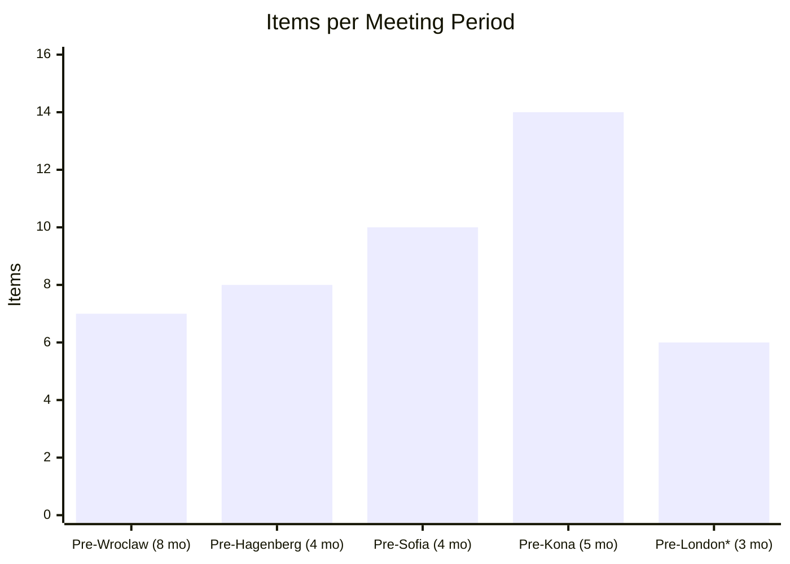
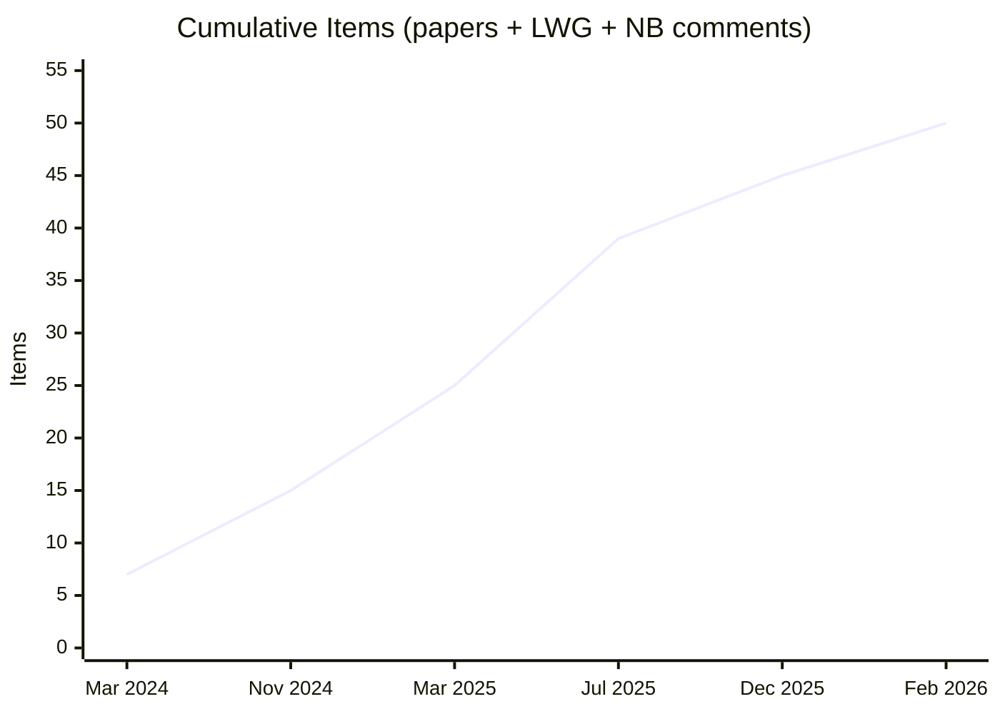
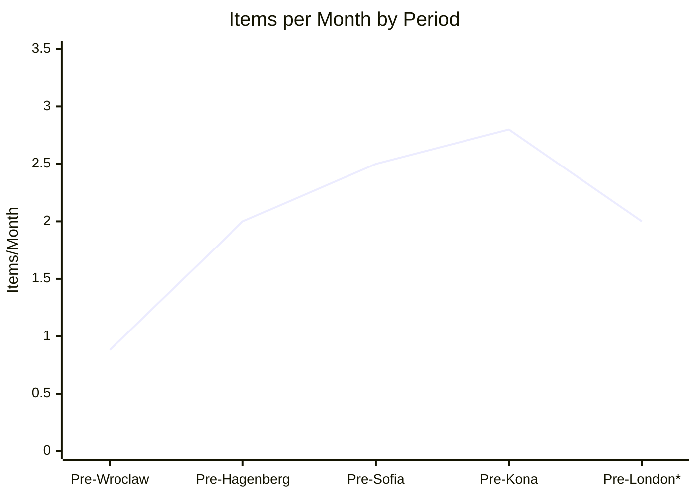

## Abstract

Since `std::execution` was approved for the C++26 working draft at Tokyo in March 2024, the committee has processed 34 papers, 11 LWG defects, and 5 national body comments - 50 items modifying a single feature in 22 months. The rate of change has accelerated over that period, not slowed. The subjects of these papers span removals, major design reworks, wording corrections, missing functionality, and safety defects including two Priority 1 issues. This paper presents a systematic survey of the published record - WG21 paper mailings, the LWG issues list, and national body ballot comments - and asks what the trajectory tells us about the feature's readiness for ABI freeze.

---

## 1. The Data

All data in this paper is gathered from the published [WG21 paper mailings](https://open-std.org/jtc1/sc22/wg21/docs/papers/), the [LWG issues list](https://cplusplus.github.io/LWG/lwg-toc.html), and the [C++26 national body ballot comments](https://github.com/cplusplus/nbballot). The survey identifies every WG21 paper, LWG issue, and NB comment that fixes, reworks, removes, or completes missing functionality in `std::execution` after its approval for C++26. Papers that extend the framework into new domains (networking, for example) are excluded.

### 1.1 Items by Meeting Period

The committee's work on `std::execution` falls naturally into five periods aligned with the plenary meetings since Tokyo:

| Period                          | Months | Removals | Reworks | Wording | Missing | LWG  | Total  |
|---------------------------------|:------:|:--------:|:-------:|:-------:|:-------:|:----:|:------:|
| Pre-Wroclaw (Mar-Oct 2024)      |    8   |    1     |    5    |    0    |    1    |  0   |     7  |
| Pre-Hagenberg (Nov 2024-Feb 25) |    4   |    1     |    0    |    2    |    2    |  3   |     8  |
| Pre-Sofia (Mar-Jun 2025)        |    4   |    0     |    2    |    0    |    7    |  1   |    10  |
| Pre-Kona (Jul-Nov 2025)         |    5   |    0     |    3    |    3    |    1    |  7   |    14  |
| Pre-London (Dec 2025-Feb 2026)  |    3   |    0     |    5    |    1    |    0    |  0   |     6  |
| **Total**                       | **24** |  **2**   | **15**  |  **6**  | **11**  |**11**| **45** |

Five NB comments on `task` allocator support and signal safety ([US 253](https://github.com/cplusplus/nbballot/issues/961), [US 254](https://github.com/cplusplus/nbballot/issues/960), [US 255](https://github.com/cplusplus/nbballot/issues/959), [US 261](https://github.com/cplusplus/nbballot/issues/966), and CH) bring the total to 50 items.

### 1.2 Items per Period

\* Pre-London period is incomplete (3 of ~6 months elapsed)

### 1.3 Cumulative Items Over Time

### 1.4 Rate of Change (Items per Month)

Normalizing by period duration reveals the acceleration:

| Period                          | Items | Months | Items/Month |
|---------------------------------|:-----:|:------:|:-----------:|
| Pre-Wroclaw (Mar-Oct 2024)      |     7 |      8 |        0.88 |
| Pre-Hagenberg (Nov 2024-Feb 25) |     8 |      4 |        2.00 |
| Pre-Sofia (Mar-Jun 2025)        |    10 |      4 |        2.50 |
| Pre-Kona (Jul-Nov 2025)         |    14 |      5 |        2.80 |
| Pre-London (Dec 2025-Feb 2026)  |     6 |      3 |        2.00 |

\* Pre-London period is incomplete

The rate rose steadily from 0.88 items/month to 2.80 items/month over the first four complete periods. The Pre-London period shows 2.00 items/month with the period only 3 months old and the London meeting still a month away. Prior periods accumulated the bulk of their items in the final months before the meeting deadline. The Pre-London rate is likely to increase: [D3980R0](https://isocpp.org/files/papers/D3980R0.html) alone addresses four outstanding NB comments with wording changes to `task`, and several of the papers listed here are still in progress and expected to produce revisions before London. The current rate already matches Pre-Hagenberg, and the period is far from complete.

---

## 2. What the Papers Address

The 50 items are not minor editorial fixes. They span every category of change:

### 2.1 Removals (2 items)

Two features were removed entirely after approval:

- `ensure_started` and `start_detached` - dynamically allocating with no allocator customization, breaking structured concurrency ([P3187R1](https://wg21.link/p3187r1))
- `split` - removed due to incorrect description and problematic semantics ([P3682R0](https://wg21.link/p3682r0))

### 2.2 Major Design Reworks (13 items)

Thirteen papers rework fundamental aspects of the approved design:

- `tag_invoke` replaced with member customization points ([P2855R1](https://wg21.link/p2855r1)) - a breaking API change
- Sender algorithm customization rewritten three times: [P2999R3](https://wg21.link/p2999r3), then [P3303R1](https://wg21.link/p3303r1) to fix missing wording from P2999, then [P3718R0](https://wg21.link/p3718r0) for further fixes, then [P3826R3](https://wg21.link/p3826r3) whose title evolved from "Defer...to C++29" to "Fix or Remove..." to "Fix..."
- The `on` algorithm renamed to `starts_on`, `transfer` renamed to `continues_on` because usage revealed a gap between expectations and behavior ([P3175R3](https://wg21.link/p3175r3))
- `get_completion_signatures` reworked from member function to static constexpr function template ([P3557R3](https://wg21.link/p3557r3))
- `task_scheduler` does not parallelize bulk work, requiring a new paper to fix ([P3927R0](https://wg21.link/p3927r0))
- `task`'s allocator model reworked to separate coroutine frame allocation from environment allocator propagation, changing allocator_arg position requirements, and pulling the allocator from the receiver's environment instead of storing it in the promise ([D3980R0](https://isocpp.org/files/papers/D3980R0.html)) - addresses four NB comments simultaneously
- Operation state lifetimes for `let_value`, `let_error`, and `let_stopped` reworked to reduce intermediate storage and align with synchronous lifetime semantics ([P3373R2](https://wg21.link/p3373r2))
- Scheduler affinity semantics for `affine_on` reworked - the algorithm's shape, default implementation, stop-token forwarding, and customization points all require redesign ([P3941R1](https://wg21.link/p3941r1))
- `return_value` and `return_void` mutual exclusion in coroutine promise types found to be incorrect ([P3950R0](https://wg21.link/p3950r0))

### 2.3 Missing Functionality (11 items)

Eleven papers add functionality that was absent from the approved design:

- `system_context` and `system_scheduler` - a basic execution context needed to run code at all ([P2079R10](https://wg21.link/p2079r10))
- `async_scope` - the abstraction needed for safe non-sequential concurrency, replacing the removed `ensure_started`/`start_detached` ([P3149R11](https://wg21.link/p3149r11))
- `task` - the coroutine type that users need to use the framework ([P3552R3](https://wg21.link/p3552r3)), adopted with 29 abstentions and 11 against (77-11-29)
- `prop` and `env` class templates for creating execution environments ([P3325R5](https://wg21.link/p3325r5))
- `write_env` and `unstoppable` sender adaptors ([P3284R4](https://wg21.link/p3284r4))
- Early diagnostics for sender expressions, moving diagnosis from connection time to construction time ([P3164R4](https://wg21.link/p3164r4))

### 2.4 LWG Defects (11 items)

Eleven LWG issues have been filed, including two at Priority 1:

- [**LWG 4368**](https://cplusplus.github.io/LWG/issue4368) (Priority 1): dangling-reference vulnerability in `transform_sender` - returns xvalue to a dead temporary, potential undefined behavior
- [**LWG 4206**](https://cplusplus.github.io/LWG/issue4206) (Priority 1): `connect_result_t` unconstrained, causing hard errors instead of SFINAE-friendly failures
- [**LWG 4215**](https://cplusplus.github.io/LWG/issue4215): `run_loop::finish` should be `noexcept` - throwing causes `sync_wait` to hang forever
- [**LWG 4190**](https://cplusplus.github.io/LWG/issue4190): `completion-signatures-for` specification is recursive - a circular dependency that cannot be satisfied
- [**LWG 4356**](https://cplusplus.github.io/LWG/issue4356): `connect()` should use `get_allocator(get_env(rcvr))` - directly relevant to the allocator sequencing gap

### 2.5 NB Comments (5 items)

Five national body comments target `std::execution`, four of which concern `task`'s allocator model and one of which identifies a safety defect in the framework:

- [**US 255-384**](https://github.com/cplusplus/nbballot/issues/959): Use allocator from receiver's environment - `task` should propagate the allocator from `get_allocator(get_env(rcvr))` rather than its own stored allocator
- [**US 253-386**](https://github.com/cplusplus/nbballot/issues/961): Allow use of arbitrary allocators for the coroutine frame - the constraint tying frame allocation to `allocator_type` is too rigid
- [**US 254-385**](https://github.com/cplusplus/nbballot/issues/960): Constrain `allocator_arg` argument position - the flexible position of `allocator_arg` is inconsistent with the rest of the standard library
- [**US 261-391**](https://github.com/cplusplus/nbballot/issues/966): Bad specification of parameter type - wording uses incorrect types in `task::promise_type` specification
- **CH (Switzerland)**: The C++26 CD ballot comment from Switzerland states that `std::execution` components "don't provide any mechanism to trigger such execution in a signal-safe way" and calls this "a serious defect" requiring resolution before publication

[D3980R0](https://isocpp.org/files/papers/D3980R0.html) addresses the first four comments with wording changes that rework `task`'s allocator model. The Kona discussion favored separating the coroutine frame allocator from the environment allocator, which required removing the `promise_type` constructor, eliminating the stored `alloc` member, and changing `get_env` to pull the allocator from the receiver. This is not a minor editorial adjustment - it changes the allocator propagation architecture of the coroutine task type adopted just six months earlier at Sofia.

---

## 3. Comparison with `<ranges>`

`<ranges>` is the closest precedent for a large library feature adopted into the standard. After its adoption for C++20, `<ranges>` accumulated roughly 30 LWG issues in its first two years, most at Priority 2-3.

`std::execution` has accumulated 11 LWG issues in less time, including two Priority 1 safety defects affecting core mechanisms (`connect` and `transform_sender`) that most sender/receiver programs exercise. The defect count may be comparable; the severity is not.

Beyond defects, `std::execution` has required 34 papers to fix, rework, or complete - a volume that `<ranges>` did not require in a comparable period.

---

## 4. The Churn Is Accelerating

The data supports three observations:

1. **The rate of change is increasing, not decreasing.** Items per month rose from 0.88 to 2.80 over the first four complete periods. The Pre-London period, only three months old and still a month from its meeting, already stands at 2.00 items/month - matching Pre-Hagenberg. With [D3980R0](https://isocpp.org/files/papers/D3980R0.html) addressing four NB comments, multiple in-progress papers expected to produce London revisions, and the meeting itself likely to generate new work, the final Pre-London rate will almost certainly exceed the current figure substantially. A feature approaching stability would show the opposite trend.

2. **The subjects are not converging.** Early periods focused on API reworks (replacing `tag_invoke`, renaming algorithms). Later periods introduced new categories: safety defects (Priority 1 LWG issues in mid-2025), allocator concerns (NB comments at Kona in late 2025), and task-type design changes ([D3980R0](https://isocpp.org/files/papers/D3980R0.html) in January 2026 changing the allocator model relative to the text adopted at Sofia in June 2025). The 2026-01 mailing added still more categories: operation state lifetime semantics ([P3373R2](https://wg21.link/p3373r2)), scheduler affinity redesign ([P3941R1](https://wg21.link/p3941r1)), and coroutine promise type correctness ([P3950R0](https://wg21.link/p3950r0)). Switzerland's CD ballot comment identifying signal-safety as "a serious defect" opens yet another front. The design surface under active modification is expanding, not contracting.

3. **The severity has not decreased.** The two Priority 1 defects - a dangling-reference vulnerability and an unconstrained alias causing hard errors - were filed in the Pre-Kona period, 16 months after approval. Priority 1 defects appearing more than a year after approval suggest that review has not yet reached the parts of the design where the most serious problems live. The [C++26 CD ballot](https://wg21.link/n5028) produced five NB comments targeting `std::execution`, including Switzerland's assessment that the framework has a "serious defect" in signal safety. The four US allocator comments required [D3980R0](https://isocpp.org/files/papers/D3980R0.html) to rework the allocator propagation architecture of `task` - the coroutine type adopted only six months prior.

---

## 5. What the Trajectory Implies

A feature that is ready for ABI freeze exhibits a recognizable pattern: the rate of change declines, the severity of discovered issues decreases, and the subjects of remaining work converge toward editorial polish. `std::execution` exhibits the opposite pattern on all three measures.

The question is not whether `std::execution` brings value - it does. The question is whether the committee is confident that the current API surface is stable enough to freeze. Fifty modifications in 22 months, with the rate showing no sign of decline, suggests the design has not yet reached that point.

The Pre-London period is particularly telling. Even before the London meeting, the 2026-01 mailing contained four new papers reworking execution semantics ([P3373R2](https://wg21.link/p3373r2), [P3941R1](https://wg21.link/p3941r1), [P3950R0](https://wg21.link/p3950r0), [D3980R0](https://isocpp.org/files/papers/D3980R0.html)), [D3980R0](https://isocpp.org/files/papers/D3980R0.html) alone addresses four outstanding NB comments with architectural changes to `task`'s allocator model, and [P3796R1](https://wg21.link/p3796r1) catalogues sixteen distinct open concerns about `task` spanning scheduler affinity, allocation, stop-token management, symmetric transfer, and operation lifetime. The London meeting will need to resolve these items. History suggests it will also discover new ones.

---

## 6. Conclusion

The evidence does not support the conclusion that `std::execution` has stabilized. The committee may wish to consider whether the current trajectory - accelerating churn, expanding scope of modifications, undiminished severity of discovered defects, and a growing backlog of unresolved NB comments - is consistent with freezing the ABI in C++26, or whether allowing more time for the design to converge would produce a stronger, more stable result.

---

## Appendix A - Complete Item Catalogue

The following tables list every item identified in the survey, organized by category.

### Removals

| Paper                                          | Title                                                   | Date       | Status  |
|------------------------------------------------|---------------------------------------------------------|------------|---------|
| [P3187R1](https://wg21.link/p3187r1)          | Remove `ensure_started` and `start_detached` from P2300 | 2024-10-15 | Adopted |
| [P3682R0](https://wg21.link/p3682r0)          | Remove `std::execution::split`                          | 2025-02-04 | Adopted |

### Major Design Reworks

| Paper                                          | Title                                                     | Date       | Status      |
|------------------------------------------------|-----------------------------------------------------------|------------|-------------|
| [P2855R1](https://wg21.link/p2855r1)          | Member customization points for Senders and Receivers     | 2024-03-18 | Adopted     |
| [P2999R3](https://wg21.link/p2999r3)          | Sender Algorithm Customization                            | 2024-04-16 | Adopted     |
| [P3303R1](https://wg21.link/p3303r1)          | Fixing Lazy Sender Algorithm Customization                | 2024-10-15 | Adopted     |
| [P3175R3](https://wg21.link/p3175r3)          | Reconsidering the `std::execution::on` algorithm          | 2024-10-15 | Adopted     |
| [P3557R3](https://wg21.link/p3557r3)          | High-Quality Sender Diagnostics with Constexpr Exceptions | 2025-06-10 | Adopted     |
| [P3570R2](https://wg21.link/p3570r2)          | Optional variants in sender/receiver                      | 2025-06-14 | Adopted     |
| [P3718R0](https://wg21.link/p3718r0)          | Fixing Lazy Sender Algorithm Customization, Again         | 2025-07-24 | In Progress |
| [P3826R3](https://wg21.link/p3826r3)          | Fix Sender Algorithm Customization                        | 2025-11-14 | In Progress |
| [P3927R0](https://wg21.link/p3927r0)          | `task_scheduler` Support for Parallel Bulk Execution      | 2026-01-15 | In Progress |
| [D3980R0](https://isocpp.org/files/papers/D3980R0.html) | Task's Allocator Use                             | 2026-01-25 | In Progress |
| [P3373R2](https://wg21.link/p3373r2)          | Of Operation States and Their Lifetimes                   | 2025-12-29 | In Progress |
| [P3941R1](https://wg21.link/p3941r1)          | Scheduler Affinity                                        | 2026-01-14 | In Progress |
| [P3950R0](https://wg21.link/p3950r0)          | `return_value` & `return_void` Are Not Mutually Exclusive | 2025-12-21 | In Progress |

### Wording Fixes

| Paper                                          | Title                                                      | Date       | Status      |
|------------------------------------------------|------------------------------------------------------------|------------|-------------|
| [P3396R1](https://wg21.link/p3396r1)          | `std::execution` wording fixes                             | 2024-11-22 | Adopted     |
| [P3388R3](https://wg21.link/p3388r3)          | When Do You Know `connect` Does Not Throw?                 | 2025-02-14 | Adopted     |
| [P3914R0](https://wg21.link/p3914r0)          | Assorted NB comment resolutions for Kona 2025              | 2025-11-07 | In Progress |
| [P3887R1](https://wg21.link/p3887r1)          | Make `when_all` a Ronseal Algorithm                        | 2025-11-07 | Adopted     |
| [P3940R0](https://wg21.link/p3940r0)          | Rename concept tags for C++26: `sender_t` to `sender_tag` | 2025-12-15 | In Progress |

### Missing Functionality

| Paper                                          | Title                                                        | Date       | Status      |
|------------------------------------------------|--------------------------------------------------------------|------------|-------------|
| [P3425R1](https://wg21.link/p3425r1)          | Reducing operation-state sizes for subobject child operations | 2024-11-19 | Approved    |
| [P3284R4](https://wg21.link/p3284r4)          | `write_env` and `unstoppable` Sender Adaptors                | 2025-02-14 | Adopted     |
| [P3685R0](https://wg21.link/p3685r0)          | Rename `async_scope_token`                                   | 2025-04-09 | Adopted     |
| [P3706R0](https://wg21.link/p3706r0)          | Rename `join` and `nest` in async scope proposal             | 2025-04-09 | Adopted     |
| [P3325R5](https://wg21.link/p3325r5)          | A Utility for Creating Execution Environments                | 2025-05-22 | Adopted     |
| [P2079R10](https://wg21.link/p2079r10)        | Parallel scheduler                                           | 2025-06-02 | Adopted     |
| [P3149R11](https://wg21.link/p3149r11)        | `async_scope`                                                | 2025-06-02 | Adopted     |
| [P3164R4](https://wg21.link/p3164r4)          | Early Diagnostics for Sender Expressions                     | 2025-06-02 | Adopted     |
| [P3552R3](https://wg21.link/p3552r3)          | Add a Coroutine Task Type                                    | 2025-06-20 | Adopted     |
| [P3815R1](https://wg21.link/p3815r1)          | Add `scope_association` concept to P3149                     | 2025-09-12 | Adopted     |

### Post-Adoption Issues

| Paper                                          | Title                                               | Date       | Status      |
|------------------------------------------------|-----------------------------------------------------|------------|-------------|
| [P3433R1](https://wg21.link/p3433r1)          | Allocator Support for Operation States              | 2024-10-17 | Adopted     |
| [P3481R5](https://wg21.link/p3481r5)          | `std::execution::bulk()` issues                     | 2024-10-17 | Adopted     |
| [P3796R1](https://wg21.link/p3796r1)          | Coroutine Task Issues                               | 2025-07-24 | In Progress |
| [P3801R0](https://wg21.link/p3801r0)          | Concerns about the design of `std::execution::task` | 2025-07-24 | In Progress |

### LWG Issues

| Issue                                                    | Title                                                            | Date       | Priority/Status   |
|----------------------------------------------------------|------------------------------------------------------------------|------------|-------------------|
| [LWG 4190](https://cplusplus.github.io/LWG/issue4190)   | `completion-signatures-for` specification is recursive           | 2025-01-02 | Open              |
| [LWG 4206](https://cplusplus.github.io/LWG/issue4206)   | `connect_result_t` should be constrained with `sender_to`        | 2025-02-04 | Open - Priority 1 |
| [LWG 4215](https://cplusplus.github.io/LWG/issue4215)   | `run_loop::finish` should be `noexcept`                          | 2025-02-13 | Open              |
| [LWG 4260](https://cplusplus.github.io/LWG/issue4260)   | Query objects must be default constructible                      | 2025-05-07 | Resolved          |
| [LWG 4355](https://cplusplus.github.io/LWG/issue4355)   | `connect-awaitable()` should mandate receiver completion-signals | 2025-08-27 | Open              |
| [LWG 4356](https://cplusplus.github.io/LWG/issue4356)   | `connect()` should use `get_allocator(get_env(rcvr))`            | 2025-08-27 | Open              |
| [LWG 4358](https://cplusplus.github.io/LWG/issue4358)   | `[exec.as.awaitable]` uses Preconditions when should be constraint | 2025-08-27 | Resolved        |
| [LWG 4360](https://cplusplus.github.io/LWG/issue4360)   | `awaitable-sender` concept should qualify `awaitable-receiver`   | 2025-08-27 | Resolved          |
| [LWG 4368](https://cplusplus.github.io/LWG/issue4368)   | Potential dangling reference from `transform_sender`             | 2025-08-31 | Open - Priority 1 |
| [LWG 4369](https://cplusplus.github.io/LWG/issue4369)   | `check-types` for `upon_error` and `upon_stopped` is wrong       | 2025-08-31 | Resolved          |
| [LWG 4336](https://cplusplus.github.io/LWG/issue4336)   | `bulk` vs. `task_scheduler`                                      | 2025-10-23 | Open              |

### NB Comments Targeting `std::execution`

| NB Comment                                                       | Title                                                                    | Status             |
|------------------------------------------------------------------|--------------------------------------------------------------------------|--------------------|
| [US 255-384](https://github.com/cplusplus/nbballot/issues/959)  | Use allocator from receiver's environment                                | Wording in D3980R0 |
| [US 253-386](https://github.com/cplusplus/nbballot/issues/961)  | Allow use of arbitrary allocators for coroutine frame                     | Wording in D3980R0 |
| [US 254-385](https://github.com/cplusplus/nbballot/issues/960)  | Constrain `allocator_arg` argument to be the first argument              | Wording in D3980R0 |
| [US 261-391](https://github.com/cplusplus/nbballot/issues/966)  | Bad specification of parameter type in `task::promise_type`              | Wording in D3980R0 |
| CH                                                               | Signal-safety defect: `std::execution` provides no signal-safe mechanism | Needs resolution   |

---

## References

- [P2079R10](https://wg21.link/p2079r10) Lee Howes. "Parallel scheduler." 2025-06-02.
- [P2855R1](https://wg21.link/p2855r1) Ville Voutilainen. "Member customization points for Senders and Receivers." 2024-03-18.
- [P2999R3](https://wg21.link/p2999r3) Eric Niebler. "Sender Algorithm Customization." 2024-04-16.
- [P3149R11](https://wg21.link/p3149r11) Ian Petersen, Jessica Wong, Kirk Shoop, et al. "async_scope." 2025-06-02.
- [P3164R4](https://wg21.link/p3164r4) Eric Niebler. "Early Diagnostics for Sender Expressions." 2025-06-02.
- [P3175R3](https://wg21.link/p3175r3) Eric Niebler. "Reconsidering the std::execution::on algorithm." 2024-10-15.
- [P3187R1](https://wg21.link/p3187r1) Lewis Baker, Eric Niebler. "Remove ensure_started and start_detached from P2300." 2024-10-15.
- [P3284R4](https://wg21.link/p3284r4) Eric Niebler. "write_env and unstoppable Sender Adaptors." 2025-02-14.
- [P3303R1](https://wg21.link/p3303r1) Eric Niebler. "Fixing Lazy Sender Algorithm Customization." 2024-10-15.
- [P3325R5](https://wg21.link/p3325r5) Eric Niebler. "A Utility for Creating Execution Environments." 2025-05-22.
- [P3373R2](https://wg21.link/p3373r2) Robert Leahy. "Of Operation States and Their Lifetimes." 2025-12-29.
- [P3388R3](https://wg21.link/p3388r3) Ville Voutilainen. "When Do You Know connect Doesn't Throw?" 2025-02-14.
- [P3396R1](https://wg21.link/p3396r1) Eric Niebler. "std::execution wording fixes." 2024-11-22.
- [P3425R1](https://wg21.link/p3425r1) Lewis Baker. "Reducing operation-state sizes for subobject child operations." 2024-11-19.
- [P3433R1](https://wg21.link/p3433r1) Dietmar Kuhl. "Allocator Support for Operation States." 2024-10-17.
- [P3481R5](https://wg21.link/p3481r5) Lucian Radu Teodorescu, Lewis Baker, Ruslan Arutyunyan. "std::execution::bulk() issues." 2024-10-17.
- [P3552R3](https://wg21.link/p3552r3) Dietmar Kuhl, Maikel Nadolski. "Add a Coroutine Task Type." 2025-06-20.
- [P3557R3](https://wg21.link/p3557r3) Eric Niebler. "High-Quality Sender Diagnostics with Constexpr Exceptions." 2025-06-10.
- [P3570R2](https://wg21.link/p3570r2) Lewis Baker. "Optional variants in sender/receiver." 2025-06-14.
- [P3682R0](https://wg21.link/p3682r0) Eric Niebler. "Remove std::execution::split." 2025-02-04.
- [P3685R0](https://wg21.link/p3685r0) Ian Petersen, Jessica Wong. "Rename async_scope_token." 2025-04-09.
- [P3706R0](https://wg21.link/p3706r0) Ian Petersen, Jessica Wong. "Rename join and nest in async scope proposal." 2025-04-09.
- [P3718R0](https://wg21.link/p3718r0) Eric Niebler. "Fixing Lazy Sender Algorithm Customization, Again." 2025-07-24.
- [P3796R1](https://wg21.link/p3796r1) Dietmar Kuhl. "Coroutine Task Issues." 2025-07-24.
- [P3801R0](https://wg21.link/p3801r0) Jonathan Wakely. "Concerns about the design of std::execution::task." 2025-07-24.
- [P3815R1](https://wg21.link/p3815r1) Jessica Wong, Ian Petersen. "Add scope_association concept to P3149." 2025-09-12.
- [P3826R3](https://wg21.link/p3826r3) Eric Niebler. "Fix Sender Algorithm Customization." 2025-11-14.
- [P3887R1](https://wg21.link/p3887r1) Robert Leahy. "Make when_all a Ronseal Algorithm." 2025-11-07.
- [P3914R0](https://wg21.link/p3914r0) Various. "Assorted NB comment resolutions for Kona 2025." 2025-11-07.
- [P3927R0](https://wg21.link/p3927r0) Eric Niebler. "task_scheduler Support for Parallel Bulk Execution." 2026-01-15.
- [P3940R0](https://wg21.link/p3940r0) Arthur O'Dwyer, Yi'an Ye. "Rename concept tags for C++26: sender_t to sender_tag." 2025-12-15.
- [P3941R1](https://wg21.link/p3941r1) Dietmar Kuhl. "Scheduler Affinity." 2026-01-14.
- [P3950R0](https://wg21.link/p3950r0) Robert Leahy. "return_value & return_void Are Not Mutually Exclusive." 2025-12-21.
- [D3980R0](https://isocpp.org/files/papers/D3980R0.html) Dietmar Kuhl. "Task's Allocator Use." 2026-01-25.
- [N5028](https://wg21.link/n5028) ISO/IEC JTC 1/SC 22. "Result of voting on ISO/IEC CD 14882." 2025-10-02.
