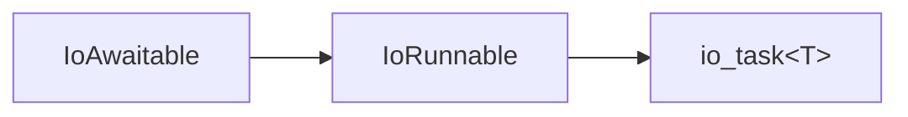
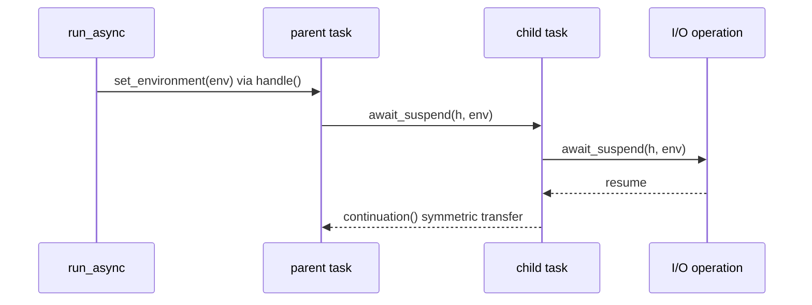
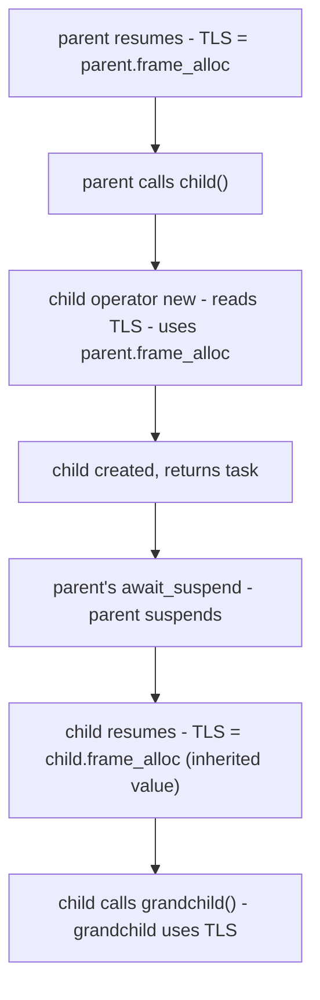

## Abstract

C++20 coroutines have five properties that, taken together, make them uniquely suited to asynchronous I/O: type erasure through `coroutine_handle<>`, customization through `promise_type`, stackless independently-resumable frames, symmetric transfer through `await_suspend`, and compiler-managed state that persists across suspension points. Each was designed for generality. Their conjunction yields something no single property suggests: the optimal basis for byte-oriented I/O.

We used C++20 coroutines directly for I/O - timers, sockets, DNS, TLS, HTTP - and observed what the language already provides. The protocol that emerged is the _IoAwaitable_: a system for associating a coroutine with an executor, stop token, and frame allocator, and propagating this context forward through a coroutine chain to the operating system API boundary where asynchronous operations are performed.

---

## Revision History

### R0: March 2026 (pre-Croydon mailing)

* Initial version.

---

## 1. Introduction

This paper is a research report drawn from working code: a complete coroutine-only networking library.

What we found surprised us in its simplicity. The protocol that emerged is small: two concepts, a type-erased executor, and a thread-local write-through cache that keeps frame allocator policy out of coroutine signatures - yet it is the foundation from which a complete networking stack can be built. We could not find anything to remove from it without losing function. Like the narrow abstractions that have succeeded in C++: iterators for traversal, RAII for resource lifetime, allocators for memory strategy, it captures one essential property and leaves everything else to the user. For readers interested in how this model relates to other execution frameworks, see [P4007R0](https://wg21.link/p4007r0) "Senders and Coroutines"<sup>[1]</sup> and [P4014R0](https://wg21.link/p4014r0) "The Sender Sub-Language"<sup>[2]</sup>.

Readers unfamiliar with event loops, completion handlers, and executor models may find the background in Appendix A helpful before proceeding.

### Priorities

We adopted three priorities:

1. **Correctness.** Invariants are enforced at compile time.

2. **Ergonomics.** User-facing interfaces stay clean.

3. **Performance.** We benchmarked at every step.

### What Matters

I/O applications share four requirements:

- **The application decides executor policy.** A read operation should not need to know about executor policy.

- **The application sends stop signals.** Stop signals propagate from the launch site to pending operations. The API builds on `std::stop_token`.

- **The application decides frame allocation.** The allocator is a property of the coroutine chain, not of the operation.

- **The execution context owns its I/O objects.** A socket knows its event loop. The call site does not.

---

## 2. Networking's Essentials

A socket read has **one implementation per platform**. The contract is specific: the coroutine suspends, a platform reactor performs the operation, and the coroutine resumes under the application's control.

The _IoAwaitable_ protocol defines this contract. The executor resumes the coroutine according to the application's policy. The stop token propagates cancellation. The frame allocator controls coroutine memory. Every executor is bound to an execution context that owns the platform reactor and its I/O objects. Completions are delivered through the context the socket is registered with - a coupling inherent to every platform: IOCP, epoll, kqueue, io_uring.

### 2.1 The Executor

An allocator controls where objects live. An executor controls how coroutines resume. A minimal executor needs two operations: `dispatch` for continuations that can run inline, and `post` for work that must be deferred. The distinction matters for correctness: inline execution while holding a lock can deadlock. `dispatch` uses symmetric transfer to avoid stack buildup. Section 4 defines the concept and its semantics.

### 2.2 The `stop_token`

The stop token propagates forward through the coroutine chain from the launch site to the I/O object:

```
http_client -> http_request -> write -> write_some -> socket
```

The I/O object cancels the pending operation through the platform primitive: `CancelIoEx` on Windows, `IORING_OP_ASYNC_CANCEL` on Linux, `close()` on POSIX. The operation completes with an error and the coroutine chain unwinds normally. Cancellation is cooperative.

### 2.3 The Frame Allocator

A *frame allocator* is a `memory_resource` used exclusively for coroutine frame allocation. Coroutine frames follow a narrow pattern: sizes repeat, lifetimes nest, and deallocation order mirrors allocation order. A frame allocator exploits this pattern.

Every `co_await` may spawn new frames. Recycling frame allocators cache recently freed frames for immediate reuse:

| Platform    | Frame Allocator  | Time (ms) | Speedup |
|-------------|------------------|----------:|--------:|
| MSVC        | Recycling        |   1265.2  |   3.10x |
| MSVC        | mimalloc         |   1622.2  |   2.42x |
| MSVC        | `std::allocator` |   3926.9  |       - |
| Apple clang | Recycling        |   2297.08 |   1.55x |
| Apple clang | `std::allocator` |   3565.49 |       - |

The mimalloc result is the critical comparison: a state-of-the-art general-purpose allocator with per-thread caches, yet the recycling frame allocator is 1.28x faster. Different deployments need different strategies - bounded pools, per-tenant budgets, allocation tracking - so the execution model must let the application choose. The frame allocator must be present at invocation time: `operator new` executes before the coroutine body. Section 5 examines the timing constraint and the solution.

### 2.4 Ergonomics

The executor, stop token, and frame allocator are infrastructure. They should be invisible to every coroutine except the launch site. When the developer needs control, the API should be obvious.

---

## 3. The Protocol: What Coroutines Need for I/O

The _IoAwaitable_ protocol is a pair of concepts layered on top of each other, working together to deliver what coroutines need for I/O correctness and performance:



> To help readers understand how these requirements fit together, this paper provides the `io_awaitable_promise_base` CRTP mixin (Section 7) as a non-normative reference implementation. It is not proposed for standardization - implementors may write their own machinery - but examining it clarifies how the protocol works in practice. The mixin also provides the `this_coro::environment` accessor, which allows coroutines to retrieve their bound context without suspending.

[Capy](https://github.com/cppalliance/capy)<sup>[5]</sup> implements the _IoAwaitable_ protocol. [Corosio](https://github.com/cppalliance/corosio)<sup>[6]</sup>, built on Capy, provides sockets, timers, TLS, and DNS resolution on multiple platforms. Both libraries are in active use. The code examples in this paper are drawn from them.

### 3.1 _IoAwaitable_

The _IoAwaitable_ concept propagates execution context **forward** from caller to callee at every suspension point. The context is three things a coroutine needs for I/O: the executor, the stop token, and the frame allocator. The entire protocol is captured in one struct and one concept:

```cpp
struct io_env
{
    executor_ref executor;
    std::stop_token stop_token;
    std::pmr::memory_resource* frame_allocator = nullptr;
};

template< typename A >
concept IoAwaitable =
    requires(
        A a, std::coroutine_handle<> h, io_env const* env )
    {
        a.await_suspend( h, env );
    };
```

What makes this work is the two-argument `await_suspend`. The caller's `await_transform` injects the environment as just an extra pointer parameter - no templates, no type leakage. `task<T>` remains `task<T>`, not `task<T, Environment>`. The environment is passed as a pointer, not by value, for two reasons: the launch function - the function that starts the coroutine chain - owns the `io_env` and every coroutine in the chain borrows it, so pointer semantics make the ownership model explicit; and copying an `io_env` is never the right choice, so the API makes it difficult to do accidentally. The frame allocator is part of the environment and propagates to coroutine frame allocation via a thread-local write-through cache, ensuring it is available before the frame is created (Section 5 covers the mechanism).

#### Satisfying _IoAwaitable_

Any type that can be `co_await`ed within the protocol must:

1. Implement `await_suspend(std::coroutine_handle<> cont, io_env const* env)`
2. Store the environment by pointer (never by copy); the pointed-to `io_env` is guaranteed to outlive the awaitable
3. Return `std::coroutine_handle<>` for symmetric transfer (or `void`/`bool` per standard rules)
4. Implement `await_ready()` and `await_resume()` per standard awaitable requirements

**Example implementation:**

```cpp
template< typename T >
struct my_awaitable
{
    io_env const* env_ = nullptr;
    std::coroutine_handle<> cont_ = {};
    T result_;

    bool await_ready() const noexcept { return false; }

    // This signature satisfies IoAwaitable
    std::coroutine_handle<> await_suspend( std::coroutine_handle<> cont, io_env const* env )
    {
        cont_ = cont;
        env_ = env;
        start_async_operation( &result_ );
        return std::noop_coroutine();
    }

    T await_resume() { return result_; }
};
```

#### Compile-Time Protocol Checking

The two-argument `await_suspend` signature is not just an implementation detail - it is a deliberate design choice for correctness. When a compliant coroutine's `await_transform` calls the two-argument `await_suspend`, a non-compliant awaitable (lacking this signature) produces a compile error. Similarly, a compliant awaitable awaited from a non-compliant coroutine fails to compile. Both sides of every suspension point are statically verified:

```cpp
template<typename A>
auto await_transform(A&& a) {
    static_assert(IoAwaitable<A>,
        "Awaitable does not satisfy IoAwaitable; "
        "await_suspend(std::coroutine_handle<>, io_env const*) is required");
    // Return wrapper that forwards to: a.await_suspend(h, environment())
    ...
}
```

This is also an interoperability feature. In a world with multiple coexisting async models, a coroutine that accidentally `co_await`s across model boundaries should fail at compile time, not silently misbehave at runtime. The two-argument signature makes each boundary explicit and verifiable.

An alternative design would place the environment in the promise type and let `await_suspend` discover it by templating on the promise:

```cpp
template<typename Promise>
auto await_suspend(std::coroutine_handle<Promise> h) {
    auto& env = h.promise().get_env();
    // ...
}
```

This has a timing problem. The caller's `await_transform` sees the awaitable's type but not the promise that will eventually resolve `await_suspend`. A non-compliant awaitable with a standard one-argument signature compiles and runs - it simply never receives the environment. Protocol mismatches become silent runtime errors. The two-argument signature makes participation verifiable at the point where the caller can still reject the awaitable.

#### The Lifetime Invariant

The launch function owns the `io_env`. The pointer to it is stable for the lifetime of the entire coroutine chain - every coroutine, from parent to grandchild, borrows the same instance. No coroutine copies, moves, or reallocates the environment. When a launch function like `run` creates a new chain with a different executor, it creates a new `io_env`, cleanly breaking the old chain and establishing a new one.

### 3.2 _IoRunnable_

The _IoRunnable_ concept refines _IoAwaitable_ with the interface needed by launch functions. `run_async` starts a coroutine chain from non-coroutine code - `main()`, a callback, an event handler. `run` is used within a coroutine to bind a child task to a different executor or customize context. Both need to manage the task's lifetime, resume it, and extract results or exceptions after completion - operations that `co_await` handles natively but that launch functions must perform manually.

```cpp
template<typename T>
concept IoRunnable =
    IoAwaitable<T> &&
    requires { typename T::promise_type; } &&
    requires( T& t, T const& ct,
              typename T::promise_type const& cp,
              typename T::promise_type& p )
    {
        { ct.handle() } noexcept
            -> std::same_as< std::coroutine_handle< typename T::promise_type> >;
        { cp.exception() } noexcept -> std::same_as< std::exception_ptr >;
        { t.release() } noexcept;
        { p.set_continuation( std::coroutine_handle<>{} ) } noexcept;
        { p.set_environment( static_cast<io_env const*>(nullptr) ) } noexcept;
    } &&
    ( std::is_void_v< decltype(std::declval<T&>().await_resume()) > ||
      requires( typename T::promise_type& p ) {
          p.result();
      });
```

**Why _IoRunnable_ exists.** Within a coroutine chain, _IoAwaitable_ alone is sufficient - a parent `co_await`s a child, and the compiler handles lifetime, result extraction, and exception propagation natively. But launch functions like `run_async` cannot `co_await` the task. The `run_async` trampoline must be allocated _before_ the task (C++17 evaluation order guarantees this for LIFO allocation ordering with the recycling frame allocator), so the trampoline exists before the task type is known. It cannot be templated on the task type. Instead, the trampoline type-erases the task, reaching into the promise after the fact to extract results. That requires a common API on every conforming task:

- **`handle()`** - Returns the typed coroutine handle. The launch function needs it to start the coroutine and access the promise for type-erased result extraction.
- **`release()`** - Transfers frame ownership. The task object normally destroys the coroutine frame in its destructor. The launch function takes over lifetime management; `release()` tells the task not to destroy the frame.
- **`exception()`** - Returns any stored `std::exception_ptr` after the task completes. The trampoline calls this through a type-erased function pointer.
- **`result()`** - Returns the stored value (non-void tasks only). Same type-erased access pattern.

Launch functions inject context into the promise via `set_continuation` and `set_environment`, both required by the _IoRunnable_ concept. The promise's `await_transform` then propagates context to child awaitables automatically.



- **`run_async`** is the root of a coroutine chain, launching from non-coroutine code
- **`run`** performs executor hopping from within coroutine code, binding a child task to a different executor

Because launch functions are constrained on the concept rather than a concrete type, they work with any conforming task:

```cpp
// Two-phase invocation: f(context)(task)
// Phase 1 returns a wrapper; Phase 2 accepts any IoRunnable

template< Executor Ex, class... Args >
unspecified run_async( Ex ex, Args&&... args );
// run_async(ex)(my_task())   - wrapper::operator()(IoRunnable auto task)

template< Executor Ex, class... Args >
unspecified run( Ex ex, Args&&... args );
// co_await run(ex)(my_task())   - wrapper::operator()(IoRunnable auto task)
```

This decoupling enables library authors to write launch utilities that work with any conforming task type, and users to define custom task types that integrate seamlessly with existing launchers.

#### Satisfying IoRunnable

**Additional requirements (beyond _IoAwaitable_):**

1. Define a nested `promise_type`
2. The task must provide `handle()` returning `std::coroutine_handle<promise_type>` (must be `noexcept`)
3. The task must provide `release()` to transfer ownership without destroying the frame (must be `noexcept`)
4. The promise must provide `exception()` returning any stored `std::exception_ptr` (must be `noexcept`)
5. For non-void tasks, the promise must provide `result()` returning the stored value
6. The promise's `await_transform` must intercept child awaitables and inject context
7. Support `operator new` overloads for frame allocator propagation (read TLS)

**Example implementation:**

```cpp
template<typename T>
struct task
{
    struct promise_type : io_awaitable_promise_base<promise_type>
    {
        std::exception_ptr ep_;
        std::optional<T> result_;

        std::exception_ptr exception() const noexcept { return ep_; }
        T&& result() noexcept { return std::move(*result_); }
    };

    std::coroutine_handle<promise_type> h_;

    bool await_ready() const noexcept { return false; }
    T await_resume() { return h_.promise().result(); }

    // Satisfies IoAwaitable
    std::coroutine_handle<> await_suspend( std::coroutine_handle<> cont, io_env const* env )
    {
        h_.promise().set_continuation( cont );
        h_.promise().set_environment( env );
        return h_;
    }

    // Satisfies IoRunnable
    std::coroutine_handle<promise_type> handle() const noexcept { return h_; }
    void release() noexcept { h_ = nullptr; }
};
```

The `handle()` method provides access to the typed coroutine handle, allowing launch functions to resume the coroutine and access the promise. The `release()` method transfers ownership - after calling it, the task wrapper no longer destroys the frame, leaving lifetime management to the launch function.

For `task<void>`, the `result()` method is not required since there is no value to retrieve. The concept uses a disjunction to handle this:

```cpp
( std::is_void_v< decltype(std::declval<T&>().await_resume()) > ||
  requires( typename T::promise_type& p ) { p.result(); } );
```

> **Non-normative note.** The `io_awaitable_promise_base` CRTP mixin (Section 7) provides the promise-internal machinery (context storage, continuation management, awaitable transformation) as a convenience. It is not proposed for standardization - implementors may write their own. The `handle()` and `release()` methods are task-specific and not part of the mixin.

### 3.3 `executor_ref`

The `executor_ref` type is the mechanism that makes `io_env` concrete rather than templated. It is a type-erasing wrapper that stores any executor satisfying the _Executor_ concept as two pointers: a `void const*` pointing to the actual executor object, and a pointer to a vtable of function pointers:

```cpp
class executor_ref
{
    void const* ex_ = nullptr;
    detail::executor_vtable const* vt_ = nullptr;

public:
    template<Executor E>
    executor_ref(E const& e) noexcept
        : ex_(&e), vt_(&detail::vtable_for<E>) {}

    std::coroutine_handle<> dispatch(std::coroutine_handle<> h) const;
    void post(std::coroutine_handle<> h) const;
    execution_context& context() const noexcept;
    // ...
};
```

The vtable contains function pointers for each executor operation - `dispatch`, `post`, `context`, work tracking, and comparison. When `executor_ref` is constructed from a typed executor, the compiler generates a vtable for that executor type. Calls through `executor_ref` incur one pointer indirection - roughly 1-2 nanoseconds <sup>[7]</sup> - which is negligible for I/O operations that take 10,000+ nanoseconds.

The `dispatch` member returns a `coroutine_handle<>` for symmetric transfer: if the caller is already in the executor's context, it returns the handle directly for immediate resumption. Otherwise it posts the handle to the executor's queue and returns `noop_coroutine()`. This enables zero-overhead resumption in the common case where the coroutine is already on the right thread.

At just two pointers, `executor_ref` copies cheaply and stores naturally inside `io_env`. Launch functions preserve a copy of the user's typed _Executor_ in their own coroutine frame. The `executor_ref` holds a pointer to that stored value. As the wrapper propagates through the call chain, the original executor remains valid - it cannot go out of scope until all coroutines in the chain are destroyed.

Coroutines can access their context directly using `this_coro::environment`. This never suspends - it returns immediately with the stored environment:

```cpp
task<void> cancellable_work()
{
    auto env = co_await this_coro::environment;  // never suspends
    
    for (int i = 0; i < 1000; ++i)
    {
        if (env->stop_token.stop_requested())
            co_return;  // Exit gracefully on cancellation
        co_await process_chunk(env->executor, i);
    }
}
```

### 3.4 How Does a Coroutine Start?

Two basic functions are needed to launch coroutine chains, and authors can define their own custom launch functions to suit their needs.

**`run_async`** - launch from callbacks, main(), event handlers, top level of a coroutine chain.

This uses a two-call syntax where the first call captures context and returns a wrapper. The executor parameter is required. The remaining parameters are optional:

* `std::stop_token` to propagate cancellation signals
* `alloc` frame allocator used to allocate **all** frames in the coroutine chain
* `h1`, invoked with the task's value at final suspend
* `h2`, invoked with `std::exception_ptr` on exception

```cpp
// Basic: executor only
run_async( ex )( my_task() );

// Full: executor, stop_token, frame allocator, success handler, error handler
run_async( ex, st, alloc, h1, h2 )( my_task() );

// Example with handlers
run_async( ioc.get_executor(), source.get_token(),
    [](int result) { std::cout << "Got: " << result << "\n"; },
    [](std::exception_ptr ep) { /* handle error */ }
)( compute_value() );
```

While the syntax is unfortunate, it is _the only way_ given the timing constraints of frame allocation. Still, it is better than callback hell. What makes this possible is a small but consequential change in C++17: guaranteed evaluation order for postfix expressions. The standard now specifies:

> "The postfix-expression is sequenced before each expression in the expression-list and any default argument."  - [expr.call]

In `run_async(ex)(my_task())`, the outer postfix-expression `run_async(ex)` is fully evaluated - returning a wrapper that allocates the trampoline coroutine - before `my_task()` is invoked. This guarantees LIFO destruction order: the trampoline is allocated BEFORE the task and serves as the task's continuation.

**`run`** - switching executors or customizing context within coroutines.

This binds a child task to a different executor while returning to the caller's executor on completion. Like `run_async`, it uses the two-call syntax to ensure proper allocation ordering:

```cpp
task<void> parent()
{
    // Child runs on worker_ex, but completion returns here
    int result = co_await run( worker_ex )( compute_on_worker() );
}
```

The executor is stored by value in the awaitable's frame, keeping it alive for the operation's duration. Additionally, `run` provides overloads without an executor parameter that inherit the caller's executor while customizing stop_token or frame allocator:

```cpp
task<void> cancellable()
{
    std::stop_source source;
    // Child inherits caller's executor, but uses a different stop_token
    co_await run( source.get_token() )( subtask() );
}
```

### 3.5 Implementing a Launcher

A launch function (e.g., `run_async`, `run`) bridges non-coroutine code into the coroutine world or performs executor hopping within a coroutine chain. Launch functions are constrained on _IoRunnable_ to work with any conforming task type:

```cpp
template<Executor Ex, class... Args>
unspecified run_async( Ex ex, Args&&... args );  // returns wrapper, caller invokes with task

template<Executor Ex, class... Args>
unspecified run( Ex ex, Args&&... args );        // returns wrapper for co_await
```

**Requirements:**

1. Accept or provide an executor
2. Accept or default a stop token
3. Set thread-local frame allocator before invoking the child coroutine
4. Bootstrap context via `set_environment` on the promise
5. Manage the task lifetime via `handle()` and `release()`
6. Handle completion via `exception()` and `result()` on the promise

**Example implementation sketch:**

```cpp
template<Executor Ex, IoRunnable Task>
void run_async( Ex ex, std::stop_token token, Task task )
{   // caller responsible for extending lifetime
    auto& promise = task.handle().promise();

    // Bootstrap context directly into the promise
    promise.set_environment( io_env{ex, token} );
    promise.set_continuation( /* trampoline handle */ );

    // Transfer ownership and start execution
    task.release();
    ex.post( task.handle() );
}
```

> **Non-normative note.** This simplified example has the frame allocator ordering problem described in Section 5.1: the task's frame is allocated before `run_async` is called, so any thread-local frame allocator setup would arrive too late. A correct implementation uses the two-call syntax shown in Section 3.4 - `run_async(ex)(my_task())` - where the first call returns a wrapper that sets up the frame allocator before the task expression is evaluated. A complete implementation is beyond the scope of this example.

Because launch functions are constrained on the concept rather than a concrete type, they work with any conforming task implementation. This decoupling enables library authors to write launch utilities that interoperate with user-defined task types.

---

## 4. Executor concept

**Terminology note.** We use the term _Executor_ intentionally. An executor controls how coroutines resume: `dispatch` for inline continuations via symmetric transfer, `post` for deferred execution. The concept is tailored to I/O's requirements: strand serialization, I/O completion contexts, and thread affinity. This terminology honors Christopher Kohlhoff's executor model in [Boost.Asio](https://www.boost.org/doc/libs/release/doc/html/boost_asio.html)<sup>[3]</sup>, which established the foundation for modern C++ asynchronous I/O.

```cpp
template<class E>
concept Executor =
    std::is_nothrow_copy_constructible_v<E> &&
    std::is_nothrow_move_constructible_v<E> &&
    requires( E& e, E const& ce, E const& ce2, std::coroutine_handle<> h ) {
        { ce == ce2 } noexcept -> std::convertible_to<bool>;
        { ce.context() } noexcept;
        requires std::is_lvalue_reference_v<decltype(ce.context())> &&
            std::derived_from<
                std::remove_reference_t<decltype(ce.context())>,
                execution_context>;
        { ce.on_work_started() } noexcept;
        { ce.on_work_finished() } noexcept;

        // Work submission
        { ce.dispatch( h ) } -> std::same_as< std::coroutine_handle<> >;
        { ce.post(h) };
    };
```

Executors are lightweight, copyable handles to execution contexts. Users often provide custom executor types tailored to application needs - priority scheduling, per-connection strand serialization, or specialized logging and instrumentation. An execution model must respect these customizations. It must also support executor composition: wrapping one executor with another. The `strand` we provide, for example, wraps an I/O context's executor to add serialization guarantees without changing the underlying dispatch mechanism.

C++20 coroutines provide type erasure *by construction* - but not through the handle type. `std::coroutine_handle<void>` and `std::coroutine_handle<promise_type>` are both just pointers with identical overhead. The erasure that matters is *structural*:

1. **The frame is opaque**: Callers see only a handle, not the promise's layout
2. **The return type is uniform**: All coroutines returning `task` have the same type, regardless of body
3. **Suspension points are hidden**: The caller does not know where the coroutine may suspend

This structural erasure is often lamented as overhead, but it is an opportunity. In this model, executor type-erasure happens late; only after the API has locked in the executor choice. Executor types are fully preserved at call sites even though they are type-erased internally. This enables zero-overhead composition at the API boundary while maintaining uniform internal representation.

### 4.1 Dispatch

Every coroutine resumption must go through either symmetric transfer or the scheduler queue - never through an inline `resume()` or `dispatch()` that creates a frame below the resumed coroutine.

`dispatch` returns a `std::coroutine_handle<>` for symmetric transfer. If the caller is already in the executor's context, `dispatch` returns the handle directly. Otherwise, the handle is posted to the scheduler queue and `std::noop_coroutine()` is returned. The caller never calls `resume()` on the handle inside `dispatch` - the returned handle is used by the caller for symmetric transfer from `await_suspend`, or called with `.resume()` at the event loop pump level.

Unlike general-purpose executors that accept templated callables, `dispatch` takes only `std::coroutine_handle<>` - this is a coroutine-only model. A coroutine handle is a simple pointer: no allocation, no type erasure overhead, no virtual dispatch.

Ordinary users writing coroutine tasks do not interact with `dispatch` and `post` directly. These operations are used by authors of coroutine machinery - `promise_type` implementations, awaitables, `await_transform` - to implement asynchronous algorithms such as `when_all`, `when_any`, `async_mutex`, channels, and similar primitives.

Some contexts prohibit inline execution. A strand currently executing work cannot dispatch inline without breaking serialization - `dispatch` then behaves like `post`, queuing unconditionally and returning `std::noop_coroutine()`.

### 4.2 Post

`post` queues work for later execution. Unlike `dispatch`, it never executes inline - the work item is always enqueued, and `post` returns immediately.

Use `post` for:
- **New work** that is not a continuation of the current operation
- **Breaking call chains** to bound stack depth
- **Safety under locks** - posting while holding a mutex avoids deadlock risk from inline execution

### 4.3 The `execution_context`

An executor's `context()` function returns a reference to the `execution_context`, the proposed base class for any object that runs work (often containing the platform reactor or event loop). I/O objects coordinate global state here. Implementations install services - singletons with well-defined shutdown and destruction ordering for safe resource release. This design borrows heavily from [Boost.Asio](https://www.boost.org/doc/libs/release/doc/html/boost_asio.html)<sup>[3]</sup>.

```cpp
class execution_context
{
public:
    class service
    {
    public:
        virtual ~service() = default;
    protected:
        service() = default;
        virtual void shutdown() = 0;
    };

    execution_context( execution_context const& ) = delete;
    execution_context& operator=( execution_context const& ) = delete;
    ~execution_context();
    execution_context();

    template<class T> bool has_service() const noexcept;
    template<class T> T* find_service() const noexcept;
    template<class T> T& use_service();
    template<class T, class... Args> T& make_service( Args&&... args );

    std::pmr::memory_resource* get_frame_allocator() const noexcept;

    void set_frame_allocator( std::pmr::memory_resource* mr ) noexcept;

    template<class Allocator>
        requires (!std::is_pointer_v<Allocator>)
    void set_frame_allocator( Allocator const& a );

protected:
    void shutdown() noexcept;
    void destroy() noexcept;
};
```

Derived classes can provide:
- **Platform reactor**: epoll, IOCP, io_uring, or kqueue integration
- **Supporting singletons**: Timer queues, resolver services, signal handlers
- **Orderly shutdown**: `stop()` and `join()` for graceful termination
- **Work tracking**: `on_work_started()` / `on_work_finished()` for run-until-idle semantics
- **Threads**: for example `thread_pool`.

I/O objects hold a reference to their execution context, and do not have an associated executor. A socket needs the context to register with the reactor; the executor alone cannot provide this.

#### Frame Allocator

The `execution_context` provides `set_frame_allocator` and `get_frame_allocator` as customization points for launchers when no frame allocator is specified at the launch site. Since every launcher requires an _Executor_, the execution context naturally coordinates frame allocation policy. The default frame allocator can optimize for speed using recycling with thread-local pools, or for economy on constrained platforms. Using `std::pmr::memory_resource*` allows implementations to change the default without breaking ABI. Applications can set a policy once via `set_frame_allocator`, and all coroutines launched with the default will use it - including those in foreign libraries, without propagating allocator template parameters or recompiling.

### 4.4 _ExecutionContext_ Concept

While `execution_context` serves as a base class for contexts that manage I/O objects and services, concrete execution contexts that can launch coroutines must also provide an associated executor. The `ExecutionContext` concept captures this requirement: a type must derive from `execution_context`, expose an `executor_type` that satisfies `Executor`, and provide `get_executor()` to obtain an executor bound to the context.

```cpp
template<class X>
concept ExecutionContext =
    std::derived_from<X, execution_context> &&
    requires(X& x) {
        typename X::executor_type;
        requires Executor<typename X::executor_type>;
        { x.get_executor() } noexcept -> std::same_as<typename X::executor_type>;
    };
```

The concept formalizes the relationship between execution contexts and their executors. Types like `io_context` and `thread_pool` satisfy `ExecutionContext` - they derive from `execution_context` for service management, and they provide executors for dispatching coroutines:

```cpp
io_context ioc;
auto ex = ioc.get_executor();  // io_context::executor_type
run_async(ex)(my_task());      // Launch coroutine on this context
```

The destructor semantics are also significant: when an `ExecutionContext` is destroyed, all unexecuted function objects that were submitted via an associated executor are also destroyed. This ensures orderly cleanup - work queued but not yet executed does not leak or outlive its context.

---

## 5. The Frame Allocator

Achieving high performance levels with coroutines demands frame allocator customization, yet frame allocator propagation presents a unique challenge. Unlike executors and stop tokens, which can be injected at suspension points via `await_transform`, the frame allocator must be available *before* the coroutine frame exists. This section examines why standard approaches fail and presents our solution.

### 5.1 The Timing Constraint

Coroutine frame allocation has a fundamental timing constraint: `operator new` executes before the coroutine body. When a coroutine is called, the compiler allocates the frame first, then begins execution. Any mechanism that injects context later - `await_transform`, explicit method calls, post-construction configuration - arrives too late.

```cpp
auto t = my_coro(sock);  // operator new called HERE
co_await t;              // await_transform kicks in HERE (too late)

spawn( my_coro(sock) );  // my_coro(sock) evaluated BEFORE calling spawn (too late)
```

### 5.2 The Awkward Approach

C++ provides exactly one hook at the right time: **`promise_type::operator new`**. The compiler passes coroutine arguments directly to this overload, allowing the promise to inspect parameters and select a frame allocator. The standard pattern uses `std::allocator_arg_t` as a tag to mark the allocator parameter:

```cpp
// Free function: frame allocator intrudes on the parameter list
task<int> fetch_data( std::allocator_arg_t, MyAllocator alloc,
                      socket& sock, buffer& buf ) { ... }

// Member function: same intrusion
task<void> Connection::process( std::allocator_arg_t, MyAllocator alloc,
                                request const& req) { ... }
```

The promise type must provide multiple `operator new` overloads to handle both cases:

```cpp
struct promise_type {
    // For free functions
    template< typename Alloc, typename... Args >
    static void* operator new( std::size_t sz,
        std::allocator_arg_t, Alloc& a, Args&&...) {
        return a.allocate(sz);
    }

    // For member functions (this is first arg)
    template< typename T, typename Alloc, typename... Args >
    static void* operator new( std::size_t sz,
        T&, std::allocator_arg_t, Alloc& a, Args&&...) {
        return a.allocate(sz);
    }
};
```

This approach works, but it violates encapsulation. The coroutine's parameter list - which should describe the algorithm's interface - is polluted with frame allocation machinery unrelated to its purpose. A function that fetches data from a socket should not need to know or care about memory policy. Worse, every coroutine in a call chain must thread the frame allocator through its signature, even if it never uses it directly. The frame allocator becomes viral, infecting interfaces throughout the codebase.

To make this concrete, consider a real HTTP route handler as written with _IoAwaitable_:

```cpp
// IoAwaitable: clean interface describes only the algorithm
route_task https_redirect(route_params& rp)
{
    std::string url = "https://";
    url += rp.req.at(field::host);
    url += rp.url.encoded_path();
    rp.status(status::found);
    rp.res.set(field::location, url);
    auto [ec] = co_await rp.send("redirect");
    if (ec)
        co_return route_error(ec);
    co_return route_done;
}
```

Now consider the same handler under the `allocator_arg_t` approach. The frame allocator must appear in the parameter list, and every coroutine the handler calls must also accept it:

```cpp
// allocator_arg_t: allocation machinery intrudes on every signature
route_task https_redirect(std::allocator_arg_t, Alloc alloc,
                          route_params& rp)
{
    std::string url = "https://";
    url += rp.req.at(field::host);
    url += rp.url.encoded_path();
    rp.status(status::found);
    rp.res.set(field::location, url);
    auto [ec] = co_await rp.send(std::allocator_arg, alloc, "redirect");
    if (ec)
        co_return route_error(ec);
    co_return route_done;
}
```

The handler's *purpose* is identical. The frame allocator adds nothing to its logic - it is a cross-cutting concern being threaded through the interface. The pollution compounds through a call chain. Consider a handler that calls two sub-coroutines:

```cpp
// IoAwaitable: the chain is clean
route_task handle_upload(route_params& rp)
{
    auto meta = co_await parse_metadata(rp);
    co_await store_file(meta, rp);
    auto [ec] = co_await rp.send("OK");
    if (ec) co_return route_error(ec);
    co_return route_done;
}
```

```cpp
// allocator_arg_t: every level in the chain carries the frame allocator
route_task handle_upload(std::allocator_arg_t, Alloc alloc,
                         route_params& rp)
{
    auto meta = co_await parse_metadata(std::allocator_arg, alloc, rp);
    co_await store_file(std::allocator_arg, alloc, meta, rp);
    auto [ec] = co_await rp.send(std::allocator_arg, alloc, "OK");
    if (ec) co_return route_error(ec);
    co_return route_done;
}
```

Every `co_await` in the chain must forward the frame allocator. Every function in the chain must accept it. `parse_metadata` and `store_file` must thread it through to their own sub-coroutines, and so on down. In a real server with dozens of route handlers, each calling several sub-coroutines, every author of every handler must remember to pass the frame allocator at every call site. This is the opposite of ergonomic.

Containers in the standard library accept allocators because they are written once by experts and used many times. Coroutine handlers are the reverse: they are written by application developers, often in large numbers, for specific business logic. Burdening every handler with frame allocation plumbing is a significant ergonomic cost.

### 5.3 Our Solution: Thread-Local Propagation

Thread-local propagation is the only approach that maintains clean interfaces while respecting the timing constraint. The premise is simple: **frame allocator customization happens at launch sites**, not within coroutine algorithms. Functions like `run_async` and `run` accept frame allocator parameters because they represent application policy decisions. Coroutine algorithms do not need to "allocator-hop" - they simply inherit whatever frame allocator the application has established.

The approach:

1. **Receive the frame allocator at launch time.** The launch site (`run_async`, `run`) accepts a fully-typed _Allocator_ parameter, or a `std::pmr::memory_resource*` at the caller's discretion.

2. **Type-erase it.** Typed allocators are stored as `std::pmr::memory_resource*`, providing a uniform interface for all downstream coroutines.

3. **Maintain lifetime via frame extension.** The frame allocator lives in the launch coroutine's frame. Because coroutine parameter lifetimes extend until final suspension, the frame allocator remains valid for the entire operation chain.

4. **Propagate through thread-locals.** Before any child coroutine is invoked, the current frame allocator is set in TLS. The child's `promise_type::operator new` reads it. TLS serves as a delivery mechanism, not the source of truth. The canonical frame allocator resides in `io_env`, a heap-stable structure owned by the launch coroutine's frame. Every resume point restores TLS from `io_env`, making TLS a write-through cache that is always repopulated before it is read. This is an example implementation (non-normative):

```cpp
// Global accessors for the current frame allocator.
// An implementation using thread_local might look like this:
//
//   namespace detail {
//   inline std::pmr::memory_resource*&
//   current_frame_allocator_ref() noexcept {
//       static thread_local std::pmr::memory_resource* mr = nullptr;
//       return mr;
//   }
//   } // namespace detail
//
//   std::pmr::memory_resource*
//   get_current_frame_allocator() noexcept {
//       return detail::current_frame_allocator_ref();
//   }
//
//   void
//   set_current_frame_allocator(
//       std::pmr::memory_resource* mr) noexcept {
//       detail::current_frame_allocator_ref() = mr;
//   }
//
// Implementations without thread_local may use whatever
// mechanism is available.

std::pmr::memory_resource*
get_current_frame_allocator() noexcept;

void
set_current_frame_allocator(
    std::pmr::memory_resource* mr) noexcept;

// These accessors are a thin wrapper over a thread-local pointer.
// get always returns exactly what set stored, including nullptr.
// No dynamic initializer on the thread-local; a dynamic TLS
// initializer moves you into a costlier implementation bucket
// on some platforms - avoid it.
//
// Only IoAwaitable machinery and launch functions should call
// these accessors. The thread-local value is valid only during
// the execution window (Section 5.4): between a coroutine's
// resumption and its next suspension point.
//
// A null return from get means "not specified" - no frame
// allocator has been established for this chain. The caller
// is free to use whatever allocation strategy makes best
// sense for its situation. Null handling is the caller's
// responsibility; the accessor must not substitute a default,
// because there are multiple valid choices
// (new_delete_resource, the default pmr resource, or
// something else entirely).
//
// Use of the frame allocator is optional. An awaitable that
// ignores this value and allocates its frame by other means
// is never wrong. However, a conforming awaitable must still
// propagate the frame allocator faithfully (via set before
// invoking child coroutines) so that downstream frames can
// use it.

// In promise_type
static void* operator new( std::size_t size ) {
    auto* mr = get_current_frame_allocator();
    if(!mr)
        mr = std::pmr::new_delete_resource();

    // Store frame allocator pointer at end of frame for correct deallocation
    auto total = size + sizeof(std::pmr::memory_resource*);
    void* raw = mr->allocate(total, alignof(std::max_align_t));
    std::memcpy(static_cast<char*>(raw) + size, &mr, sizeof(mr));
    return raw;
}

static void operator delete( void* ptr, std::size_t size ) {
    // Read the frame allocator pointer from the end of the frame
    std::pmr::memory_resource* mr;
    std::memcpy(&mr, static_cast<char*>(ptr) + size, sizeof(mr));
    auto total = size + sizeof(std::pmr::memory_resource*);
    mr->deallocate(ptr, total, alignof(std::max_align_t));
}
```

`get_current_frame_allocator` can return null when a coroutine frame is
created without going through a launch function:

```cpp
auto co = my_coro();        // frame allocated here - no launcher set TLS
run_async( ex )( co );      // too late, frame already exists
```

The fallback to `pmr::new_delete_resource()` gives the same behavior the user would get if the coroutine had no custom `operator new` at all - plain `new`/`delete`. We choose `new_delete_resource` rather than `pmr::get_default_resource()` because the latter is a mutable global whose value can change at any time, which could produce surprising allocations depending on what some other part of the program stored there. One might ask why the thread-local is not simply initialized to `pmr::new_delete_resource()` so the null check is unnecessary. The reason is portability: thread-local storage works best when the variable is a plain pointer zero-initialized by the loader. A dynamic initializer - even a trivial function call - moves the variable into a costlier TLS implementation bucket on some platforms. Keeping the default as null and handling it at the call site avoids that cost entirely.

This design keeps frame allocator policy where it belongs - at the application layer - while coroutine algorithms remain blissfully unaware of memory strategy. The propagation happens during what we call "the window": a narrow interval of execution where the correct state is guaranteed in thread-locals.

**Use of the frame allocator is optional.** An awaitable whose `promise_type::operator new` ignores the thread-local value and allocates its frame by other means is never wrong - the program remains correct. The frame allocator controls *where* a frame's memory comes from, not what the coroutine does. However, a conforming awaitable must still propagate the frame allocator faithfully: before invoking any child coroutine, the currently running coroutine restores the thread-local from its `io_env` so that the child's `operator new` sees the intended value. An awaitable that consumes the frame allocator for its own frame without restoring it would silently break allocation policy for every downstream coroutine in the chain. Correct propagation is a protocol obligation even when the awaitable itself does not use the frame allocator.

An important distinction: other coroutine libraries that use thread-local storage for frame allocation set it once globally, so all coroutine chains share the same frame allocator for the lifetime of the program. Our approach is per-chain. Each launch site can choose a different frame allocator, and that frame allocator is scoped to the specific chain it launches. When a chain suspends for I/O, another chain with a different frame allocator can run without interference. When the first chain resumes, the window mechanism restores its frame allocator before any child coroutines are created. This is how frame allocators should work in practice - stateful and scoped to the work they serve, not a global policy that every coroutine chain must share.

### 5.4 The Window

Thread-local propagation relies on a narrow, deterministic execution window. Consider:

```cpp
task<void> parent() {        // parent is RUNNING here
    co_await child();        // child() called while parent is running
}
```

When `child()` is called:
1. `parent` coroutine is **actively executing** (not suspended)
2. `child()`'s `operator new` is called
3. `child()`'s frame is created
4. `child()` returns task
5. THEN `parent` suspends

The window is the period while the parent coroutine body executes. If `parent` sets TLS when it resumes and `child()` is called during that execution, `child`'s `operator new` sees the correct TLS value.

TLS remains valid between `await_suspend` and `await_resume`:

```cpp
auto initial_suspend() noexcept {
    struct awaiter {
        promise_type* p_;
        bool await_ready() const noexcept { return false; }
        void await_suspend(std::coroutine_handle<>) const noexcept {
            // Capture TLS frame allocator while it is still valid
            p_->set_frame_allocator( get_current_frame_allocator() );
        }
        void await_resume() const noexcept {
            // Restore TLS when body starts executing
            if( p_->frame_allocator() )
                set_current_frame_allocator( p_->frame_allocator() );
        }
    };
    return awaiter{this};
}
```

Every time the coroutine resumes (after any `co_await`), it sets TLS to its frame allocator. When `child()` is called, TLS is already pointing to `parent`'s frame allocator. The flow:



This is safe because:
- TLS is only read in `operator new` - no other code path inspects the thread-local frame allocator
- TLS is written by the currently-running coroutine before any child is created, and restored from the heap-stable `io_env` on every resume via `await_resume`
- Thread migration is handled: when a coroutine suspends on thread A and resumes on thread B, the `await_resume` path writes the correct frame allocator into thread B's TLS before the coroutine body continues. TLS is never *read* on a thread unless the coroutine that wrote it is actively executing on that thread
- No dangling: the coroutine that set TLS is still on the call stack when `operator new` reads it
- Deallocation is thread-independent: `operator delete` reads the frame allocator from a pointer embedded in the frame footer, not from TLS. A frame can be destroyed on any thread

### 5.5 Addressing TLS Concerns

Thread-local storage has a well-deserved reputation for creating hidden coupling and brittle behavior. The concerns are familiar and worth addressing directly.

#### Concern: Hidden Behavior

TLS has earned its bad name: a global variable by another name. Functions behave differently depending on who called them last. The objection is sound in the general case.

This is not the general case. The thread-local here is a **write-through cache** with exactly one purpose: deliver a `memory_resource*` to `operator new`. It is written before every coroutine invocation and read in exactly one place. The canonical value lives in `io_env`, heap-stable and owned by the launch function, repopulated on every resume. No algorithm inspects it. No behavior changes based on its contents. It controls where memory comes from, not what the program does.

The reason TLS is involved at all is `operator new`'s fixed signature. The frame allocator cannot arrive as a parameter without polluting every coroutine signature with `allocator_arg_t` (Section 5.2). The standard library already accepted this tradeoff: `std::pmr::get_default_resource()` is a process-wide thread-local allocator channel, adopted in C++17. Ours is the same principle, scoped per-chain instead of per-process.

#### Concern: Thread Migration

Thread migration is the obvious objection: suspend on thread A, resume on thread B, read stale TLS. The invariant that prevents this is simple: **TLS is never read on a thread unless the coroutine that wrote it is actively executing on that same thread.**

Every resume path - `initial_suspend`, every subsequent `co_await` via `await_transform` - unconditionally writes the frame allocator from `io_env` into TLS *before* the coroutine body continues:

```cpp
void await_resume() const noexcept
{
    // Restore TLS from heap-stable io_env
    set_current_frame_allocator(p_->io_env_->frame_allocator);
}
```

The write always precedes the read on the new thread. No suspended coroutine depends on TLS retaining a value across a suspension point.

Deallocation is thread-independent. Each frame stores its `memory_resource*` in a footer. `operator delete` reads from the footer, not from TLS. A frame allocated on thread A can be destroyed on thread C.

#### Concern: Implicit Propagation and Lifetime

Coroutine chains differ structurally from containers. A container can outlive its creator. A coroutine chain cannot outlive its launch site. The frame allocator outlives every frame that uses it - not by convention, but by the structural nesting of coroutine lifetimes.

The _IoAwaitable_ model performs the lookup before the frame is created - the one point in time where it can actually work. Any mechanism that delivers the allocator after coroutine invocation arrives too late by definition.

---

## 6. The Ergonomics of Type Erasure

C++20 coroutines allocate a frame for every invocation. The frame stores local variables, awaitables, and intermediate state across suspension points. For I/O coroutines, this allocation is unavoidable: Heap Allocation eLision Optimization (HALO) cannot apply when frame lifetime depends on an external event.

**The allocation we cannot avoid buys the type erasure we need.**

### 6.1 Coroutine Frames as Type Erasure

A socket, an SSL context, an HTTP parser, a database connection - all live inside a coroutine frame. The caller sees `task<Response>`. The coroutine body goes in a `.cpp` file; the header exposes the signature. Every type behind the frame boundary is hidden from the caller's type system. This is the foundation of ABI stability for coroutine-based libraries.

### 6.2 Type-Erased Streams

This research produced `any_read_stream`, a type-erased wrapper for any type satisfying the `ReadStream` concept (complete listing in Appendix B). It is not part of the _IoAwaitable_ protocol, but it demonstrates what the protocol enables: zero-steady-state-allocation type erasure for I/O, with cached awaitable storage and a vtable that dispatches through the two-argument `await_suspend`.

[Boost.Http](https://github.com/cppalliance/http)<sup>[8]</sup>, an HTTP library built on Capy, works entirely in terms of type-erased streams. It reads requests, parses headers, dispatches to route handlers, and sends responses without knowing whether the underlying transport is a TCP socket, a TLS connection, or a test harness. The HTTP library depends on Capy's type-erased abstractions. It ships as a compiled library with stable ABI.

### 6.3 One Template Parameter

The _IoAwaitable_ protocol type-erases the environment through `executor_ref` and `std::pmr::memory_resource*`. The task type has one template parameter:

```cpp
template<class T> class task;
```

This enables separate compilation and ABI stability. A coroutine returning `task<int>` can be defined in a `.cpp` file and called from any translation unit without exposing the executor type, the frame allocator, or the stop token in the public interface. Libraries built on _IoAwaitable_ ship as compiled binaries. [P4007R0](https://wg21.link/p4007r0)<sup>[1]</sup> Section 6.4 examines why alternative designs require a second template parameter and what the ecosystem's response has been.

### 6.4 Ergonomic Impact

An HTTP server has dozens of route handlers. A database layer has query functions. A WebSocket handler has message processors. Application developers write these, not framework experts.

With _IoAwaitable_, the executor, frame allocator, and stop token propagate automatically. The developer writes business logic:

```cpp
route_task serve_api( route_params& rp )
{
    auto result = co_await db.query("SELECT ...");
    auto json = serialize(result);
    auto [ec] = co_await rp.send(json);
    if (ec) co_return route_error(ec);
    co_return route_done;
}
```

---

## 7. The `io_awaitable_promise_base` Mixin

This utility simplifies promise type implementation by providing the internal machinery that every _IoRunnable_-conforming promise type needs:

```cpp
template<typename Derived>
class io_awaitable_promise_base
{
    io_env const* env_ = nullptr;
    mutable std::coroutine_handle<> cont_{
        std::noop_coroutine()};

public:
    // Frame allocation using thread-local frame allocator.
    // Stores the memory_resource* at the end of each
    // frame so deallocation is correct even when TLS
    // has changed.

    static void* operator new(std::size_t size)
    {
        auto* mr = get_current_frame_allocator();
        if (!mr)
            mr = std::pmr::new_delete_resource();
        auto total =
            size + sizeof(std::pmr::memory_resource*);
        void* raw = mr->allocate(
            total, alignof(std::max_align_t));
        std::memcpy(
            static_cast<char*>(raw) + size,
            &mr, sizeof(mr));
        return raw;
    }

    static void operator delete(
        void* ptr, std::size_t size) noexcept
    {
        std::pmr::memory_resource* mr;
        std::memcpy(
            &mr, static_cast<char*>(ptr) + size,
            sizeof(mr));
        auto total =
            size + sizeof(std::pmr::memory_resource*);
        mr->deallocate(
            ptr, total,
            alignof(std::max_align_t));
    }

    ~io_awaitable_promise_base()
    {
        // Abnormal teardown: destroy orphaned continuation
        if (cont_ != std::noop_coroutine())
            cont_.destroy();
    }

    // Continuation for symmetric transfer at final_suspend

    void set_continuation(
        std::coroutine_handle<> cont) noexcept
    {
        cont_ = cont;
    }

    std::coroutine_handle<>
    continuation() const noexcept
    {
        return std::exchange(
            cont_, std::noop_coroutine());
    }

    // Environment storage

    void set_environment(
        io_env const* env) noexcept
    {
        env_ = env;
    }

    io_env const* environment() const noexcept
    {
        return env_;
    }

    // Default pass-through; derived classes override
    // to add custom awaitable transformation.

    template<typename A>
    decltype(auto) transform_awaitable(A&& a)
    {
        return std::forward<A>(a);
    }

    // Intercepts this_coro tags, delegates the rest
    // to transform_awaitable.

    template<typename T>
    auto await_transform(T&& t)
    {
        using Tag = std::decay_t<T>;

        if constexpr (
            std::is_same_v<Tag, environment_tag>)
        {
            struct awaiter
            {
                io_env const* env_;
                bool await_ready() const noexcept
                    { return true; }
                void await_suspend(
                    std::coroutine_handle<>)
                    const noexcept {}
                io_env const* await_resume()
                    const noexcept { return env_; }
            };
            return awaiter{env_};
        }
        else
        {
            return static_cast<Derived*>(this)
                ->transform_awaitable(
                    std::forward<T>(t));
        }
    }
};
```

Promise types inherit from this mixin to gain:

- **Frame allocation**: `operator new`/`delete` using the thread-local frame allocator, with the frame allocator pointer stored via `memcpy` at the end of each frame for correct deallocation. Bypasses virtual dispatch for the recycling frame allocator
- **Continuation support**: `set_continuation`/`continuation` for unconditional symmetric transfer at `final_suspend`
- **Environment storage**: `set_environment`/`environment` for executor and stop token propagation
- **Awaitable transformation**: `await_transform` intercepts `environment_tag`, delegating all other awaitables to `transform_awaitable`

The `await_transform` method uses `if constexpr` to dispatch tag types to immediate awaiters (where `await_ready()` returns `true`), enabling `co_await this_coro::environment` without suspension. Other awaitables pass through to `transform_awaitable`, which derived classes can override to add custom transformation logic.

> **Non-normative note.** Derived promise types that need additional `await_transform` overloads should override `transform_awaitable` rather than `await_transform` itself. Defining `await_transform` in the derived class shadows the base class version, silently breaking `this_coro::environment` support. If a separate `await_transform` overload is truly necessary, import the base class overloads with a using-declaration:
>
> ```cpp
> struct promise_type : io_awaitable_promise_base<promise_type>
> {
>     using io_awaitable_promise_base<promise_type>::await_transform;
>     auto await_transform(my_custom_type&& t); // additional overload
> };
> ```

This mixin encapsulates the boilerplate that every _IoRunnable_-compatible promise type would otherwise duplicate.

---

## 8. Conclusion

We asked what happens when networking requirements drive the design of a coroutine execution model. The protocol that emerged is small, and we could not find anything to remove from it without losing function. Every language feature it depends on - `coroutine_handle<>`, `promise_type`, `await_suspend`, compiler-managed state - is part of C++20.

The abstractions that succeed in C++ are narrow. Iterators capture traversal. Allocators capture memory strategy. Each serves a broad category by focusing on one set of requirements. I/O asynchrony is one such category. GPU computing is another. Each deserves a model that fits.

**For I/O, the basis is already in the language.**

A reference implementation is available as [Capy](https://github.com/cppalliance/capy)<sup>[5]</sup>, with networking provided by [Corosio](https://github.com/cppalliance/corosio)<sup>[6]</sup>. A self-contained demonstration is on [Compiler Explorer](https://godbolt.org/z/Wzrb7McrT) (https://godbolt.org/z/Wzrb7McrT)<sup>[10]</sup>.

These libraries arose from use-case-first development with a simple mandate: use C++20 coroutines directly for I/O and observe what the language provides. Every design decision emerged from implementing the solution. Standards should follow implementations, not the reverse. The _IoAwaitable_ protocol is offered in that spirit: not as a theoretical construct, but as a distillation of patterns proven in practice.

---

## 9. Suggested Straw Polls

SG4 polled at Kona (November 2023) on [P2762R2](https://wg21.link/p2762r2) "Sender/Receiver Interface For Networking"<sup>[9]</sup>:

> *"Networking should support only a sender/receiver model for asynchronous operations; the Networking TS's executor model should be removed"*
>
> | SF | F | N | A | SA |
> |----|---|---|---|----|
> |  5 | 5 | 1 | 0 |  1 |
>
> Consensus.

The approach described in this paper - a coroutine-native I/O model using C++20 language features - was not among the alternatives considered.

**Poll 1.** A coroutine-native I/O model is a distinct approach from both the Networking TS executor model and the sender/receiver model.

**Poll 2.** New research into coroutine-native I/O, not available at the time of the Kona poll, warrants consideration.

---

## 10. Thoughts on Wording

> **Non-normative note.** The wording below is not primarily intended for standardization. Its purpose is to demonstrate how a use-case-first design produces a lean specification footprint, and to show how compact an execution model becomes when designed specifically for I/O workloads.

### 10.1 Header `<io_awaitable>` synopsis [ioawait.syn]

```cpp
namespace std {
  // [ioawait.env], struct io_env
  struct io_env;

  // [ioawait.concepts], concepts
  template<class A> concept io_awaitable = see-below;
  template<class T> concept io_runnable = see-below;
  template<class E> concept executor = see-below;
  template<class X> concept ExecutionContext = see-below;

  // [ioawait.execref], class executor_ref
  class executor_ref;

  // [ioawait.execctx], class execution_context
  class execution_context;

  // [ioawait.launch], launch functions
  template<executor Ex, class... Args>
    unspecified run_async(Ex ex, Args&&... args);

  template<executor Ex, class... Args>
    unspecified run(Ex ex, Args&&... args);

  template<class... Args>
    unspecified run(Args&&... args);  // inherits caller's executor

  // [ioawait.thiscoro], namespace this_coro
  namespace this_coro {
    struct environment_tag {};
    inline constexpr environment_tag environment{};
  }
}
```

### 10.2 Struct `io_env` [ioawait.env]

```cpp
namespace std {
  struct io_env {
    executor_ref executor;
    stop_token stop_token;
    pmr::memory_resource* frame_allocator = nullptr;
  };
}
```

1 The struct `io_env` holds the execution environment propagated through a coroutine chain. It is created by a launch function and passed by pointer through `await_suspend` at each suspension point.

2 All coroutines in a chain share the same `io_env` instance. The launch function owns the object; coroutines borrow it by pointer.

3 The `executor` member identifies the executor bound to the coroutine chain.

4 The `stop_token` member carries the cancellation token for the chain. I/O objects at the end of the chain observe this token to support cooperative cancellation.

5 The `frame_allocator` member, when non-null, identifies the memory resource used for coroutine frame allocation in the chain. A null value indicates that no frame allocator was specified at the launch site; the implementation is free to use any allocation strategy.

### 10.3 Concepts [ioawait.concepts]

#### 10.3.1 Concept `io_awaitable` [ioawait.concepts.awaitable]

```cpp
template<class A>
concept io_awaitable =
  requires(A a, coroutine_handle<> h, io_env const* env) {
    a.await_suspend(h, env);
  };
```

1 A type `A` meets the `io_awaitable` requirements if it satisfies the syntactic requirements above and the semantic requirements below.

2 In Table 1, `a` denotes a value of type `A`, `h` denotes a value of type `coroutine_handle<>` representing the calling coroutine, and `env` denotes a value of type `io_env const*`.

**Table 1  - io_awaitable requirements**

| expression | return type | assertion/note pre/post-conditions |
|------------|-------------|-----------------------------------|
| `a.await_suspend(h, env)` | `void`, `bool`, or `coroutine_handle<>` | *Effects:* Initiates the asynchronous operation represented by `a`. The environment `env` is propagated to the operation. If the return type is `coroutine_handle<>`, the returned handle is suitable for symmetric transfer. *Preconditions:* `h` is a suspended coroutine. `env->executor` refers to a valid executor. The pointed-to `io_env` object remains valid for the duration of the asynchronous operation; the caller is responsible for ensuring this lifetime guarantee. *Synchronization:* The call to `await_suspend` synchronizes with the resumption of `h` or any coroutine to which control is transferred. |

3 [ *Note:* The two-argument `await_suspend` signature distinguishes `io_awaitable` types from standard awaitables. A compliant coroutine's `await_transform` calls this signature, enabling static detection of protocol mismatches at compile time. *- end note* ]

#### 10.3.2 Concept `io_runnable` [ioawait.concepts.runnable]

```cpp
template<class T>
concept io_runnable =
  io_awaitable<T> &&
  requires { typename T::promise_type; } &&
  requires(T& t, T const& ct, typename T::promise_type const& cp,
           typename T::promise_type& p) {
    { ct.handle() } noexcept -> same_as<coroutine_handle<typename T::promise_type>>;
    { cp.exception() } noexcept -> same_as<exception_ptr>;
    { t.release() } noexcept;
    { p.set_continuation(coroutine_handle<>{}) } noexcept;
    { p.set_environment(static_cast<io_env const*>(nullptr)) } noexcept;
  } &&
  (is_void_v<decltype(declval<T&>().await_resume())> ||
   requires(typename T::promise_type& p) { p.result(); });
```

1 A type `T` meets the `io_runnable` requirements if it satisfies `io_awaitable<T>`, has a nested type `promise_type`, and satisfies the semantic requirements below.

2 In Table 2, `t` denotes an lvalue of type `T`, `ct` denotes a const lvalue of type `T`, `cp` denotes a const lvalue of type `typename T::promise_type`, `p` denotes an lvalue of type `typename T::promise_type`, and `h` denotes a value of type `coroutine_handle<>`.

**Table 2  - io_runnable requirements**

| expression | return type | assertion/note pre/post-conditions |
|------------|-------------|-----------------------------------|
| `ct.handle()` | `coroutine_handle<typename T::promise_type>` | *Returns:* The typed coroutine handle for this task. Shall not exit via an exception. |
| `cp.exception()` | `exception_ptr` | *Returns:* The exception captured during coroutine execution, or a null `exception_ptr` if no exception occurred. Shall not exit via an exception. |
| `t.release()` | `void` | *Effects:* Releases ownership of the coroutine frame. After this call, the task object no longer destroys the frame upon destruction. Shall not exit via an exception. *Postconditions:* The task object is in a moved-from state. |
| `p.set_continuation(h)` | `void` | *Effects:* Sets the coroutine handle to resume when this task reaches `final_suspend`. Shall not exit via an exception. |
| `p.set_environment(env)` | `void` | *Effects:* Sets the `io_env` pointer that propagates executor, stop token, and frame allocator through the coroutine chain. Shall not exit via an exception. *Preconditions:* `env` points to an `io_env` whose lifetime exceeds that of the coroutine. |
| `p.result()` | *unspecified* | *Returns:* The result value stored in the promise. *Preconditions:* The coroutine completed with a value (not an exception). *Remarks:* This expression is only required when `await_resume()` returns a non-void type. |

3 [ *Note:* The `handle()` and `release()` methods enable launch functions to manage task lifetime directly. After `release()`, the launch function assumes responsibility for destroying the coroutine frame. *- end note* ]

#### 10.3.3 Concept `executor` [ioawait.concepts.executor]

```cpp
template<class E>
concept executor =
  is_nothrow_copy_constructible_v<E> &&
  is_nothrow_move_constructible_v<E> &&
  requires(E& e, E const& ce, E const& ce2, coroutine_handle<> h) {
    { ce == ce2 } noexcept -> convertible_to<bool>;
    { ce.context() } noexcept -> see-below;
    { ce.on_work_started() } noexcept;
    { ce.on_work_finished() } noexcept;
    { ce.dispatch(h) } -> same_as<coroutine_handle<>>;
    { ce.post(h) };
  };
```

1 A type `E` meets the `executor` requirements if it is nothrow copy and move constructible, and satisfies the semantic requirements below.

2 No comparison operator, copy operation, move operation, swap operation, or member functions `context`, `on_work_started`, and `on_work_finished` on these types shall exit via an exception.

3 The executor copy constructor, comparison operators, and other member functions defined in these requirements shall not introduce data races as a result of concurrent calls to those functions from different threads. The member function `dispatch` does not resume `h` directly; the caller is responsible for using the returned handle for symmetric transfer.

4 Let `ctx` be the execution context returned by the executor's `context()` member function. An executor becomes invalid when the first call to `ctx.shutdown()` returns. The effect of calling `on_work_started`, `on_work_finished`, `dispatch`, or `post` on an invalid executor is undefined. [ *Note:* The copy constructor, comparison operators, and `context()` member function continue to remain valid until `ctx` is destroyed. *- end note* ]

5 In Table 3, `x1` and `x2` denote (possibly const) values of type `E`, `mx1` denotes an xvalue of type `E`, `h` denotes a value of type `coroutine_handle<>`, and `u` denotes an identifier.

**Table 3  - executor requirements**

| expression | return type | assertion/note pre/post-conditions |
|------------|-------------|-----------------------------------|
| `E u(x1);` | | Shall not exit via an exception. *Postconditions:* `u == x1` and `addressof(u.context()) == addressof(x1.context())`. |
| `E u(mx1);` | | Shall not exit via an exception. *Postconditions:* `u` equals the prior value of `mx1` and `addressof(u.context())` equals the prior value of `addressof(mx1.context())`. |
| `x1 == x2` | `bool` | *Returns:* `true` only if `x1` and `x2` can be interchanged with identical effects in any of the expressions defined in these type requirements. [ *Note:* Returning `false` does not necessarily imply that the effects are not identical. *- end note* ] `operator==` shall be reflexive, symmetric, and transitive, and shall not exit via an exception. |
| `x1 != x2` | `bool` | Same as `!(x1 == x2)`. |
| `x1.context()` | `execution_context&`, or `C&` where `C` is publicly derived from `execution_context` | Shall not exit via an exception. The comparison operators and member functions defined in these requirements shall not alter the reference returned by this function. |
| `x1.on_work_started()` | `void` | Shall not exit via an exception. |
| `x1.on_work_finished()` | `void` | Shall not exit via an exception. *Preconditions:* A preceding call `x2.on_work_started()` where `x1 == x2`. |
| `x1.dispatch(h)` | `coroutine_handle<>` | *Returns:* A handle suitable for symmetric transfer. If the caller is already in the executor's context and inline execution is safe, returns `h` directly. Otherwise, queues `h` for later execution and returns `noop_coroutine()`. The caller must use the returned handle for symmetric transfer (e.g., return it from `await_suspend`). *Synchronization:* The invocation of `dispatch` synchronizes with the resumption of `h`. |
| `x1.post(h)` | `void` | *Effects:* Queues `h` for later execution. The executor shall not block forward progress of the caller pending resumption of `h`. The executor shall not resume `h` before the call to `post` returns. *Synchronization:* The invocation of `post` synchronizes with the resumption of `h`. |

6 [ *Note:* Unlike the Networking TS executor requirements, this concept operates on `coroutine_handle<>` rather than arbitrary function objects. This restriction enables zero-allocation dispatch in the common case and leverages the structural type erasure that coroutines already provide. The `dispatch` operation returns a `coroutine_handle<>` to enable symmetric transfer: the caller returns the handle from `await_suspend`, avoiding stack buildup. When the executor can run inline, it returns the handle directly; otherwise it posts to a queue and returns `noop_coroutine()`. *- end note* ]

#### 10.3.4 Concept `ExecutionContext` [ioawait.concepts.execctx]

```cpp
template<class X>
concept ExecutionContext =
  derived_from<X, std::execution_context> &&
  requires(X& x) {
    typename X::executor_type;
    requires executor<typename X::executor_type>;
    { x.get_executor() } noexcept -> same_as<typename X::executor_type>;
  };
```

1 A type `X` meets the `ExecutionContext` requirements if it is publicly and unambiguously derived from `std::execution_context`, and satisfies the semantic requirements below.

2 In Table 4, `x` denotes a value of type `X`.

**Table 4  - ExecutionContext requirements**

| expression | return type | assertion/note pre/post-conditions |
|------------|-------------|-----------------------------------|
| `X::executor_type` | type | A type meeting the `executor` requirements. |
| `x.get_executor()` | `X::executor_type` | *Returns:* An executor object that is associated with the execution context. Shall not exit via an exception. |
| `x.~X()` | | *Effects:* Destroys all unexecuted function objects that were submitted via an executor object that is associated with the execution context. |

3 [ *Note:* The destructor requirement ensures orderly cleanup - work queued but not yet executed does not leak or outlive its context. Types such as `io_context` and `thread_pool` satisfy this concept. *- end note* ]

### 10.4 Class `executor_ref` [ioawait.execref]

1 Class `executor_ref` is a type-erasing wrapper for executors satisfying the `executor` concept. It provides a uniform, non-templated interface for executor operations.

```cpp
namespace std {
  class executor_ref {
    void const* ex_ = nullptr;                    // exposition only
    unspecified const* vt_ = nullptr;             // exposition only

  public:
    executor_ref() = default;
    executor_ref(executor_ref const&) = default;
    executor_ref& operator=(executor_ref const&) = default;

    template<executor E>
      executor_ref(E const& e) noexcept;

    explicit operator bool() const noexcept;
    bool operator==(executor_ref const&) const noexcept;

    execution_context& context() const noexcept;
    void on_work_started() const noexcept;
    void on_work_finished() const noexcept;
    coroutine_handle<> dispatch(coroutine_handle<> h) const;
    void post(coroutine_handle<> h) const;

    template<executor E> E const* target() const noexcept;
    template<executor E> E* target() noexcept;
  };
}
```

2 The class `executor_ref` satisfies `copy_constructible` and `equality_comparable`. Copies of an `executor_ref` refer to the same underlying executor.

3 [ *Note:* At two pointers in size, `executor_ref` is designed for efficient propagation through coroutine chains. The `dispatch` member returns a `coroutine_handle<>` for symmetric transfer, enabling zero-overhead resumption when executors match. *- end note* ]

#### 10.4.1 `executor_ref` constructors [ioawait.execref.cons]
```cpp
executor_ref() = default;
```

1 *Postconditions:* `bool(*this) == false`.

```cpp
template<executor E>
  executor_ref(E const& e) noexcept;
```

2 *Effects:* Constructs an `executor_ref` that refers to `e`.

3 *Postconditions:* `bool(*this) == true`. `addressof(context())` equals `addressof(e.context())`.

4 *Remarks:* The behavior is undefined if `e` is destroyed or becomes invalid while `*this` or any copy of `*this` still exists. [ *Note:* In typical usage, the referenced executor is stored in a launch function's frame or a coroutine promise, which outlives all `executor_ref` copies propagated through the coroutine chain. *- end note* ]

#### 10.4.2 `executor_ref` observers [ioawait.execref.obs]

```cpp
explicit operator bool() const noexcept;
```

1 *Returns:* `true` if `*this` refers to an executor, otherwise `false`.

```cpp
bool operator==(executor_ref const& other) const noexcept;
```

2 *Returns:* `true` if `*this` and `other` both refer to the same executor object (by address), or if both are empty. If both refer to executors of the same type, returns the result of the underlying executor's `operator==`. Otherwise `false`.

#### 10.4.3 `executor_ref` operations [ioawait.execref.ops]

```cpp
execution_context& context() const noexcept;
```

1 *Preconditions:* `bool(*this) == true`.

2 *Returns:* A reference to the execution context of the referenced executor, as if by calling `e.context()` where `e` is the referenced executor.

```cpp
void on_work_started() const noexcept;
```

3 *Preconditions:* `bool(*this) == true`.

4 *Effects:* Equivalent to `e.on_work_started()` where `e` is the referenced executor.

```cpp
void on_work_finished() const noexcept;
```

5 *Preconditions:* `bool(*this) == true`. A preceding call to `on_work_started()` on `*this` or on an `executor_ref` that compares equal to `*this`.

6 *Effects:* Equivalent to `e.on_work_finished()` where `e` is the referenced executor.

```cpp
coroutine_handle<> dispatch(coroutine_handle<> h) const;
```

7 *Preconditions:* `bool(*this) == true`. `h` is a valid, suspended coroutine handle.

8 *Effects:* Equivalent to `e.dispatch(h)` where `e` is the referenced executor.

9 *Synchronization:* The invocation of `dispatch` synchronizes with the resumption of `h`.

```cpp
void post(coroutine_handle<> h) const;
```

10 *Preconditions:* `bool(*this) == true`. `h` is a valid, suspended coroutine handle.

11 *Effects:* Equivalent to `e.post(h)` where `e` is the referenced executor.

12 *Synchronization:* The invocation of `post` synchronizes with the resumption of `h`.

#### 10.4.4 `executor_ref` target access [ioawait.execref.target]

```cpp
template<executor E> E const* target() const noexcept;
template<executor E> E* target() noexcept;
```

1 *Returns:* If `*this` was constructed from an executor of type `E`, a pointer to the stored executor. Otherwise, `nullptr`.

2 *Remarks:* The returned pointer is invalidated when `*this` is destroyed or assigned to.

### 10.5 Class `execution_context` [ioawait.execctx]

1 Class `execution_context` is the base class for objects that manage a set of services and provide an execution environment for I/O operations. Derived classes typically provide platform-specific reactor integration (epoll, IOCP, io_uring, kqueue).

```cpp
namespace std {
  class execution_context {
  public:
    class service;

    execution_context();
    execution_context(execution_context const&) = delete;
    execution_context& operator=(execution_context const&) = delete;
    ~execution_context();

    template<class T> bool has_service() const noexcept;
    template<class T> T* find_service() const noexcept;
    template<class T> T& use_service();
    template<class T, class... Args> T& make_service(Args&&... args);

    pmr::memory_resource* get_frame_allocator() const noexcept;
    void set_frame_allocator(pmr::memory_resource* mr) noexcept;

    template<class Allocator>
      requires (!is_pointer_v<Allocator>)
    void set_frame_allocator(Allocator const& a);

    template<class X> X const* target() const noexcept;
    template<class X> X* target() noexcept;

  protected:
    void shutdown() noexcept;
    void destroy() noexcept;
  };

  class execution_context::service {
  public:
    virtual ~service() = default;
  protected:
    service() = default;
    virtual void shutdown() = 0;
  };
}
```

2 Access to the services of an `execution_context` is via the function templates `use_service`, `make_service`, `find_service`, and `has_service`.

3 In a call to `use_service<Service>`, the type argument chooses a service from the set in the `execution_context`. If the service is not present, an object of type `Service` is created and added. A program can check if an `execution_context` contains a particular service with `has_service<Service>`.

4 Service objects may be explicitly added using `make_service<Service>`. If the service is already present, `make_service` throws an exception.

5 Once a service reference is obtained from an `execution_context` by calling `use_service` or `make_service`, that reference remains usable until a call to `destroy()`.

6 The functions `use_service`, `make_service`, `find_service`, and `has_service` do not introduce data races as a result of concurrent calls from different threads.

#### 10.5.1 `execution_context` constructors and destructor [ioawait.execctx.cons]

```cpp
execution_context();
```

1 *Effects:* Creates an object of class `execution_context` which contains no services. [ *Note:* An implementation may preload services of internal service types for its own use. *- end note* ]

```cpp
~execution_context();
```

2 *Effects:* Destroys an object of class `execution_context`. Performs `shutdown()` followed by `destroy()`.

#### 10.5.2 `execution_context` protected operations [ioawait.execctx.protected]

```cpp
void shutdown() noexcept;
```

1 *Effects:* For each service object `svc` in the `execution_context` set, in reverse order of addition to the set, performs `svc->shutdown()`. For each service in the set, `svc->shutdown()` is called only once irrespective of the number of calls to `shutdown` on the `execution_context`.

```cpp
void destroy() noexcept;
```

2 *Effects:* Destroys each service object in the `execution_context` set, and removes it from the set, in reverse order of addition to the set.

#### 10.5.3 `execution_context` service access [ioawait.execctx.services]

```cpp
template<class Service> bool has_service() const noexcept;
```

1 *Returns:* `true` if an object of type `Service` is present in `*this`, otherwise `false`.

```cpp
template<class Service> Service* find_service() const noexcept;
```

2 *Returns:* A pointer to the service of type `Service` if present in `*this`, otherwise `nullptr`.

```cpp
template<class Service> Service& use_service();
```

3 *Effects:* Let `Key` be `Service::key_type` if that *qualified-id* is valid and denotes a type, otherwise `Service`. If a service with key `Key` does not already exist in the `execution_context` set, creates an object of type `Service`, initialized as `Service(*this)`, and adds it to the set indexed under `Key`.

4 *Returns:* A reference to the service indexed under `Key`.

5 *Remarks:* The reference returned remains valid until a call to `destroy()`. [ *Note:* The `key_type` mechanism allows a derived service to replace a base service in the lookup table. This enables service implementations to be swapped without changing the lookup key. *- end note* ]

```cpp
template<class Service, class... Args> Service& make_service(Args&&... args);
```

6 *Preconditions:* A service with the same key does not already exist in the `execution_context` set. The key is `Service::key_type` if that *qualified-id* is valid and denotes a type, otherwise `Service`.

7 *Effects:* Creates an object of type `Service`, initialized as `Service(*this, forward<Args>(args)...)`, and adds it to the `execution_context` set.

8 *Returns:* A reference to the new service.

9 *Throws:* `std::invalid_argument` if a service with the same key is already present in the set.

10 *Remarks:* The reference returned remains valid until a call to `destroy()`.

#### 10.5.4 `execution_context` frame allocator [ioawait.execctx.alloc]

```cpp
pmr::memory_resource* get_frame_allocator() const noexcept;
```

1 *Returns:* The memory resource set via `set_frame_allocator`. The default value is implementation-defined and shall not be null. [ *Note:* A quality implementation uses a recycling frame allocator for coroutine frames. *- end note* ]

2 *Remarks:* This function provides the default frame allocator for coroutine frames launched with executors from this context when no frame allocator is specified at the launch site.

```cpp
void set_frame_allocator(pmr::memory_resource* mr) noexcept;
```

3 *Effects:* Sets the memory resource to be returned by subsequent calls to `get_frame_allocator()`.

4 *Remarks:* This function does not affect coroutine frames that have already been allocated.

```cpp
template<class Allocator>
  requires (!is_pointer_v<Allocator>)
void set_frame_allocator(Allocator const& a);
```

5 *Effects:* Wraps `a` in a `pmr::memory_resource` and sets it as if by calling `set_frame_allocator(mr)` where `mr` is a pointer to the wrapper. The wrapper is owned by the `execution_context` and remains valid until the next call to `set_frame_allocator` or until the `execution_context` is destroyed.

6 *Mandates:* `Allocator` satisfies the *Cpp17Allocator* requirements. `Allocator` is copy constructible.

7 [ *Note:* The frame allocator is a quality of implementation concern. A conforming implementation may ignore the frame allocator parameter entirely, and programs should still behave correctly. The frame allocator mechanism is provided to enable performance optimizations such as thread-local recycling pools or bounded allocation strategies, but correct program behavior must not depend on a specific frame allocation strategy being used. *- end note* ]

#### 10.5.5 `execution_context` target access [ioawait.execctx.target]

```cpp
template<class X> X const* target() const noexcept;
template<class X> X* target() noexcept;
```

1 *Returns:* If `*this` is of dynamic type `X` (or a type publicly derived from `X`), a pointer to `*this` cast to `X`. Otherwise, `nullptr`.

2 *Remarks:* `X` shall be publicly and unambiguously derived from `execution_context`.

#### 10.5.6 Class `execution_context::service` [ioawait.execctx.service]

```cpp
class execution_context::service {
public:
  virtual ~service() = default;
protected:
  service() = default;
  virtual void shutdown() = 0;
};
```

1 A class is a service if it is publicly and unambiguously derived from `execution_context::service`.

2 A service's `shutdown` member function shall destroy all copies of function objects that are held by the service.

### 10.6 Launch functions [ioawait.launch]

1 Launch functions bootstrap execution context into a coroutine chain. They are the bridge between non-coroutine code and the `io_awaitable` protocol.

#### 10.6.1 Function template `run_async` [ioawait.launch.async]

```cpp
template<executor Ex, class... Args>
  unspecified run_async(Ex ex, Args&&... args);
```

1 *Returns:* A callable object `f` such that the expression `f(task)` is valid when `task` satisfies `io_runnable`.

2 *Effects:* When `f(task)` is invoked:

  - (2.1) Sets the thread-local frame allocator to the frame allocator specified in `Args`, or to `ex.context().get_frame_allocator()` if no frame allocator is specified.
  - (2.2) Evaluates `task` (which allocates the coroutine frame using the thread-local frame allocator).
  - (2.3) Calls `task.handle().promise().set_environment(io_env{ex, token, alloc})` where `token` is the stop token specified in `Args`, or a default-constructed `stop_token` if none is specified, and `alloc` is the frame allocator specified in `Args`, or `nullptr` if none is specified.
  - (2.4) Calls `task.handle().promise().set_continuation(h)` where `h` is a coroutine handle for the trampoline that will process completion.
  - (2.5) Sets up completion handling: if completion handlers are specified in `Args`, arranges for them to be invoked when `task` completes.
  - (2.6) Calls `task.release()` to transfer ownership.
  - (2.7) Resumes the coroutine via the executor.


3 *Remarks:* `Args` may include:

  - A `stop_token` to propagate cancellation signals.
  - A frame allocator satisfying the *Allocator* requirements, or a `pmr::memory_resource*`, used to allocate all coroutine frames in the chain.
  - A completion handler invoked with the task's result value upon successful completion.
  - An error handler invoked with `exception_ptr` if the task completes with an exception.

4 *Synchronization:* The call to `run_async(ex, args...)(task)` synchronizes with the invocation of the completion handler (if any) and with the resumption of the task coroutine.

5 [ *Note:* The two-call syntax `run_async(ex)(task())` is required because of coroutine allocation timing. The outer expression `run_async(ex)` must complete - returning the callable and establishing the thread-local frame allocator - before `task()` is evaluated. This ordering is guaranteed by [expr.call] in C++17 and later: "The postfix-expression is sequenced before each expression in the expression-list." *- end note* ]

6 [ *Example:*

```cpp
// Basic launch
run_async(ioc.get_executor())(my_task());

// With stop token and frame allocator
run_async(ex, source.get_token(), my_allocator)(my_task());

// With completion handlers
run_async(ex,
    [](int result) { /* handle success */ },
    [](exception_ptr ep) { /* handle error */ }
)(compute_value());
```

*- end example* ]

#### 10.6.2 Function template `run` [ioawait.launch.run]

```cpp
template<executor Ex, class... Args>
  unspecified run(Ex ex, Args&&... args);

template<class... Args>
  unspecified run(Args&&... args);
```

1 *Returns:* A callable object `f` such that the expression `f(task)` is valid when `task` satisfies `io_runnable`, and returns an awaitable object `a`.

2 *Effects:* When `f(task)` is invoked:

  - (2.1) Sets the thread-local frame allocator to the frame allocator specified in `Args`, or inherits the caller's frame allocator if none is specified.
  - (2.2) Evaluates `task` (which allocates the coroutine frame using the thread-local frame allocator).
  - (2.3) Returns an awaitable `a` that stores the executor (if provided), stop token (if provided), and the task.

3 *Effects:* When `a` is awaited via `co_await a`:

  - (3.1) The child task is bound to executor `ex` (if provided) or inherits the caller's executor.
  - (3.2) The stop token from `Args` is propagated to `task`, or the caller's stop token is inherited if none is specified.
  - (3.3) The child task executes on the bound executor.
  - (3.4) Upon completion, the caller resumes on its original executor (via `dispatch` for symmetric transfer when executors differ, or direct continuation return when they match).
  - (3.5) The result of `co_await a` is the result of `task`.

4 *Preconditions:* The expression appears in a coroutine whose promise type satisfies `io_runnable`.

5 *Remarks:* `Args` may include:

  - A `stop_token` to override the caller's stop token.
  - A frame allocator satisfying the *Allocator* requirements, or a `pmr::memory_resource*`, used for coroutine frame allocation.

6 *Remarks:* When no executor is provided, the task inherits the caller's executor directly, enabling zero-overhead symmetric transfer on completion.

7 *Synchronization:* The suspension of the caller synchronizes with the resumption of `task`. The completion of `task` synchronizes with the resumption of the caller.

8 [ *Note:* Like `run_async`, `run` uses the two-call syntax `run(ex)(task())` to ensure proper frame allocation ordering. *- end note* ]

9 [ *Example:*

```cpp
task<int> parent() {
    // Child runs on worker_ex, but completion returns here
    int result = co_await run(worker_ex)(compute_on_worker());
    co_return result * 2;
}

task<void> with_custom_token() {
    std::stop_source source;
    // Child inherits caller's executor, uses different stop_token
    co_await run(source.get_token())(cancellable_work());
}
```

*- end example* ]

### 10.7 Namespace `this_coro` [ioawait.thiscoro]

```cpp
namespace std::this_coro {
  struct environment_tag {};
  inline constexpr environment_tag environment{};
}
```

1 The `this_coro` namespace provides tag objects that can be awaited within a coroutine to retrieve execution context information without suspension.

#### 10.7.1 `this_coro::environment` [ioawait.thiscoro.environment]

```cpp
inline constexpr environment_tag environment;
```

1 When awaited via `co_await this_coro::environment` inside a coroutine whose promise type satisfies `io_runnable`:

2 *Returns:* A pointer to the `io_env` bound to the current coroutine, as would be returned by `promise.environment()`.

3 *Remarks:* This operation never suspends. The promise's `await_transform` intercepts the `environment_tag` type and returns an immediate awaiter where `await_ready()` returns `true`.

4 *Preconditions:* `set_environment` has been called on the promise.

5 [ *Example:*

```cpp
task<void> cancellable_work() {
    auto env = co_await this_coro::environment;
    
    for (int i = 0; i < 1000; ++i) {
        if (env->stop_token.stop_requested())
            co_return;  // Exit gracefully
        co_await process_chunk(i);
    }
}
```

*- end example* ]

### 10.8 Threading and synchronization [ioawait.sync]

1 Unless otherwise specified, it is safe to call `const` member functions of the classes defined in this clause concurrently from multiple threads.

2 The execution context, executor, and coroutine handle types do not introduce data races when used according to their documented requirements.

3 Synchronization between asynchronous operations follows the "synchronizes with" relationship defined in [intro.multithread]:

  - (3.1) A call to `executor::dispatch` or `executor::post` synchronizes with the resumption of the submitted coroutine handle.
  - (3.2) The suspension of a coroutine at a `co_await` expression synchronizes with the resumption of that coroutine.
  - (3.3) The completion of a child coroutine (at final suspension) synchronizes with the resumption of the parent coroutine.

4 [ *Note:* These synchronization guarantees ensure that modifications made by one coroutine before suspension are visible to the code that resumes it. *- end note* ]

---

## Appendix A: Understanding Asynchronous I/O

Not every committee member or library reviewer works with network programming daily, and the challenges that shape I/O library design may not be immediately obvious from other domains. This appendix provides the background needed to evaluate the design decisions in the paper. The concepts presented here draw heavily from Christopher Kohlhoff's pioneering work on Boost.Asio, which has served the C++ community for over two decades, and from Gor Nishanov's C++ coroutines that now enable elegant expression of asynchronous control flow.

### A.1 The Problem with Waiting

Network I/O operates on a fundamentally different timescale than computation. A CPU executes billions of instructions per second; reading a single byte from a local network takes microseconds, and from a remote server, milliseconds. The disparity is stark:

| Operation                | Approximate Time |
|--------------------------|------------------|
| CPU instruction          | 0.3 ns           |
| L1 cache access          | 1 ns             |
| Main memory access       | 100 ns           |
| Local network round-trip | 500 &mu;s        |
| Internet round-trip      | 50-200 ms        |

When code calls a blocking read on a socket, the thread waits - doing nothing - while the network delivers data. During a 100ms network round-trip, a modern CPU could have executed 300 billion instructions. Blocking I/O wastes this potential.

```cpp
// Blocking I/O: thread waits here
char buf[1024];
ssize_t n = recv(fd, buf, sizeof(buf), 0);  // Thread blocked
process(buf, n);
```

For a single connection, this inefficiency is tolerable. For a server handling thousands of connections, it becomes catastrophic.

### A.2 The Thread-Per-Connection Trap

The natural response to blocking I/O is to spawn a thread per connection. Each thread blocks on its own socket; while one waits, others make progress.

```cpp
void handle_client(socket client) {
    char buf[1024];
    while (auto [ec, n] = client.read_some(buf); !ec) {
        process(buf, n);
    }
}

// Spawn a thread for each connection
for (;;) {
    socket client = accept(listener);
    std::thread(handle_client, std::move(client)).detach();
}
```

This works - until it does not. Each thread consumes memory (typically 1MB for the stack) and creates scheduling overhead. Context switches between threads cost thousands of CPU cycles. At 10,000 connections, you have 10,000 threads consuming 10GB of stack space, and the scheduler spends more time switching between threads than running actual code.

The [C10K problem](http://www.kegel.com/c10k.html)<sup>[4]</sup> - handling 10,000 concurrent connections - revealed that thread-per-connection does not scale. Modern servers handle millions of connections. Something else is needed.

### A.3 Event-Driven I/O

The solution is to invert the relationship between threads and I/O operations. Instead of one thread per connection, use a small number of threads that multiplex across many connections. The operating system provides mechanisms to wait for *any* of a set of file descriptors to become ready:

- **Linux**: `epoll`  - register interest in file descriptors, wait for events
- **Windows**: I/O Completion Ports (IOCP)  - queue-based completion notification
- **BSD/macOS**: `kqueue`  - unified event notification

These mechanisms enable the **proactor pattern**: instead of blocking until an operation completes, you *initiate* an operation and receive notification when it finishes. The thread is free to do other work in the meantime.

```cpp
io_context ioc;
socket sock(ioc);
sock.open();

// Initiate an async operation - returns immediately
auto [ec] = co_await sock.connect(endpoint(ipv4_address::loopback(), 8080));
// Execution resumes here when the connection completes
```

The `io_context` is the heart of this model. It maintains a queue of pending operations and dispatches completions as they arrive from the OS. Calling `ioc.run()` processes this queue:

```cpp
io_context ioc;
// ... set up async operations ...
ioc.run();  // Process completions until no work remains
```

A single thread calling `run()` can service thousands of connections. For CPU-bound workloads, multiple threads can call `run()` on the same context, processing completions in parallel.

### A.4 Completion Handlers and Coroutines

Early asynchronous APIs used callbacks to handle completions:

```cpp
// Callback-based async (traditional style)
socket.async_read(buffer, [](error_code ec, size_t n) {
    if (!ec) {
        // Process data, then start another read...
        socket.async_read(buffer, [](error_code ec, size_t n) {
            // More nesting...
        });
    }
});
```

This "callback hell" inverts control flow, making code hard to follow and debug. Error handling becomes scattered across nested lambdas. State must be explicitly captured and managed.

C++20 coroutines restore sequential control flow while preserving the efficiency of asynchronous execution:

```cpp
// Coroutine-based async (modern style)
task<> handle_connection(socket sock) {
    char buf[1024];
    for (;;) {
        auto [ec, n] = co_await sock.read_some(buf);
        if (ec)
            co_return;
        co_await process_data(buf, n);
    }
}
```

The `co_await` keyword suspends the coroutine until the operation completes, then resumes execution at that point. The code reads sequentially, but executes asynchronously. The `task<>` return type represents a coroutine that can be awaited by a caller or launched independently.

### A.5 The Execution Context

I/O objects must be associated with an execution context that manages their lifecycle and delivers completions. A `socket` created with an `io_context` is registered with that context's platform reactor (epoll, IOCP, etc.). This binding is physical - the socket's file descriptor is registered with specific kernel structures.

```cpp
io_context ioc;
socket sock(ioc);  // Socket bound to this context
sock.open();

// The socket's completions will be delivered through ioc
auto [ec] = co_await sock.connect(endpoint);
```

This binding has implications:
- A socket cannot migrate between contexts
- Completions are delivered to the context that owns the socket
- The context must remain alive while operations are pending

The `io_context` abstracts platform differences. On Windows, it wraps an I/O Completion Port. On Linux, it wraps epoll (or io_uring). Application code remains portable while the implementation leverages platform-specific optimizations.

### A.6 Executors

An **executor** determines where and how work runs. It answers: when an async operation completes, which thread should run the completion handler? Should it run immediately, or be queued for later?

```cpp
auto ex = ioc.get_executor();
```

The executor provides two fundamental operations:

**`dispatch`** - Run work immediately if safe, otherwise queue it. When the I/O context thread detects a completion, it typically dispatches the waiting coroutine inline for minimal latency.

**`post`** - Always queue work for later execution. Use this when you need a guarantee that the work will not run until after the current function returns - for example, when holding a lock.

```cpp
// Dispatch: may run inline
ex.dispatch(continuation);

// Post: always queued
ex.post(new_work);
```

The distinction matters for correctness. Dispatching while holding a mutex could cause the completion handler to run immediately, potentially deadlocking if it tries to acquire the same mutex. Posting guarantees the handler runs later, after the lock is released.

### A.7 Strands: Serialization Without Locks

When multiple threads call `ioc.run()`, completions may execute concurrently. If two coroutines access shared state, you need synchronization. Mutexes work but introduce blocking - the very thing async I/O tries to avoid.

A **strand** provides an alternative: it guarantees that handlers submitted through it never execute concurrently, without using locks.

```cpp
strand my_strand(ioc.get_executor());

// Entire coroutine runs serialized through the strand
run_async(my_strand)(handle_connection(sock));
```

Handlers on a strand execute in FIFO order, one at a time. Multiple strands can make progress concurrently on different threads, but within a single strand, execution is sequential. This enables safe concurrent access to connection state without explicit locking.

### A.8 Cancellation

Long-running operations need a way to stop gracefully. A connection might timeout. A user might close a window. A server might be shutting down.

C++20's `std::stop_token` provides cooperative cancellation:

```cpp
std::stop_source source;
std::stop_token token = source.get_token();

// Launch a coroutine with a stop token
run_async(ex, token)(long_running_operation());

// Later, request cancellation
source.request_stop();
```

The stop token propagates through the coroutine chain. At the lowest level, I/O objects observe the token and cancel pending operations with the appropriate OS primitive (`CancelIoEx` on Windows, `IORING_OP_ASYNC_CANCEL` on Linux). The operation completes with an error, and the coroutine can handle it normally.

Cancellation is cooperative - no operation is forcibly terminated. The I/O layer requests cancellation, the OS acknowledges it, and the operation completes with an error code. This keeps resource cleanup predictable and avoids the hazards of abrupt termination.

### A.9 Moving Forward

With these fundamentals in hand - event loops, executors, strands, and cancellation - you have the conceptual vocabulary to understand the design decisions in the sections that follow. These patterns form the bedrock of modern C++ networking: high-performance servers and responsive client applications build on some combination of non-blocking I/O, completion handlers, and execution contexts.

If you are eager to experiment, the [Corosio](https://github.com/cppalliance/corosio)<sup>[6]</sup> library implements these concepts in production-ready code. It provides sockets, timers, TLS, and DNS resolution - all built on the coroutine-first model we'll explore in depth. The [Boost.Asio](https://www.boost.org/doc/libs/release/doc/html/boost_asio.html)<sup>[3]</sup> documentation and its many community tutorials offer additional paths to hands-on learning. Building a simple echo server or chat application is one of the best ways to internalize how these pieces fit together.

The rest of this paper examines what an execution model looks like when these networking requirements drive the design from the ground up.

---

## Appendix B: `any_read_stream`

This appendix provides the complete listing of `any_read_stream`, a type-erased wrapper for any type satisfying the `ReadStream` concept. It is not proposed for standardization - it is included to demonstrate what the _IoAwaitable_ protocol enables. The implementation is from the [Capy](https://github.com/cppalliance/capy)<sup>[5]</sup> library.

The vtable dispatches through the two-argument `await_suspend(coroutine_handle<>, io_env const*)`, preserving _IoAwaitable_ protocol compliance across the type erasure boundary. Awaitable storage is preallocated at construction time, so steady-state read operations involve zero allocation.

```cpp
class any_read_stream
{
    struct vtable;

    template<ReadStream S>
    struct vtable_for_impl;

    void* stream_ = nullptr;
    vtable const* vt_ = nullptr;
    void* cached_awaitable_ = nullptr;
    void* storage_ = nullptr;
    bool awaitable_active_ = false;

public:
    ~any_read_stream();

    any_read_stream() = default;
    any_read_stream(any_read_stream const&) = delete;
    any_read_stream& operator=(any_read_stream const&) = delete;

    any_read_stream(any_read_stream&& other) noexcept
        : stream_(std::exchange(other.stream_, nullptr))
        , vt_(std::exchange(other.vt_, nullptr))
        , cached_awaitable_(std::exchange(
              other.cached_awaitable_, nullptr))
        , storage_(std::exchange(other.storage_, nullptr))
        , awaitable_active_(std::exchange(
              other.awaitable_active_, false))
    {
    }

    any_read_stream&
    operator=(any_read_stream&& other) noexcept;

    // Owning construction
    template<ReadStream S>
        requires (!std::same_as<std::decay_t<S>,
                                any_read_stream>)
    any_read_stream(S s);

    // Reference construction
    template<ReadStream S>
    any_read_stream(S* s);

    bool has_value() const noexcept
    {
        return stream_ != nullptr;
    }

    explicit operator bool() const noexcept
    {
        return has_value();
    }

    template<MutableBufferSequence MB>
    auto read_some(MB buffers);
};

// vtable: one per concrete stream type
struct any_read_stream::vtable
{
    void (*construct_awaitable)(
        void* stream, void* storage,
        std::span<mutable_buffer const> buffers);
    bool (*await_ready)(void*);
    std::coroutine_handle<> (*await_suspend)(
        void*, std::coroutine_handle<>,
        io_env const*);
    io_result<std::size_t> (*await_resume)(void*);
    void (*destroy_awaitable)(void*) noexcept;
    std::size_t awaitable_size;
    std::size_t awaitable_align;
    void (*destroy)(void*) noexcept;
};

// vtable instantiation for a concrete ReadStream
template<ReadStream S>
struct any_read_stream::vtable_for_impl
{
    using Awaitable = decltype(
        std::declval<S&>().read_some(
            std::span<mutable_buffer const>{}));

    static void construct_awaitable_impl(
        void* stream, void* storage,
        std::span<mutable_buffer const> buffers)
    {
        auto& s = *static_cast<S*>(stream);
        ::new(storage) Awaitable(s.read_some(buffers));
    }

    static constexpr vtable value = {
        &construct_awaitable_impl,
        +[](void* p) {
            return static_cast<Awaitable*>(p)
                ->await_ready();
        },
        +[](void* p, std::coroutine_handle<> h,
            io_env const* env) {
            return static_cast<Awaitable*>(p)
                ->await_suspend(h, env);
        },
        +[](void* p) {
            return static_cast<Awaitable*>(p)
                ->await_resume();
        },
        +[](void* p) noexcept {
            static_cast<Awaitable*>(p)->~Awaitable();
        },
        sizeof(Awaitable),
        alignof(Awaitable),
        +[](void* p) noexcept {
            static_cast<S*>(p)->~S();
        }
    };
};

// read_some returns an IoAwaitable that dispatches
// through the vtable
template<MutableBufferSequence MB>
auto
any_read_stream::read_some(MB buffers)
{
    struct awaitable
    {
        any_read_stream* self_;
        mutable_buffer_array<max_iovec> ba_;

        bool await_ready()
        {
            self_->vt_->construct_awaitable(
                self_->stream_,
                self_->cached_awaitable_,
                ba_.to_span());
            self_->awaitable_active_ = true;
            return self_->vt_->await_ready(
                self_->cached_awaitable_);
        }

        std::coroutine_handle<>
        await_suspend(
            std::coroutine_handle<> h,
            io_env const* env)
        {
            return self_->vt_->await_suspend(
                self_->cached_awaitable_, h, env);
        }

        io_result<std::size_t>
        await_resume()
        {
            struct guard {
                any_read_stream* self;
                ~guard() {
                    self->vt_->destroy_awaitable(
                        self->cached_awaitable_);
                    self->awaitable_active_ = false;
                }
            } g{self_};
            return self_->vt_->await_resume(
                self_->cached_awaitable_);
        }
    };
    return awaitable{this,
        mutable_buffer_array<max_iovec>(buffers)};
}
```

---

# Acknowledgements

This document is written in Markdown and depends on the extensions in
[`pandoc`](https://pandoc.org/MANUAL.html#pandocs-markdown) and
[`mermaid`](https://github.com/mermaid-js/mermaid), and we would like to
thank the authors of those extensions and associated libraries.

The authors would like to thank Chris Kohlhoff for Boost.Asio and Lewis Baker for his foundational work on C++ coroutines - their contributions shaped the landscape this paper builds upon. We also thank Peter Dimov and Mateusz Pusz for their valuable feedback.

---

## References

1. [P4007R0](https://wg21.link/p4007r0) - Senders and Coroutines (Vinnie Falco, Mungo Gill). https://wg21.link/p4007r0
2. [P4014R0](https://wg21.link/p4014r0) - The Sender Sub-Language (Vinnie Falco, Mungo Gill). https://wg21.link/p4014r0
3. [Boost.Asio](https://www.boost.org/doc/libs/release/doc/html/boost_asio.html) - Asynchronous I/O library (Chris Kohlhoff). https://www.boost.org/doc/libs/release/doc/html/boost_asio.html
4. [The C10K problem](http://www.kegel.com/c10k.html) - Scalable network programming (Dan Kegel). http://www.kegel.com/c10k.html
5. [Capy](https://github.com/cppalliance/capy) - _IoAwaitable_ protocol implementation (Vinnie Falco, Steve Gerbino). https://github.com/cppalliance/capy
6. [Corosio](https://github.com/cppalliance/corosio) - Coroutine-native I/O library (Vinnie Falco, Steve Gerbino). https://github.com/cppalliance/corosio
7. [Optimizing Away C++ Virtual Functions May Be Pointless](https://www.youtube.com/watch?v=i5MAXAxp_Tw) - CppCon 2023 (Shachar Shemesh). https://www.youtube.com/watch?v=i5MAXAxp_Tw
8. [Boost.Http](https://github.com/cppalliance/http) - HTTP library built on Capy (Vinnie Falco). https://github.com/cppalliance/http
9. [P2762R2](https://wg21.link/p2762r2) - "Sender/Receiver Interface For Networking" (Dietmar K&uuml;hl, 2023). https://wg21.link/p2762r2
10. [Compiler Explorer](https://godbolt.org/z/Wzrb7McrT) - Self-contained IoAwaitable demonstration. https://godbolt.org/z/Wzrb7McrT
